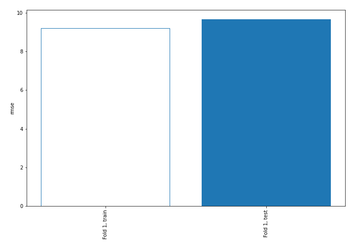

# Summary of 1_Baseline

## Baseline Regressor (Baseline)
- **explain_level**: 2

## Validation
 - **validation_type**: split
 - **train_ratio**: 0.75
 - **shuffle**: True

## Optimized metric
rmse

## Training time

0.0 seconds

### Metric details:
| Metric   |       Score |
|:---------|------------:|
| MAE      |  6.9013     |
| MSE      | 93.2822     |
| RMSE     |  9.65827    |
| R2       | -0.00137903 |

## Learning curves
