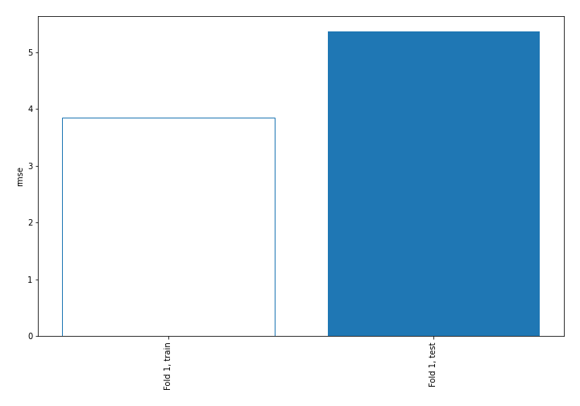
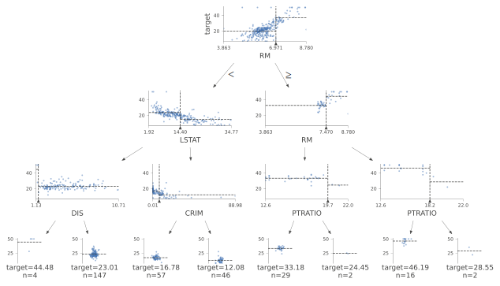
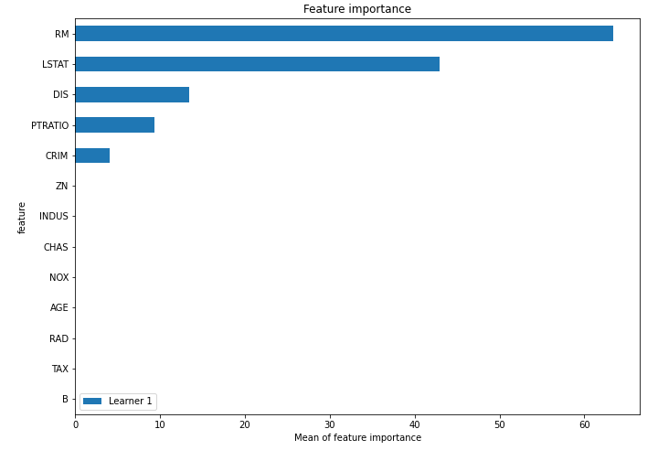
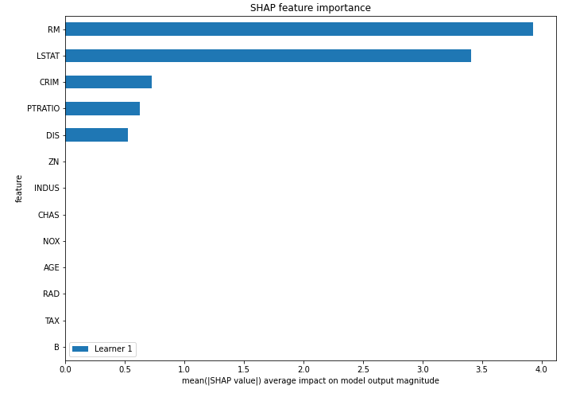
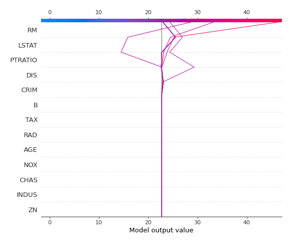
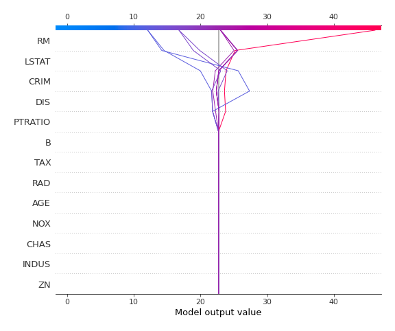

# Summary of 2_DecisionTree

## Decision Tree
- **criterion**: mse
- **max_depth**: 3
- **explain_level**: 2

## Validation
 - **validation_type**: split
 - **train_ratio**: 0.75
 - **shuffle**: True

## Optimized metric
rmse

## Training time

7.3 seconds

### Metric details:
| Metric   |     Score |
|:---------|----------:|
| MAE      |  3.81145  |
| MSE      | 28.7895   |
| RMSE     |  5.36558  |
| R2       |  0.690947 |

## Learning curves

## Tree visualizations

### Tree #1

## Permutation-based Importance

## SHAP Importance

## SHAP Dependence plots

### Dependence (Fold #1)

## SHAP Decision plots

### Top-10 Worst decisions (Fold #1)

### Top-10 Best decisions (Fold #1)
