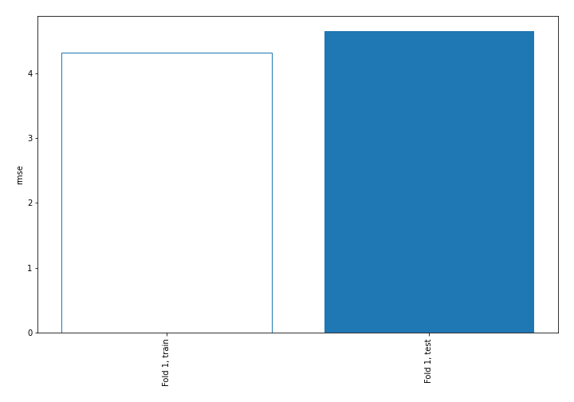
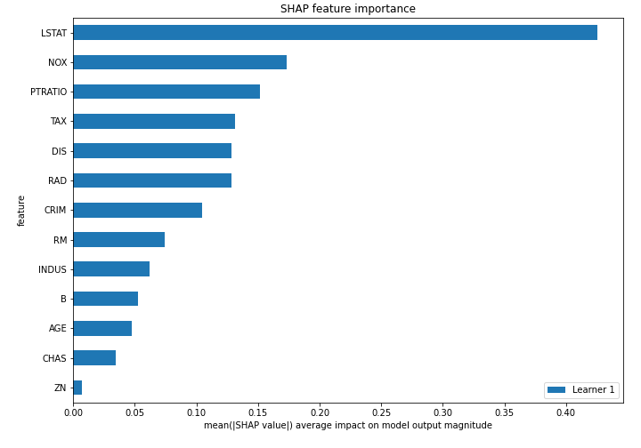
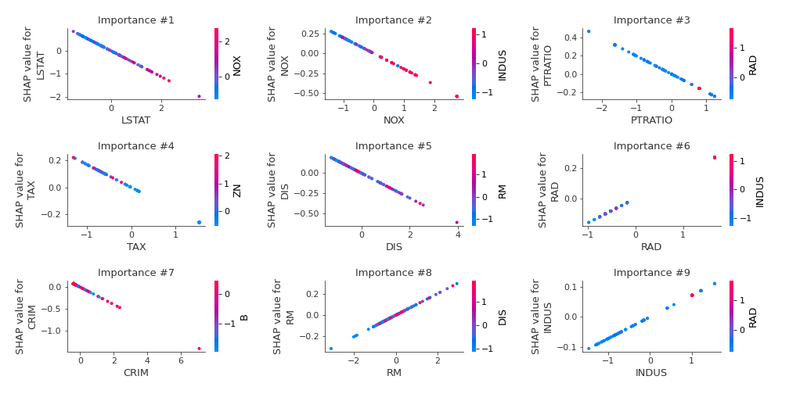
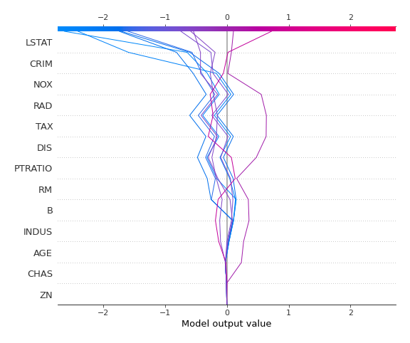
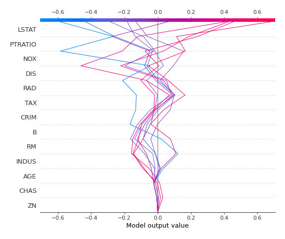

# Summary of 3_Linear

## Linear Regression (Linear)
- **explain_level**: 2

## Validation
 - **validation_type**: split
 - **train_ratio**: 0.75
 - **shuffle**: True

## Optimized metric
rmse

## Training time

2.5 seconds

### Metric details:
| Metric   |    Score |
|:---------|---------:|
| MAE      |  3.29179 |
| MSE      | 21.5958  |
| RMSE     |  4.64713 |
| R2       |  0.76645 |

## Learning curves

## Coefficients
| feature   |   Learner_1 |
|:----------|------------:|
| CHAS      |  0.259179   |
| RAD       |  0.161165   |
| RM        |  0.101509   |
| B         |  0.0968896  |
| INDUS     |  0.0716511  |
| AGE       |  0.0533554  |
| ZN        |  0.00993402 |
| intercept | -0.0188183  |
| DIS       | -0.153671   |
| TAX       | -0.171589   |
| PTRATIO   | -0.195569   |
| NOX       | -0.196256   |
| CRIM      | -0.20008    |
| LSTAT     | -0.562836   |

## Permutation-based Importance

## SHAP Importance

## SHAP Dependence plots

### Dependence (Fold #1)

## SHAP Decision plots

### Top-10 Worst decisions (Fold #1)

### Top-10 Best decisions (Fold #1)
