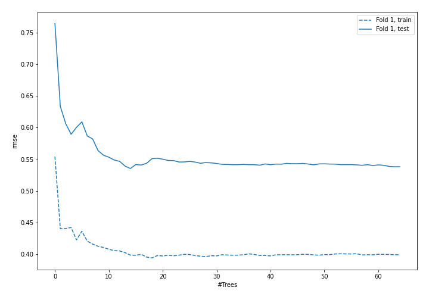
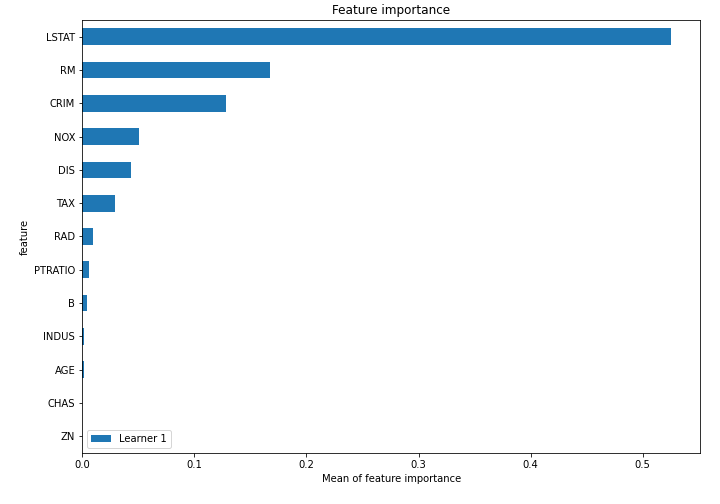
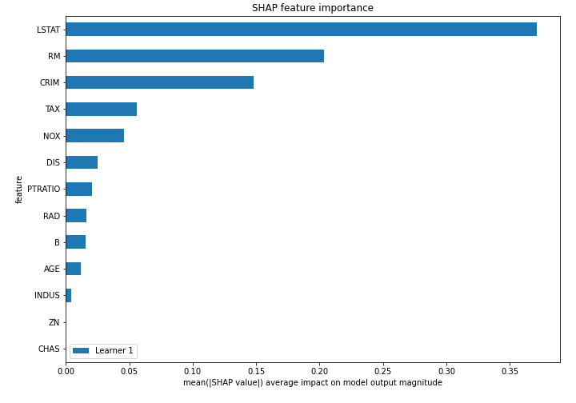
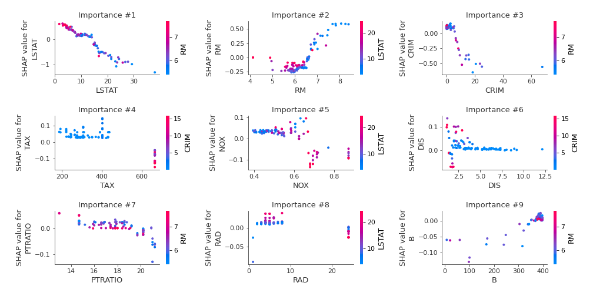
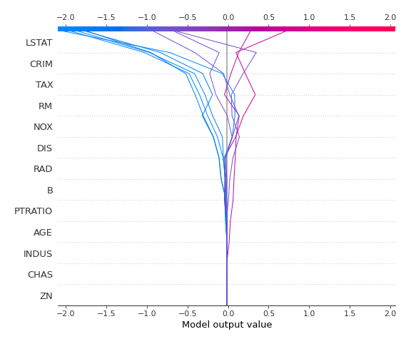
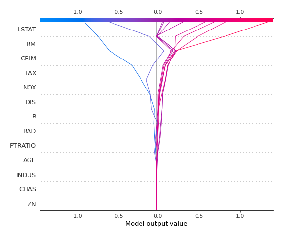

# Summary of 4_Default_RandomForest

## Random Forest
- **criterion**: mse
- **max_features**: 0.6
- **min_samples_split**: 30
- **explain_level**: 2

## Validation
 - **validation_type**: split
 - **train_ratio**: 0.75
 - **shuffle**: True

## Optimized metric
rmse

## Training time

3.9 seconds

### Metric details:
| Metric   |     Score |
|:---------|----------:|
| MAE      |  2.82456  |
| MSE      | 18.0819   |
| RMSE     |  4.25229  |
| R2       |  0.804451 |

## Learning curves

## Permutation-based Importance

## SHAP Importance

## SHAP Dependence plots

### Dependence (Fold #1)

## SHAP Decision plots

### Top-10 Worst decisions (Fold #1)

### Top-10 Best decisions (Fold #1)
