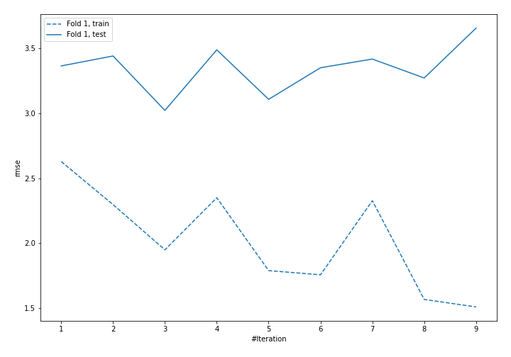
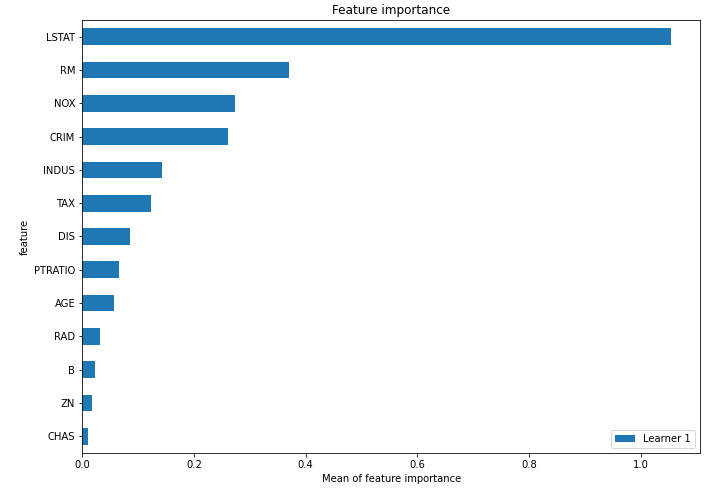

# Summary of 6_Default_NeuralNetwork

## Neural Network
- **dense_layers**: 2
- **dense_1_size**: 32
- **dense_2_size**: 16
- **dropout**: 0
- **learning_rate**: 0.05
- **momentum**: 0.9
- **decay**: 0.001
- **explain_level**: 2
- **model_architecture_json**: "{\"class_name\": \"Sequential\", \"config\": {\"name\": \"sequential_1\", \"layers\": [{\"class_name\": \"Dense\", \"config\": {\"name\": \"dense_1\", \"trainable\": true, \"batch_input_shape\": [null, 13], \"dtype\": \"float32\", \"units\": 32, \"activation\": \"relu\", \"use_bias\": true, \"kernel_initializer\": {\"class_name\": \"VarianceScaling\", \"config\": {\"scale\": 1.0, \"mode\": \"fan_avg\", \"distribution\": \"uniform\", \"seed\": null}}, \"bias_initializer\": {\"class_name\": \"Zeros\", \"config\": {}}, \"kernel_regularizer\": null, \"bias_regularizer\": null, \"activity_regularizer\": null, \"kernel_constraint\": null, \"bias_constraint\": null}}, {\"class_name\": \"Dense\", \"config\": {\"name\": \"dense_2\", \"trainable\": true, \"batch_input_shape\": [null, 13], \"dtype\": \"float32\", \"units\": 16, \"activation\": \"relu\", \"use_bias\": true, \"kernel_initializer\": {\"class_name\": \"VarianceScaling\", \"config\": {\"scale\": 1.0, \"mode\": \"fan_avg\", \"distribution\": \"uniform\", \"seed\": null}}, \"bias_initializer\": {\"class_name\": \"Zeros\", \"config\": {}}, \"kernel_regularizer\": null, \"bias_regularizer\": null, \"activity_regularizer\": null, \"kernel_constraint\": null, \"bias_constraint\": null}}, {\"class_name\": \"Dense\", \"config\": {\"name\": \"dense_3\", \"trainable\": true, \"dtype\": \"float32\", \"units\": 1, \"activation\": \"linear\", \"use_bias\": true, \"kernel_initializer\": {\"class_name\": \"VarianceScaling\", \"config\": {\"scale\": 1.0, \"mode\": \"fan_avg\", \"distribution\": \"uniform\", \"seed\": null}}, \"bias_initializer\": {\"class_name\": \"Zeros\", \"config\": {}}, \"kernel_regularizer\": null, \"bias_regularizer\": null, \"activity_regularizer\": null, \"kernel_constraint\": null, \"bias_constraint\": null}}]}, \"keras_version\": \"2.3.1\", \"backend\": \"tensorflow\"}"

## Validation
 - **validation_type**: split
 - **train_ratio**: 0.75
 - **shuffle**: True

## Optimized metric
rmse

## Training time

3.0 seconds

### Metric details:
| Metric   |    Score |
|:---------|---------:|
| MAE      | 2.23755  |
| MSE      | 9.13683  |
| RMSE     | 3.02272  |
| R2       | 0.901189 |

## Learning curves

## Permutation-based Importance
