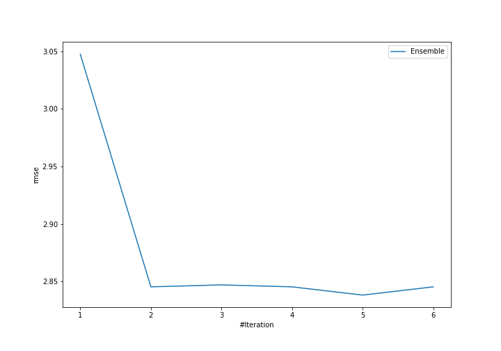

# Summary of Ensemble

## Ensemble structure
| Model                   |   Weight |
|:------------------------|---------:|
| 5_Default_Xgboost       |        2 |
| 6_Default_NeuralNetwork |        3 |

### Metric details:
| Metric   |    Score |
|:---------|---------:|
| MAE      | 2.08784  |
| MSE      | 8.05517  |
| RMSE     | 2.83816  |
| R2       | 0.913528 |

## Learning curves
