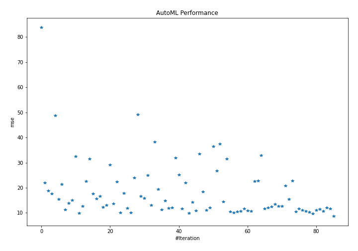
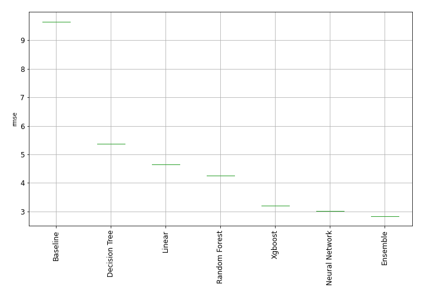

# AutoML Leaderboard

| Best model       | name     | model_type    | metric_type   |   metric_value |   train_time | Link                               |
|:-----------------|:---------|:--------------|:--------------|---------------:|-------------:|:-----------------------------------|
|                  | model_1  | Baseline      | mse           |       83.8487  |         0.14 | [Results link](model_1/README.md)  |
|                  | model_2  | Linear        | mse           |       21.9294  |        11.22 | [Results link](model_2/README.md)  |
|                  | model_3  | Decision Tree | mse           |       18.9022  |        22.19 | [Results link](model_3/README.md)  |
|                  | model_4  | Decision Tree | mse           |       17.6983  |        22.23 | [Results link](model_4/README.md)  |
|                  | model_5  | Decision Tree | mse           |       48.8144  |         9.97 | [Results link](model_5/README.md)  |
|                  | model_37 | Xgboost       | mse           |       15.4105  |        46.42 | [Results link](model_37/README.md) |
|                  | model_15 | Random Forest | mse           |       21.4363  |        36.29 | [Results link](model_15/README.md) |
|                  | model_36 | Xgboost       | mse           |       11.2719  |        71.67 | [Results link](model_36/README.md) |
|                  | model_44 | Xgboost       | mse           |       13.9194  |        47.27 | [Results link](model_44/README.md) |
|                  | model_49 | CatBoost      | mse           |       15.0055  |         8.39 | [Results link](model_49/README.md) |
|                  | model_19 | Extra Trees   | mse           |       32.5118  |        28.66 | [Results link](model_19/README.md) |
|                  | model_55 | CatBoost      | mse           |        9.83549 |        23.99 | [Results link](model_55/README.md) |
|                  | model_32 | LightGBM      | mse           |       12.7338  |        21.86 | [Results link](model_32/README.md) |
|                  | model_24 | Extra Trees   | mse           |       22.5283  |        36.58 | [Results link](model_24/README.md) |
|                  | model_25 | Extra Trees   | mse           |       31.5092  |        58.32 | [Results link](model_25/README.md) |
|                  | model_39 | Xgboost       | mse           |       17.6997  |        22.36 | [Results link](model_39/README.md) |
|                  | model_48 | CatBoost      | mse           |       15.6524  |        42.31 | [Results link](model_48/README.md) |
|                  | model_52 | CatBoost      | mse           |       16.657   |         7.38 | [Results link](model_52/README.md) |
|                  | model_34 | LightGBM      | mse           |       12.2056  |        28.81 | [Results link](model_34/README.md) |
|                  | model_50 | CatBoost      | mse           |       12.9696  |        13.55 | [Results link](model_50/README.md) |
|                  | model_8  | Random Forest | mse           |       29.1999  |        35.01 | [Results link](model_8/README.md)  |
|                  | model_28 | LightGBM      | mse           |       13.5619  |        15.3  | [Results link](model_28/README.md) |
|                  | model_11 | Random Forest | mse           |       22.4731  |        43.17 | [Results link](model_11/README.md) |
|                  | model_22 | Extra Trees   | mse           |       10.1703  |        60.48 | [Results link](model_22/README.md) |
|                  | model_14 | Random Forest | mse           |       17.904   |        40.81 | [Results link](model_14/README.md) |
|                  | model_41 | Xgboost       | mse           |       11.868   |        18.43 | [Results link](model_41/README.md) |
|                  | model_54 | CatBoost      | mse           |       10.1563  |        19.83 | [Results link](model_54/README.md) |
|                  | model_13 | Random Forest | mse           |       23.9534  |        53.59 | [Results link](model_13/README.md) |
|                  | model_20 | Extra Trees   | mse           |       49.2293  |        37.19 | [Results link](model_20/README.md) |
|                  | model_27 | LightGBM      | mse           |       16.6136  |        16.84 | [Results link](model_27/README.md) |
|                  | model_53 | CatBoost      | mse           |       15.8954  |        22.4  | [Results link](model_53/README.md) |
|                  | model_35 | LightGBM      | mse           |       24.9019  |        31.92 | [Results link](model_35/README.md) |
|                  | model_51 | CatBoost      | mse           |       13.0109  |        42.4  | [Results link](model_51/README.md) |
|                  | model_17 | Extra Trees   | mse           |       38.2125  |        33.49 | [Results link](model_17/README.md) |
|                  | model_31 | LightGBM      | mse           |       19.453   |        22.44 | [Results link](model_31/README.md) |
|                  | model_42 | Xgboost       | mse           |       11.176   |        16.17 | [Results link](model_42/README.md) |
|                  | model_46 | CatBoost      | mse           |       14.7792  |        15.62 | [Results link](model_46/README.md) |
|                  | model_29 | LightGBM      | mse           |       11.8345  |        37.59 | [Results link](model_29/README.md) |
|                  | model_38 | Xgboost       | mse           |       11.9972  |        15.91 | [Results link](model_38/README.md) |
|                  | model_21 | Extra Trees   | mse           |       31.8189  |        52.47 | [Results link](model_21/README.md) |
|                  | model_6  | Random Forest | mse           |       25.1007  |        65.23 | [Results link](model_6/README.md)  |
|                  | model_12 | Random Forest | mse           |       11.7052  |        76.71 | [Results link](model_12/README.md) |
|                  | model_9  | Random Forest | mse           |       21.9956  |        70.71 | [Results link](model_9/README.md)  |
|                  | model_47 | CatBoost      | mse           |        9.89328 |        12.02 | [Results link](model_47/README.md) |
|                  | model_30 | LightGBM      | mse           |       14.1958  |        27.63 | [Results link](model_30/README.md) |
|                  | model_33 | LightGBM      | mse           |       10.8837  |        33.47 | [Results link](model_33/README.md) |
|                  | model_23 | Extra Trees   | mse           |       33.4801  |        72    | [Results link](model_23/README.md) |
|                  | model_26 | LightGBM      | mse           |       18.3823  |        30.07 | [Results link](model_26/README.md) |
|                  | model_45 | Xgboost       | mse           |       11.0353  |        46.57 | [Results link](model_45/README.md) |
|                  | model_43 | Xgboost       | mse           |       11.9909  |        41.28 | [Results link](model_43/README.md) |
|                  | model_16 | Extra Trees   | mse           |       36.476   |        35.73 | [Results link](model_16/README.md) |
|                  | model_7  | Random Forest | mse           |       26.7212  |        54.87 | [Results link](model_7/README.md)  |
|                  | model_18 | Extra Trees   | mse           |       37.3783  |        77.73 | [Results link](model_18/README.md) |
|                  | model_40 | Xgboost       | mse           |       14.3836  |        73.43 | [Results link](model_40/README.md) |
|                  | model_10 | Random Forest | mse           |       31.4661  |        49.25 | [Results link](model_10/README.md) |
|                  | model_56 | CatBoost      | mse           |       10.5529  |        20.5  | [Results link](model_56/README.md) |
|                  | model_57 | CatBoost      | mse           |       10.0902  |        27.83 | [Results link](model_57/README.md) |
|                  | model_58 | CatBoost      | mse           |       10.4178  |        44.01 | [Results link](model_58/README.md) |
|                  | model_59 | CatBoost      | mse           |       10.7742  |        43.57 | [Results link](model_59/README.md) |
|                  | model_60 | CatBoost      | mse           |       11.7153  |        43.57 | [Results link](model_60/README.md) |
|                  | model_61 | Extra Trees   | mse           |       10.8966  |        83.22 | [Results link](model_61/README.md) |
|                  | model_62 | Extra Trees   | mse           |       10.7267  |        41.37 | [Results link](model_62/README.md) |
|                  | model_63 | Extra Trees   | mse           |       22.5746  |        57.45 | [Results link](model_63/README.md) |
|                  | model_64 | Extra Trees   | mse           |       22.6782  |        74.15 | [Results link](model_64/README.md) |
|                  | model_65 | Extra Trees   | mse           |       32.924   |        75.4  | [Results link](model_65/README.md) |
|                  | model_66 | LightGBM      | mse           |       11.7109  |        35.88 | [Results link](model_66/README.md) |
|                  | model_67 | LightGBM      | mse           |       11.9858  |        41.36 | [Results link](model_67/README.md) |
|                  | model_68 | LightGBM      | mse           |       12.4939  |        83.6  | [Results link](model_68/README.md) |
|                  | model_69 | LightGBM      | mse           |       13.4741  |        60.89 | [Results link](model_69/README.md) |
|                  | model_70 | LightGBM      | mse           |       12.6789  |        63.2  | [Results link](model_70/README.md) |
|                  | model_71 | Random Forest | mse           |       12.6593  |        75.64 | [Results link](model_71/README.md) |
|                  | model_72 | Random Forest | mse           |       20.767   |        76.14 | [Results link](model_72/README.md) |
|                  | model_73 | Random Forest | mse           |       15.4349  |        75.79 | [Results link](model_73/README.md) |
|                  | model_74 | Random Forest | mse           |       22.8274  |        73.05 | [Results link](model_74/README.md) |
|                  | model_75 | Xgboost       | mse           |       10.4041  |        66.68 | [Results link](model_75/README.md) |
|                  | model_76 | Xgboost       | mse           |       11.6201  |        34.89 | [Results link](model_76/README.md) |
|                  | model_77 | Xgboost       | mse           |       11.0856  |        50.63 | [Results link](model_77/README.md) |
|                  | model_78 | Xgboost       | mse           |       10.6338  |        54.65 | [Results link](model_78/README.md) |
|                  | model_79 | Xgboost       | mse           |       10.3362  |        28.34 | [Results link](model_79/README.md) |
|                  | model_80 | CatBoost      | mse           |        9.74477 |        12.01 | [Results link](model_80/README.md) |
|                  | model_81 | CatBoost      | mse           |       10.9733  |        10.98 | [Results link](model_81/README.md) |
|                  | model_82 | CatBoost      | mse           |       11.3846  |        42.4  | [Results link](model_82/README.md) |
|                  | model_83 | CatBoost      | mse           |       10.5784  |        13.34 | [Results link](model_83/README.md) |
|                  | model_84 | LightGBM      | mse           |       11.9858  |        18.04 | [Results link](model_84/README.md) |
|                  | model_85 | LightGBM      | mse           |       11.6358  |        22.24 | [Results link](model_85/README.md) |
| *** the best *** | ensemble | Ensemble      | mse           |        8.6839  |        17.93 | [Results link](ensemble/README.md) |

### AutoML Performance

### AutoML Performance Boxplot
