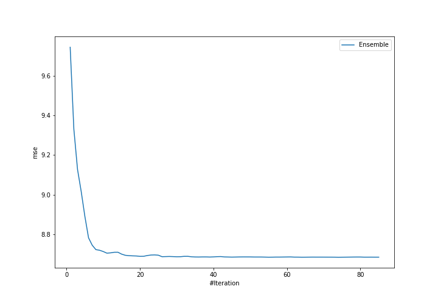

# Summary of ensemble

## Ensemble structure
| Model    |   Weight |
|:---------|---------:|
| model_22 |        2 |
| model_3  |        8 |
| model_33 |       15 |
| model_43 |       12 |
| model_47 |       12 |
| model_62 |       15 |
| model_75 |        7 |
| model_79 |        2 |
| model_80 |        1 |

### Metric details:
| Metric   |    Score |
|:---------|---------:|
| MAE      | 1.99703  |
| MSE      | 8.6839   |
| RMSE     | 2.94685  |
| R2       | 0.896223 |

## Learning curves
