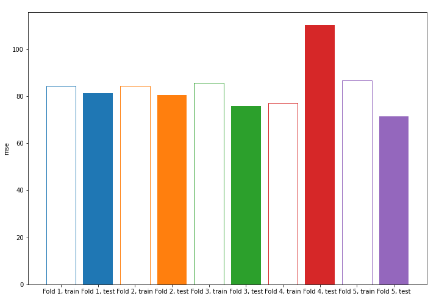

# Summary of model_1

## Baseline Regressor (Baseline)

## Validation
 - **validation_type**: kfold
 - **k_folds**: 5
 - **shuffle**: True

## Optimized metric
mse

## Training time

0.1 seconds

### Metric details:
| Metric   |       Score |
|:---------|------------:|
| MAE      |  6.61177    |
| MSE      | 83.8487     |
| RMSE     |  9.15689    |
| R2       | -0.00203964 |

## Learning curves
