# Summary of model_13

## Random Forest
- **criterion**: mae
- **max_features**: 0.7
- **min_samples_split**: 20
- **min_samples_leaf**: 18

## Validation
 - **validation_type**: kfold
 - **k_folds**: 5
 - **shuffle**: True

## Optimized metric
mse

## Training time

53.6 seconds

### Metric details:
| Metric   |     Score |
|:---------|----------:|
| MAE      |  3.00951  |
| MSE      | 23.9534   |
| RMSE     |  4.89423  |
| R2       |  0.713743 |

## Learning curves
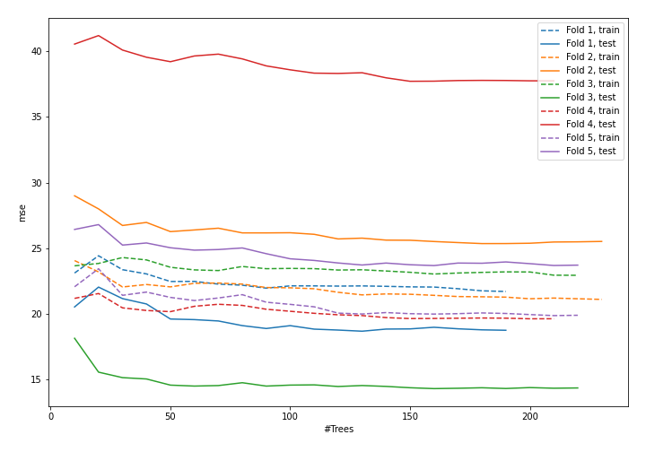

## Permutation-based Importance
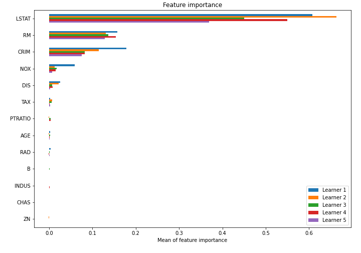

## SHAP Importance
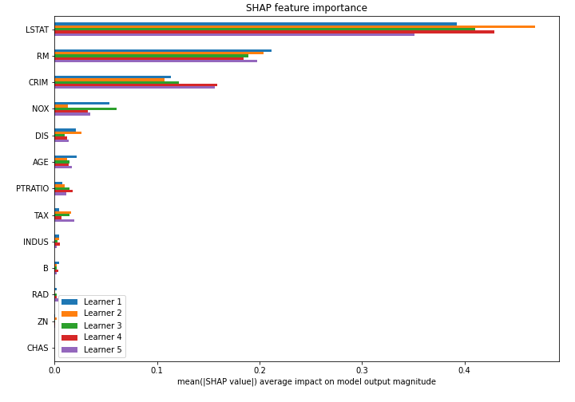

## SHAP Dependence plots

### Dependence (Fold #1)
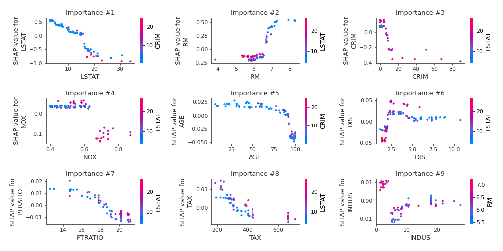
### Dependence (Fold #2)
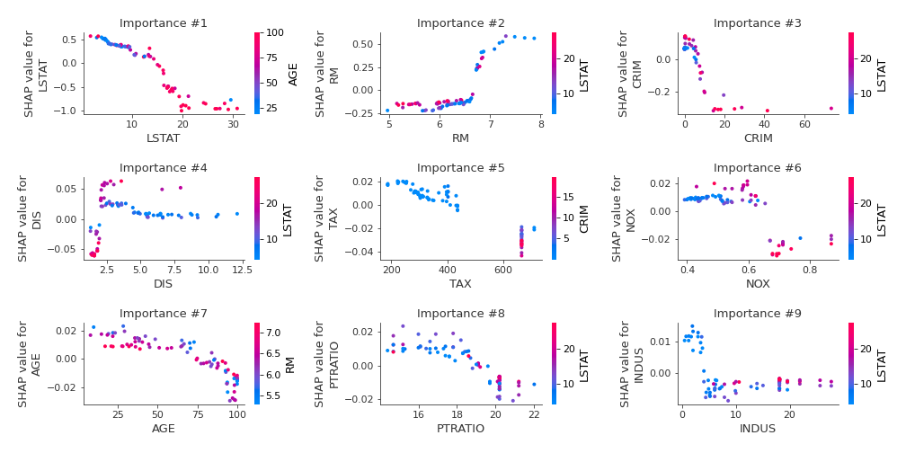
### Dependence (Fold #3)
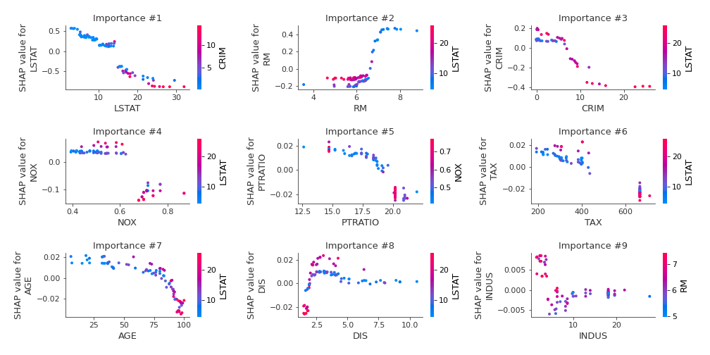
### Dependence (Fold #4)
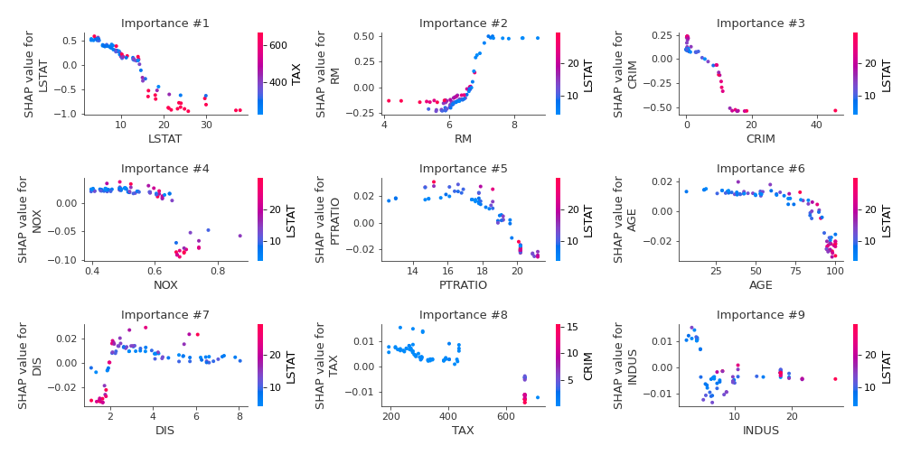
### Dependence (Fold #5)
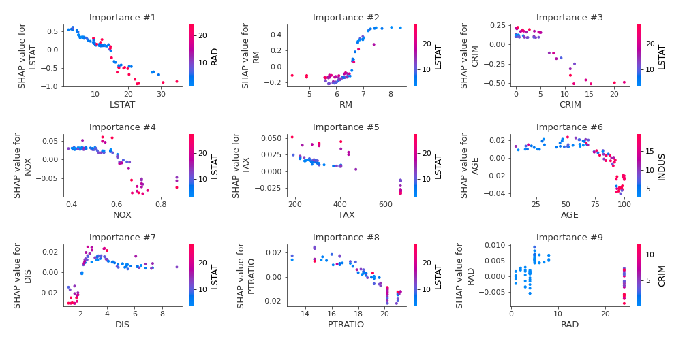

## SHAP Decision plots

### Top-10 Worst decisions (Fold #1)
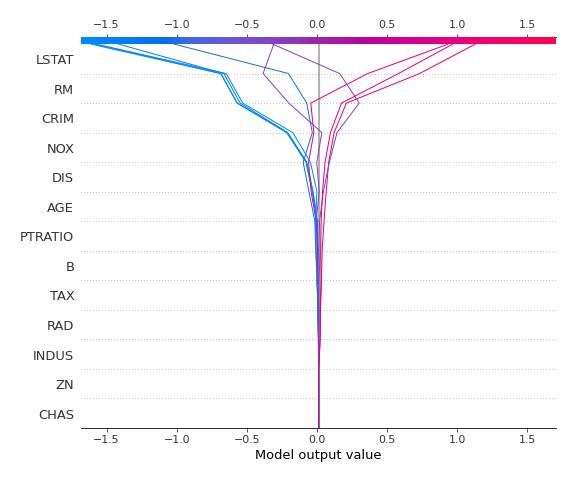
### Top-10 Worst decisions (Fold #2)
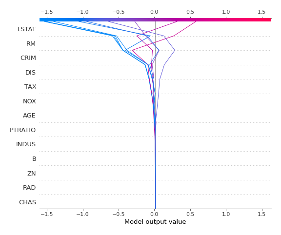
### Top-10 Worst decisions (Fold #3)
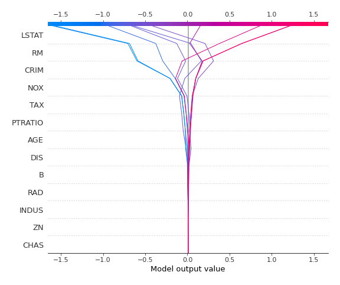
### Top-10 Worst decisions (Fold #4)
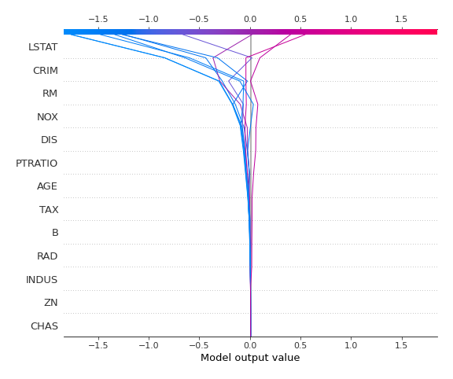
### Top-10 Worst decisions (Fold #5)
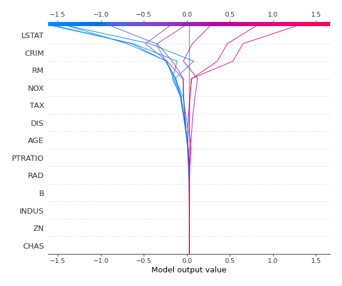
### Top-10 Best decisions (Fold #1)
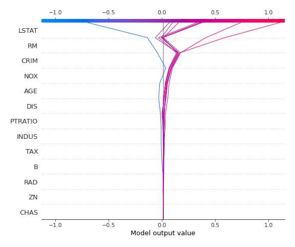
### Top-10 Best decisions (Fold #2)
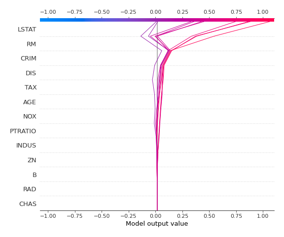
### Top-10 Best decisions (Fold #3)
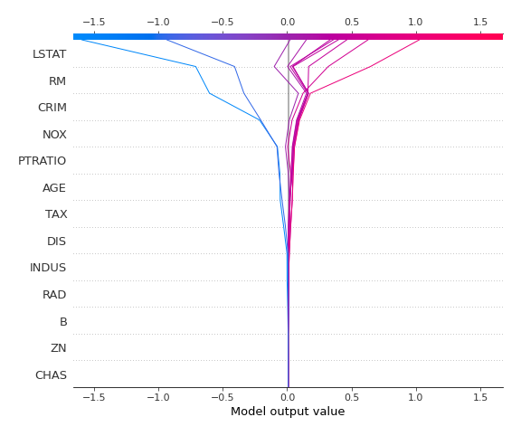
### Top-10 Best decisions (Fold #4)
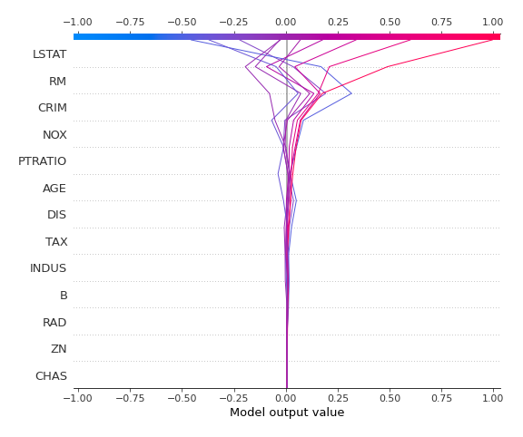
### Top-10 Best decisions (Fold #5)
