# Summary of model_2

## Linear Regression (Linear)

## Validation
 - **validation_type**: kfold
 - **k_folds**: 5
 - **shuffle**: True

## Optimized metric
mse

## Training time

11.2 seconds

### Metric details:
| Metric   |     Score |
|:---------|----------:|
| MAE      |  3.12813  |
| MSE      | 21.9294   |
| RMSE     |  4.68288  |
| R2       |  0.737931 |

## Learning curves
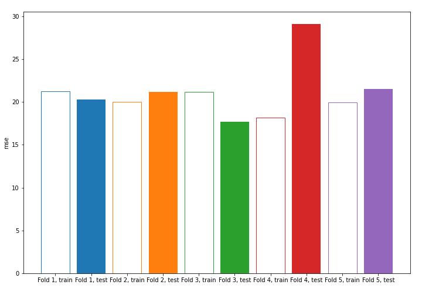

## Coefficients
| feature   |   Learner_1 |   Learner_2 |   Learner_3 |   Learner_4 |   Learner_5 |
|:----------|------------:|------------:|------------:|------------:|------------:|
| RAD       |   0.319779  |   0.359961  |   0.237195  |  0.261572   |   0.298531  |
| CHAS      |   0.22204   |   0.240581  |   0.317213  |  0.108551   |   0.227628  |
| B         |   0.0955063 |   0.069405  |   0.0532474 |  0.0713581  |   0.0749064 |
| RM        |   0.0239061 |   0.0774652 |   0.079357  |  0.0806978  |   0.0708854 |
| INDUS     |   0.0520313 |   0.0373514 |   0.075795  |  0.0507064  |   0.0565506 |
| ZN        |   0.0738222 |   0.0406914 |   0.019394  |  0.06369    |   0.0496419 |
| AGE       |   0.0602334 |   0.0529475 |   0.036581  |  0.018314   |   0.0436209 |
| intercept |  -0.0158109 |  -0.017876  |  -0.0176775 | -0.00638533 |  -0.0140511 |
| PTRATIO   |  -0.162663  |  -0.161744  |  -0.160471  | -0.146437   |  -0.139718  |
| NOX       |  -0.160544  |  -0.152849  |  -0.209232  | -0.133255   |  -0.154912  |
| DIS       |  -0.20268   |  -0.177128  |  -0.202307  | -0.205648   |  -0.193211  |
| TAX       |  -0.294492  |  -0.317104  |  -0.199095  | -0.241149   |  -0.291315  |
| CRIM      |  -0.207704  |  -0.298932  |  -0.305111  | -0.319725   |  -0.295208  |
| LSTAT     |  -0.618732  |  -0.56569   |  -0.566257  | -0.568977   |  -0.574494  |

## Permutation-based Importance
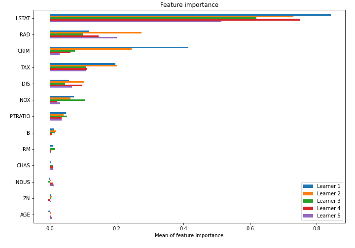

## SHAP Importance
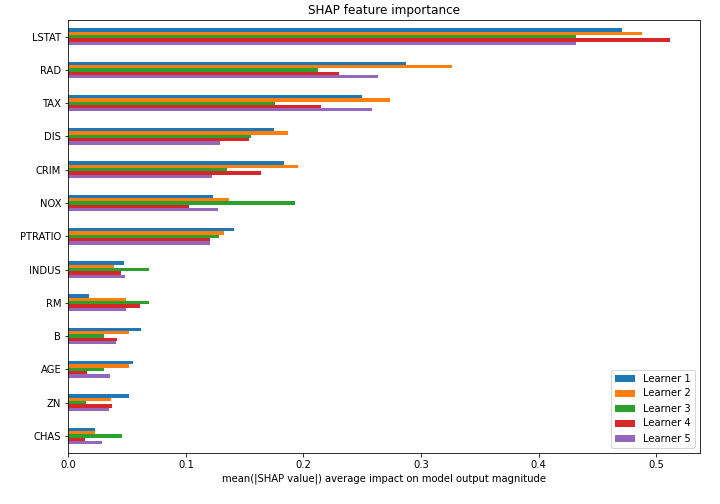

## SHAP Dependence plots

### Dependence (Fold #1)
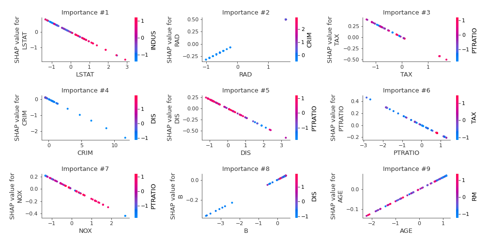
### Dependence (Fold #2)
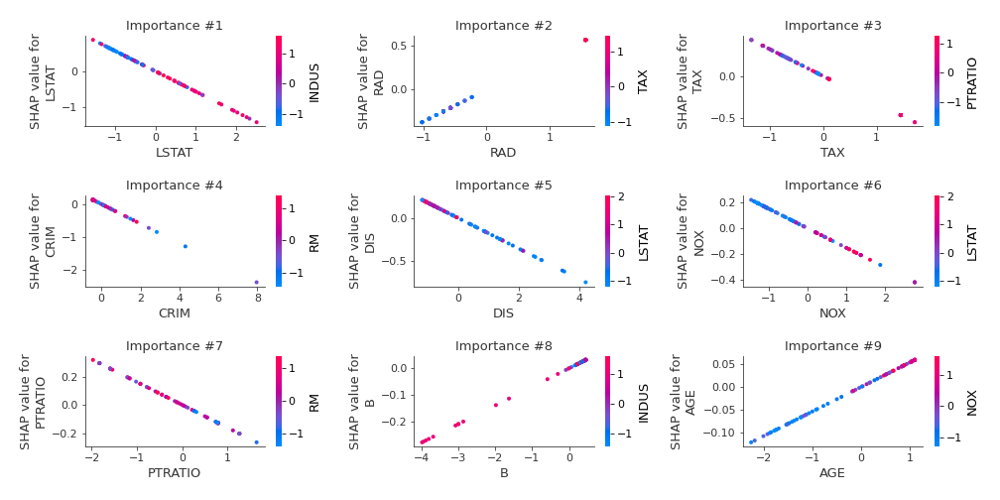
### Dependence (Fold #3)
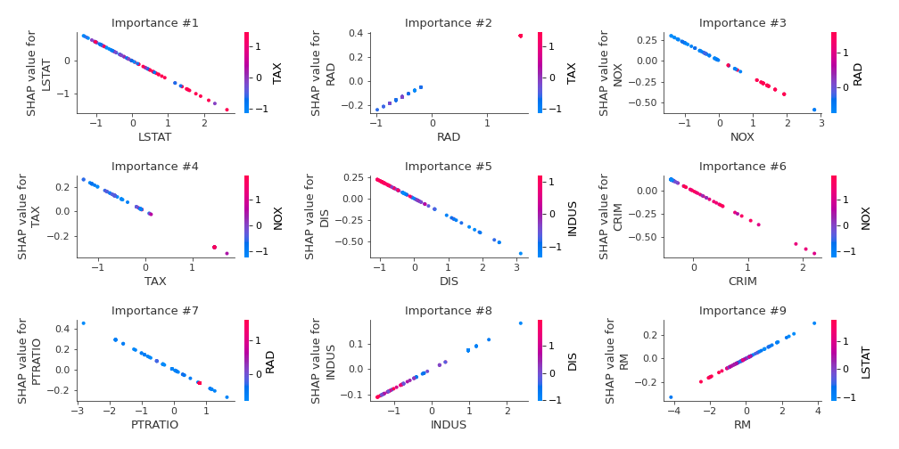
### Dependence (Fold #4)

### Dependence (Fold #5)
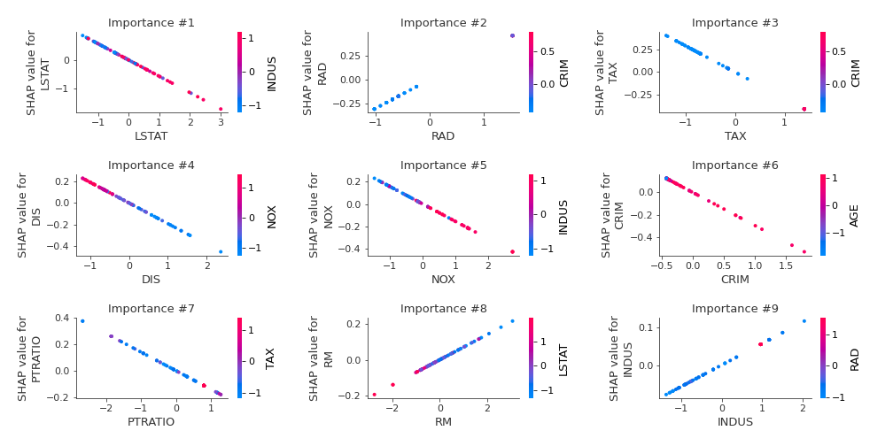

## SHAP Decision plots

### Top-10 Worst decisions (Fold #1)
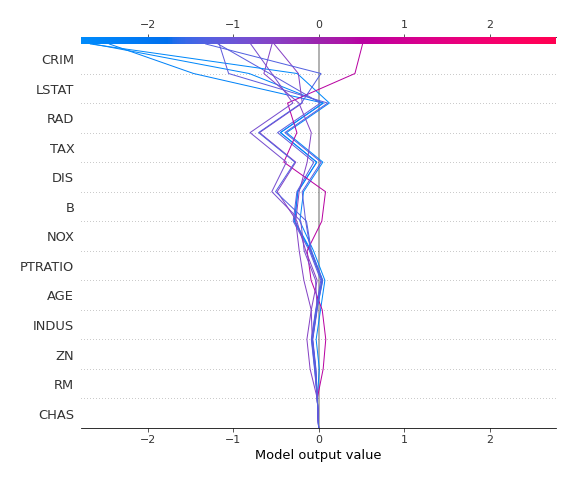
### Top-10 Worst decisions (Fold #2)
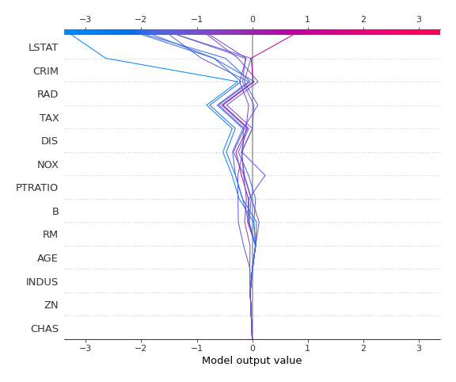
### Top-10 Worst decisions (Fold #3)
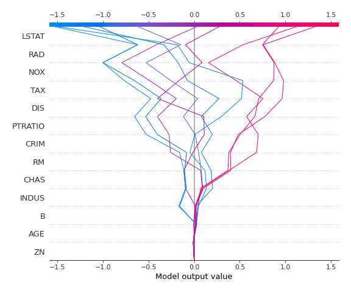
### Top-10 Worst decisions (Fold #4)
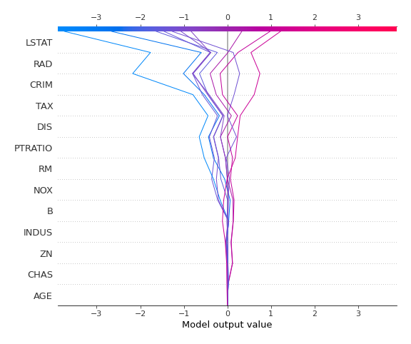
### Top-10 Worst decisions (Fold #5)
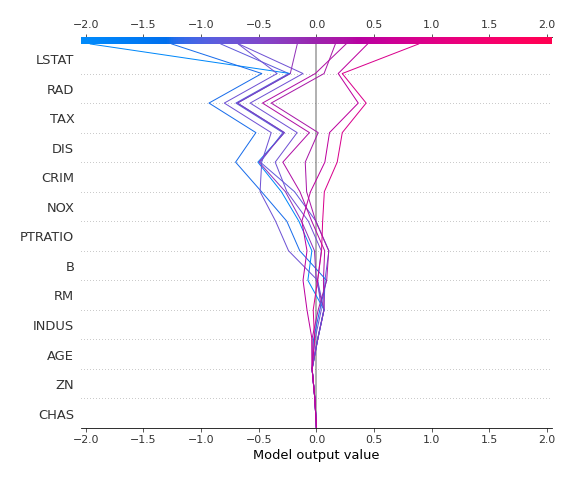
### Top-10 Best decisions (Fold #1)
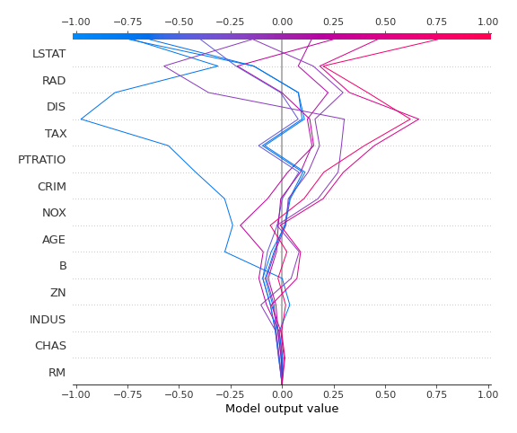
### Top-10 Best decisions (Fold #2)
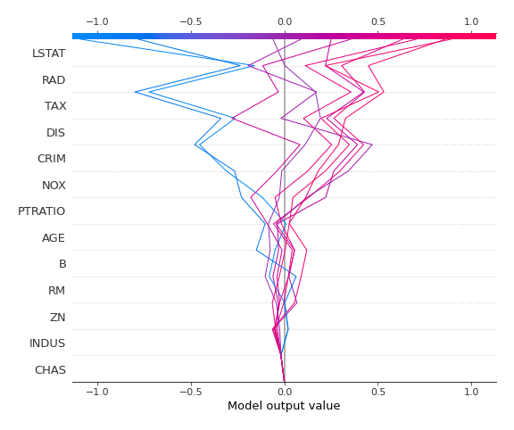
### Top-10 Best decisions (Fold #3)
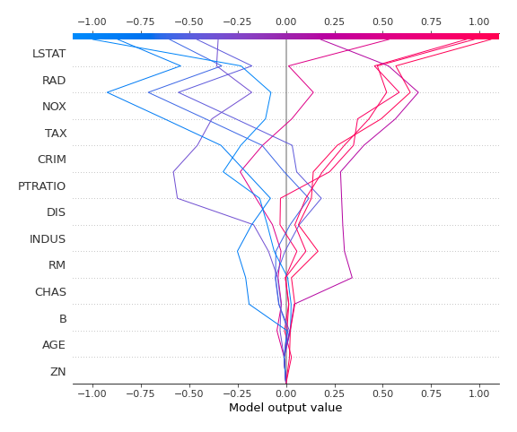
### Top-10 Best decisions (Fold #4)
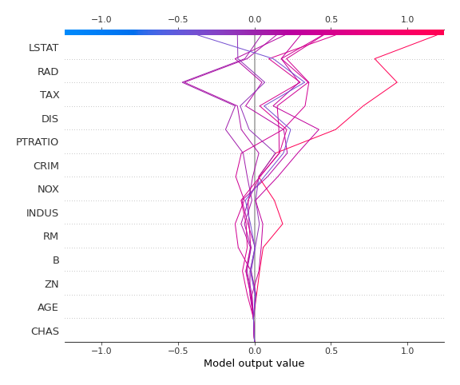
### Top-10 Best decisions (Fold #5)
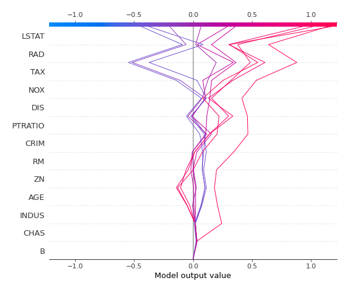