# Summary of model_28

## LightGBM
- **objective**: regression
- **metric**: l2
- **num_leaves**: 512
- **learning_rate**: 0.075
- **feature_fraction**: 1.0
- **bagging_fraction**: 0.8
- **bagging_freq**: 3

## Validation
 - **validation_type**: kfold
 - **k_folds**: 5
 - **shuffle**: True

## Optimized metric
mse

## Training time

15.3 seconds

### Metric details:
| Metric   |     Score |
|:---------|----------:|
| MAE      |  2.37776  |
| MSE      | 13.5619   |
| RMSE     |  3.68265  |
| R2       |  0.837928 |

## Learning curves
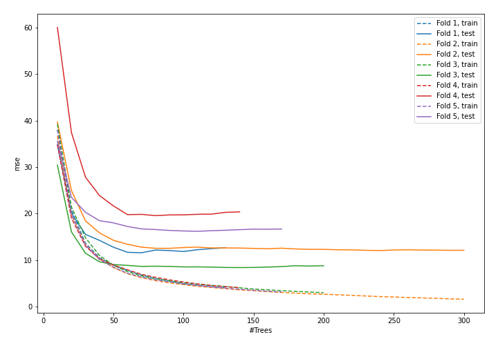

## Permutation-based Importance
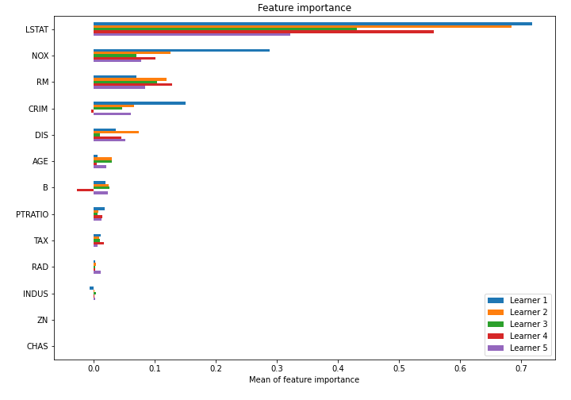

## SHAP Importance
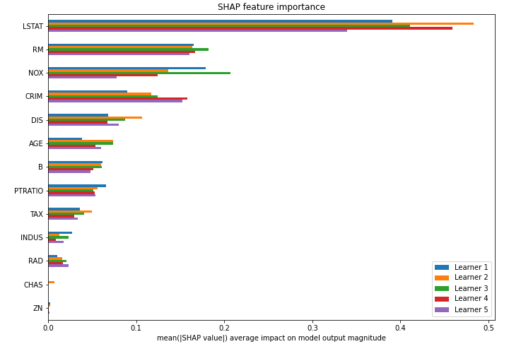

## SHAP Dependence plots

### Dependence (Fold #1)
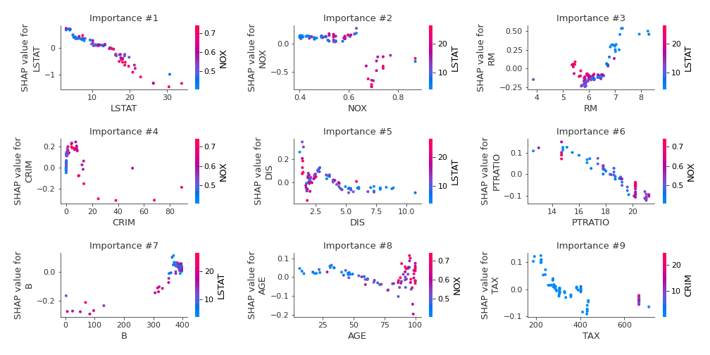
### Dependence (Fold #2)
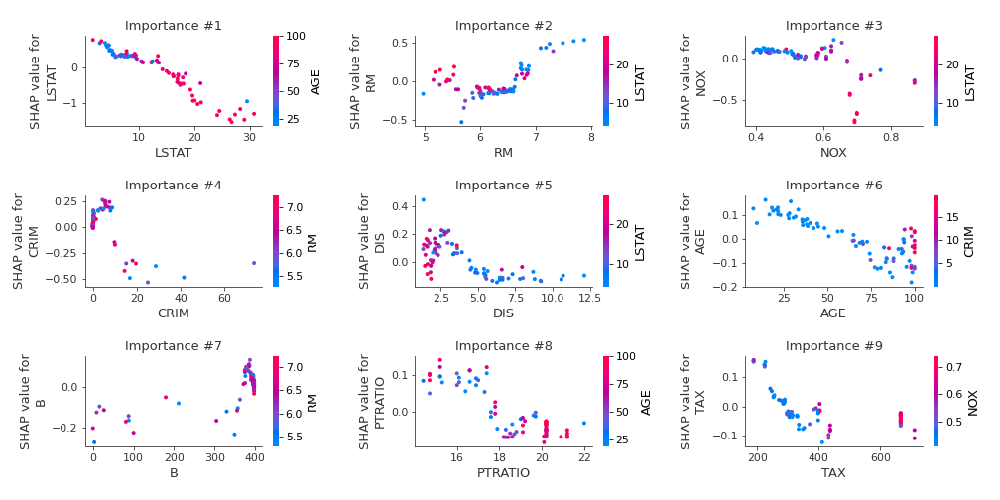
### Dependence (Fold #3)
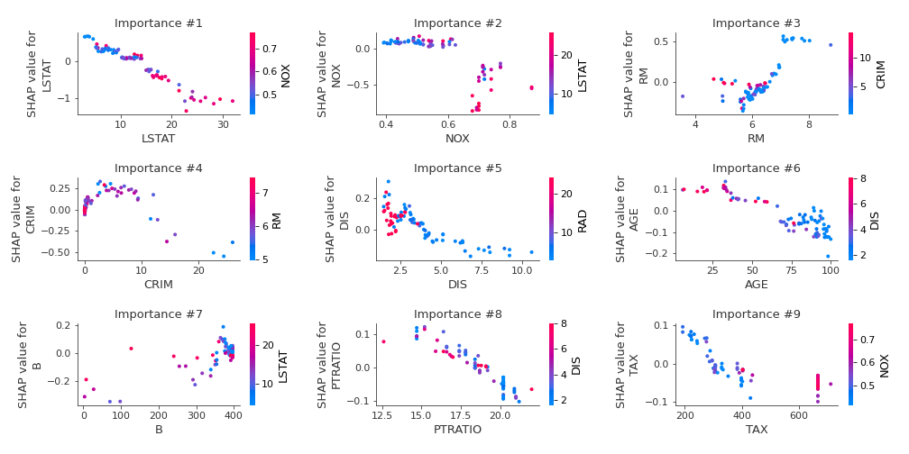
### Dependence (Fold #4)
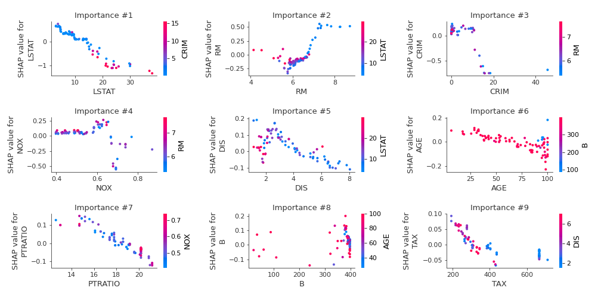
### Dependence (Fold #5)
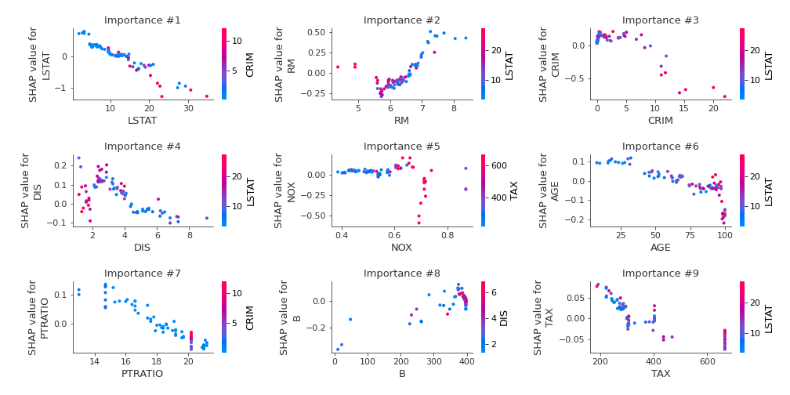

## SHAP Decision plots

### Top-10 Worst decisions (Fold #1)
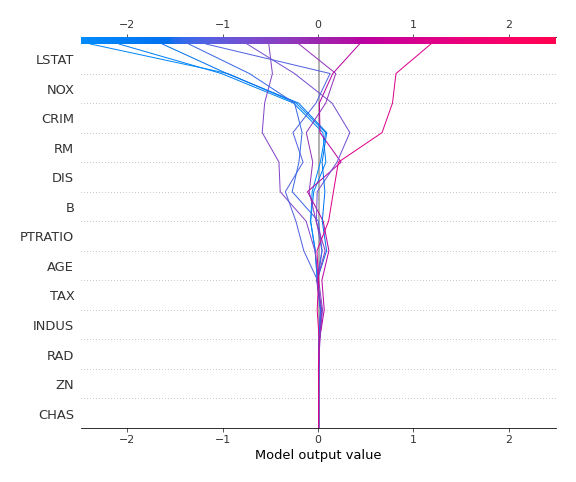
### Top-10 Worst decisions (Fold #2)
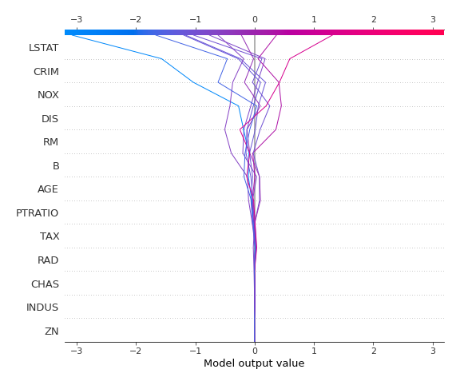
### Top-10 Worst decisions (Fold #3)
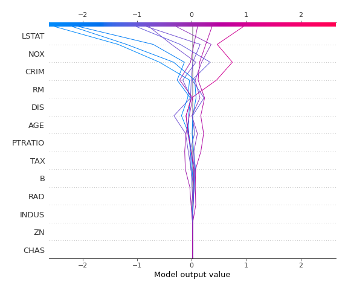
### Top-10 Worst decisions (Fold #4)
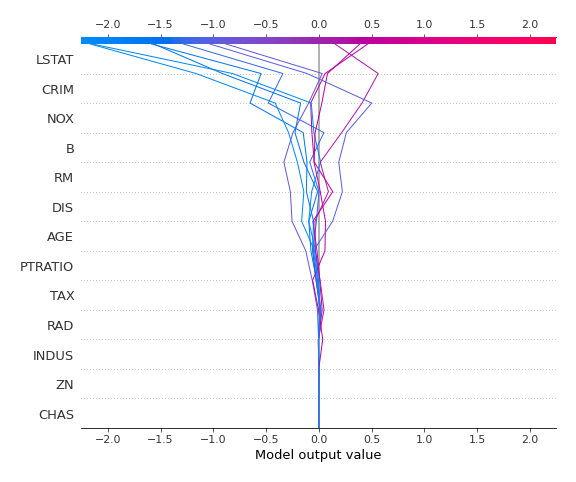
### Top-10 Worst decisions (Fold #5)
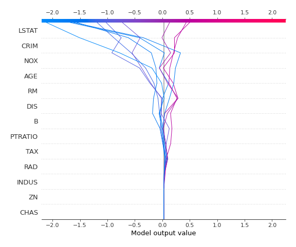
### Top-10 Best decisions (Fold #1)
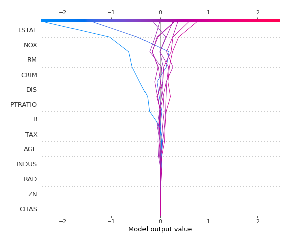
### Top-10 Best decisions (Fold #2)
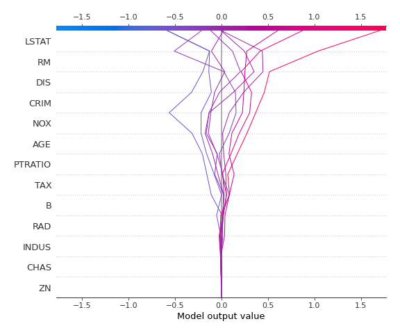
### Top-10 Best decisions (Fold #3)
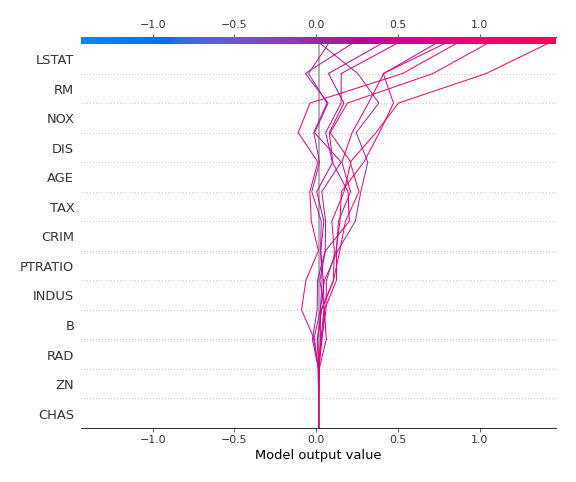
### Top-10 Best decisions (Fold #4)
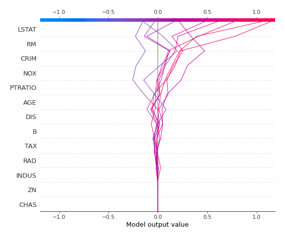
### Top-10 Best decisions (Fold #5)
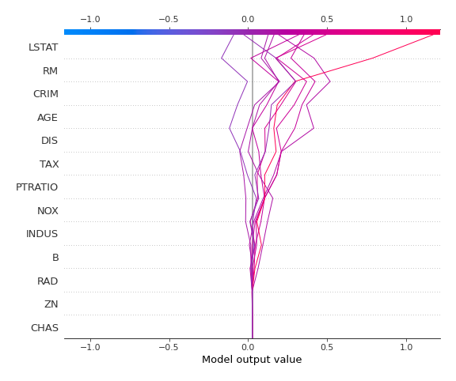