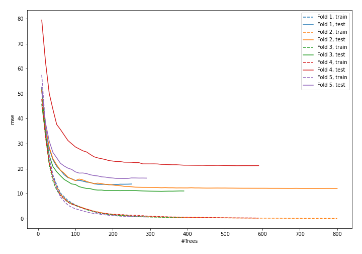
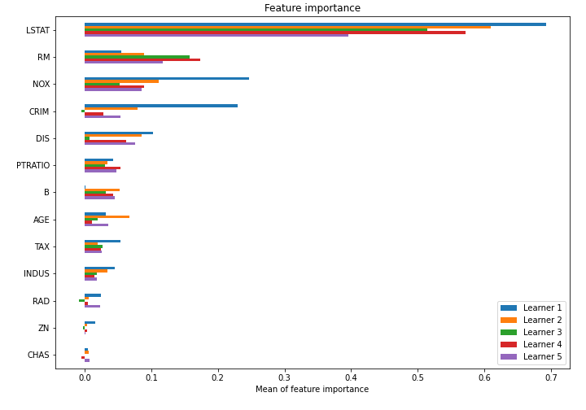

# Summary of model_46

## CatBoost
- **learning_rate**: 0.05
- **depth**: 8
- **rsm**: 0.5
- **l2_leaf_reg**: 3
- **loss_function**: MAE

## Validation
 - **validation_type**: kfold
 - **k_folds**: 5
 - **shuffle**: True

## Optimized metric
mse

## Training time

15.6 seconds

### Metric details:
| Metric   |    Score |
|:---------|---------:|
| MAE      |  2.36123 |
| MSE      | 14.7792  |
| RMSE     |  3.84438 |
| R2       |  0.82338 |

## Learning curves

## Permutation-based Importance
