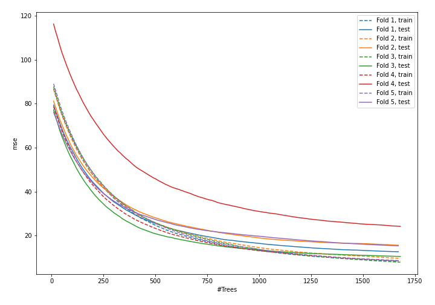
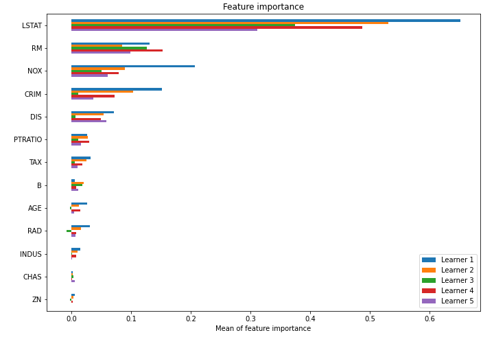

# Summary of model_48

## CatBoost
- **learning_rate**: 0.005
- **depth**: 5
- **rsm**: 0.9
- **l2_leaf_reg**: 10
- **loss_function**: RMSE

## Validation
 - **validation_type**: kfold
 - **k_folds**: 5
 - **shuffle**: True

## Optimized metric
mse

## Training time

42.3 seconds

### Metric details:
| Metric   |     Score |
|:---------|----------:|
| MAE      |  2.56231  |
| MSE      | 15.6524   |
| RMSE     |  3.95631  |
| R2       |  0.812945 |

## Learning curves

## Permutation-based Importance
