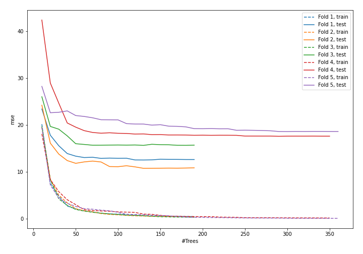
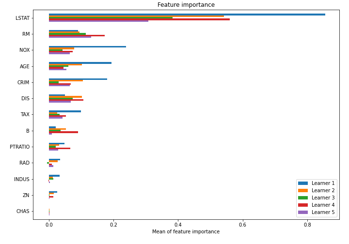

# Summary of model_49

## CatBoost
- **learning_rate**: 0.2
- **depth**: 7
- **rsm**: 1.0
- **l2_leaf_reg**: 1
- **loss_function**: MAE

## Validation
 - **validation_type**: kfold
 - **k_folds**: 5
 - **shuffle**: True

## Optimized metric
mse

## Training time

8.4 seconds

### Metric details:
| Metric   |     Score |
|:---------|----------:|
| MAE      |  2.51426  |
| MSE      | 15.0055   |
| RMSE     |  3.8737   |
| R2       |  0.820675 |

## Learning curves

## Permutation-based Importance
