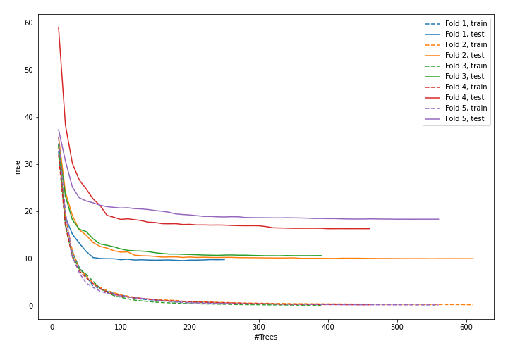
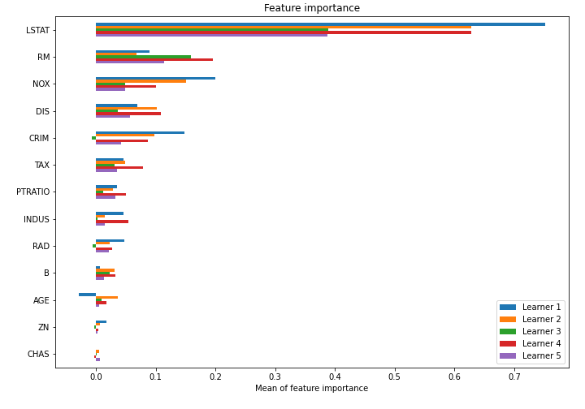

# Summary of model_50

## CatBoost
- **learning_rate**: 0.1
- **depth**: 7
- **rsm**: 0.7
- **l2_leaf_reg**: 10
- **loss_function**: MAE

## Validation
 - **validation_type**: kfold
 - **k_folds**: 5
 - **shuffle**: True

## Optimized metric
mse

## Training time

13.5 seconds

### Metric details:
| Metric   |     Score |
|:---------|----------:|
| MAE      |  2.26964  |
| MSE      | 12.9696   |
| RMSE     |  3.60133  |
| R2       |  0.845006 |

## Learning curves

## Permutation-based Importance
