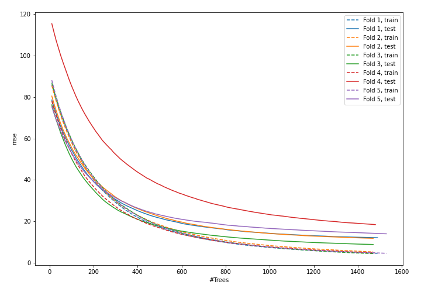
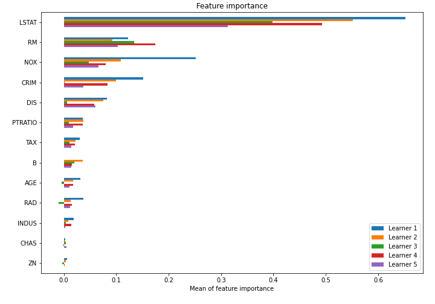

# Summary of model_51

## CatBoost
- **learning_rate**: 0.005
- **depth**: 6
- **rsm**: 0.9
- **l2_leaf_reg**: 3
- **loss_function**: RMSE

## Validation
 - **validation_type**: kfold
 - **k_folds**: 5
 - **shuffle**: True

## Optimized metric
mse

## Training time

42.4 seconds

### Metric details:
| Metric   |     Score |
|:---------|----------:|
| MAE      |  2.35739  |
| MSE      | 13.0109   |
| RMSE     |  3.60706  |
| R2       |  0.844513 |

## Learning curves

## Permutation-based Importance
