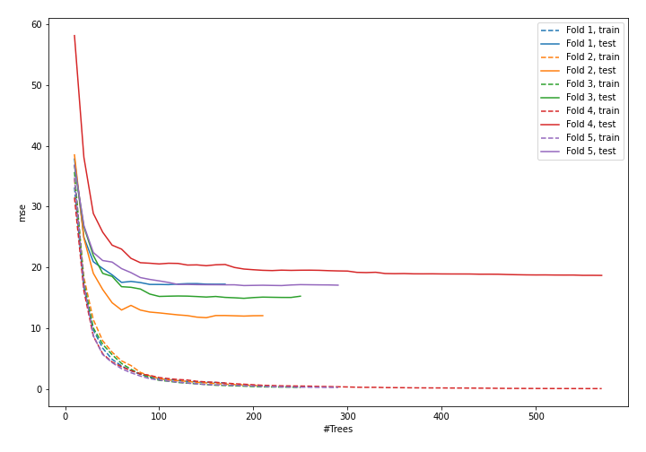
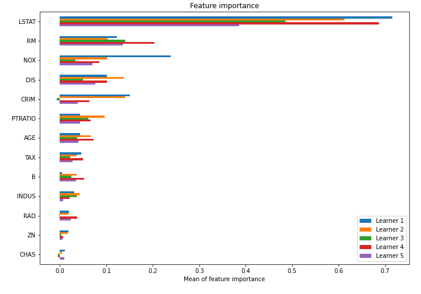

# Summary of model_53

## CatBoost
- **learning_rate**: 0.1
- **depth**: 8
- **rsm**: 1.0
- **l2_leaf_reg**: 7
- **loss_function**: MAE

## Validation
 - **validation_type**: kfold
 - **k_folds**: 5
 - **shuffle**: True

## Optimized metric
mse

## Training time

22.4 seconds

### Metric details:
| Metric   |     Score |
|:---------|----------:|
| MAE      |  2.4259   |
| MSE      | 15.8954   |
| RMSE     |  3.9869   |
| R2       |  0.810041 |

## Learning curves

## Permutation-based Importance
