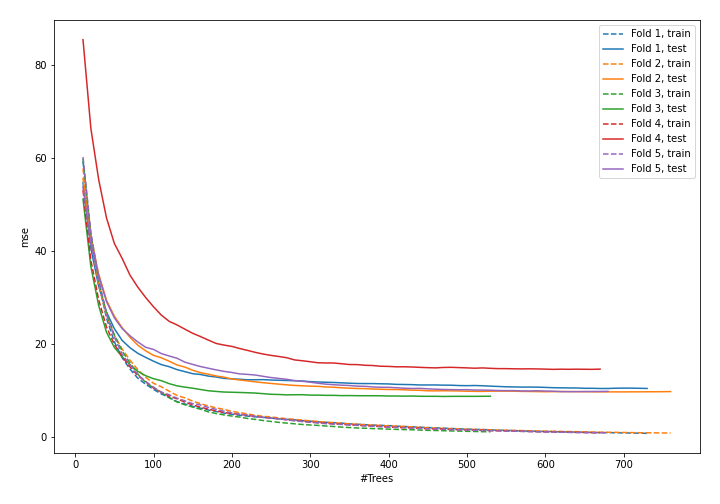
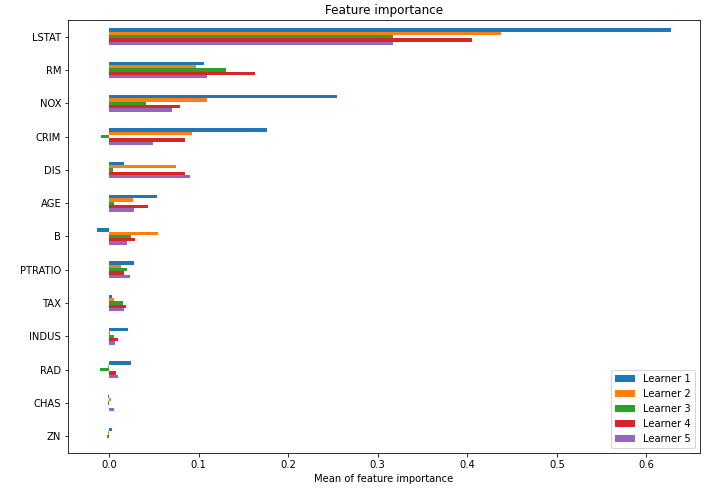

# Summary of model_56

## CatBoost
- **learning_rate**: 0.05
- **depth**: 5
- **rsm**: 0.9
- **l2_leaf_reg**: 5
- **loss_function**: RMSE

## Validation
 - **validation_type**: kfold
 - **k_folds**: 5
 - **shuffle**: True

## Optimized metric
mse

## Training time

20.5 seconds

### Metric details:
| Metric   |     Score |
|:---------|----------:|
| MAE      |  2.1668   |
| MSE      | 10.5529   |
| RMSE     |  3.24852  |
| R2       |  0.873887 |

## Learning curves

## Permutation-based Importance
