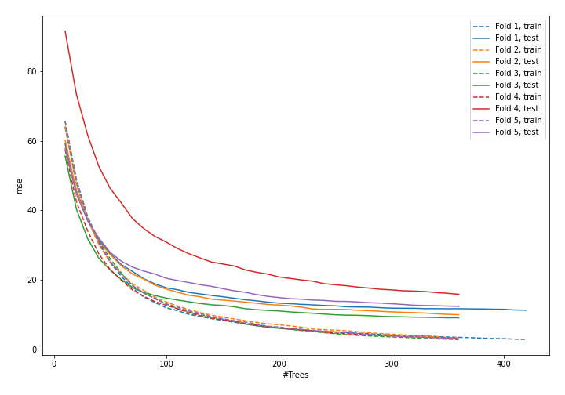
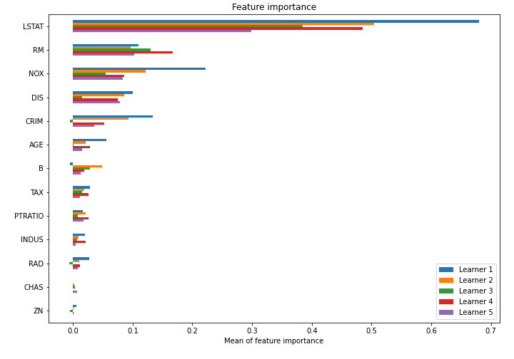

# Summary of model_60

## CatBoost
- **learning_rate**: 0.05
- **depth**: 6
- **rsm**: 0.7
- **l2_leaf_reg**: 10
- **loss_function**: RMSE

## Validation
 - **validation_type**: kfold
 - **k_folds**: 5
 - **shuffle**: True

## Optimized metric
mse

## Training time

43.6 seconds

### Metric details:
| Metric   |     Score |
|:---------|----------:|
| MAE      |  2.30895  |
| MSE      | 11.7153   |
| RMSE     |  3.42276  |
| R2       |  0.859996 |

## Learning curves

## Permutation-based Importance
