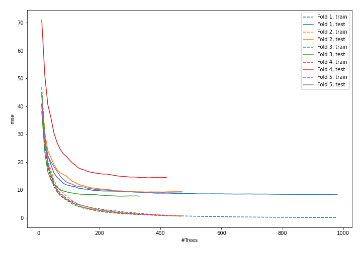
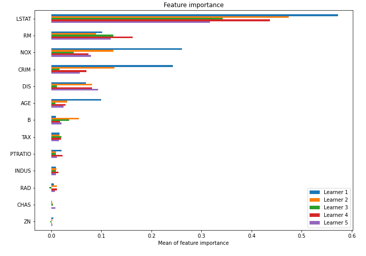

# Summary of model_80

## CatBoost
- **learning_rate**: 0.1
- **depth**: 5
- **rsm**: 0.5
- **l2_leaf_reg**: 7
- **loss_function**: RMSE

## Validation
 - **validation_type**: kfold
 - **k_folds**: 5
 - **shuffle**: True

## Optimized metric
mse

## Training time

12.0 seconds

### Metric details:
| Metric   |    Score |
|:---------|---------:|
| MAE      | 2.12175  |
| MSE      | 9.74477  |
| RMSE     | 3.12166  |
| R2       | 0.883544 |

## Learning curves

## Permutation-based Importance
