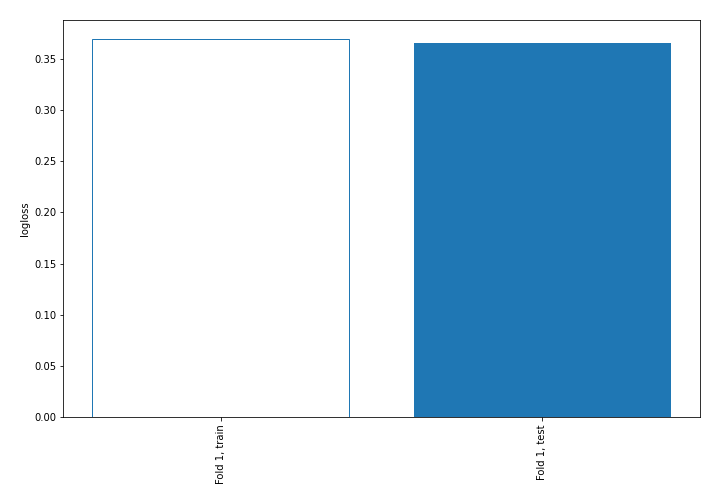
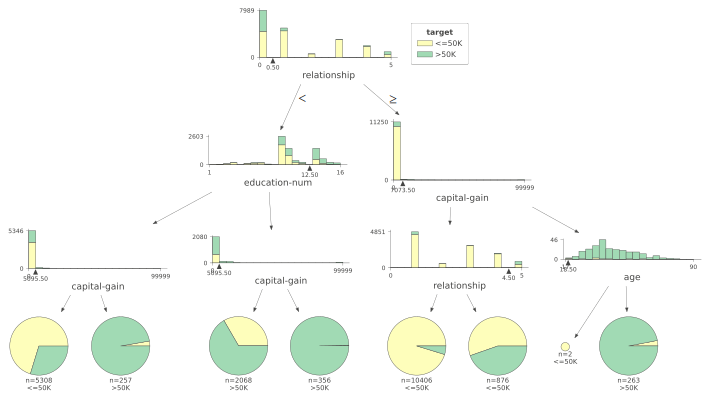
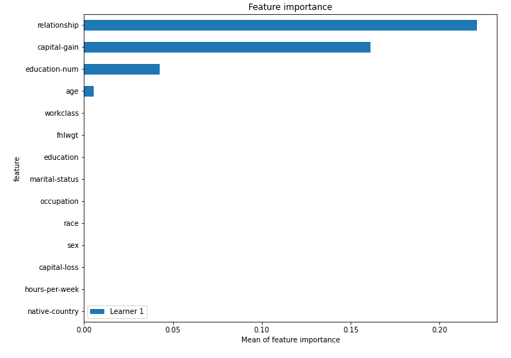
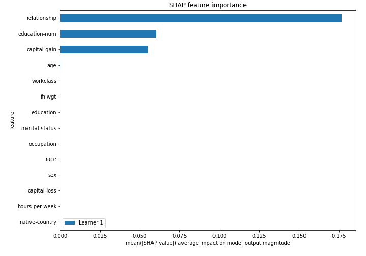
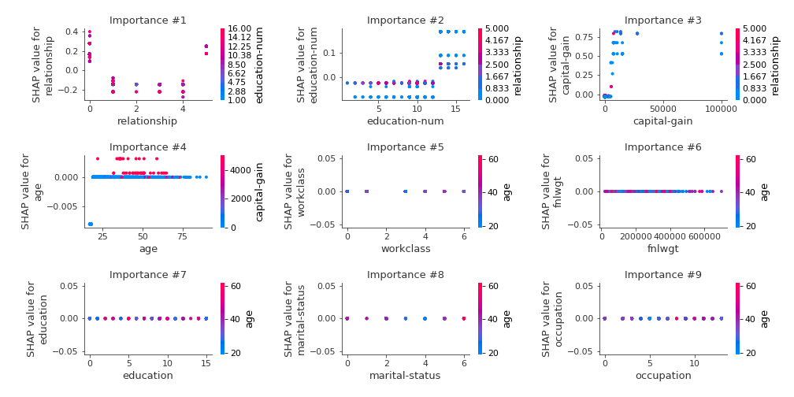
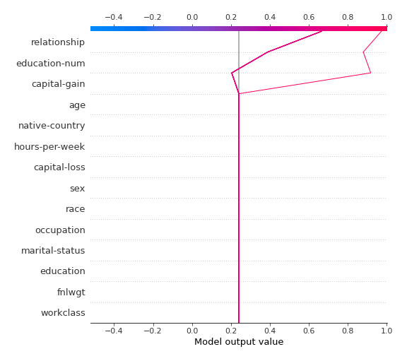
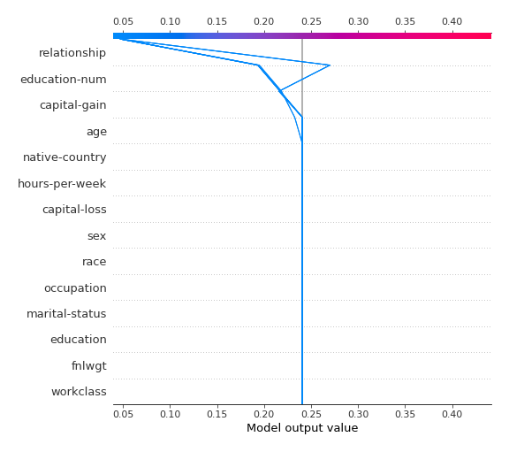
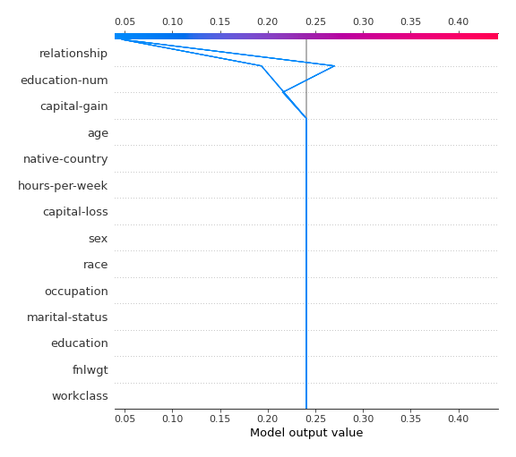
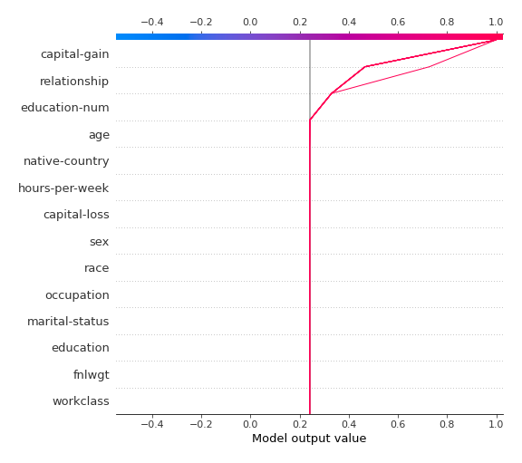

# Summary of 2_DecisionTree

## Decision Tree
- **criterion**: gini
- **max_depth**: 3
- **explain_level**: 2

## Validation
 - **validation_type**: split
 - **train_ratio**: 0.75
 - **shuffle**: True
 - **stratify**: True

## Optimized metric
logloss

## Training time

10.3 seconds

## Metric details
|           |    score |   threshold |
|:----------|---------:|------------:|
| logloss   | 0.365591 | nan         |
| auc       | 0.848303 | nan         |
| f1        | 0.62168  |   0.297476  |
| accuracy  | 0.844748 |   0.633529  |
| precision | 0.987421 |   0.831768  |
| recall    | 1        |   0.0427254 |
| mcc       | 0.533833 |   0.633529  |

## Confusion matrix (at threshold=0.297476)
|                     |   Predicted as negative |   Predicted as positive |
|:--------------------|------------------------:|------------------------:|
| Labeled as negative |                    4592 |                     352 |
| Labeled as positive |                     702 |                     866 |

## Learning curves

## Tree visualizations

### Tree #1

## Permutation-based Importance

## SHAP Importance

## SHAP Dependence plots

### Dependence (Fold #1)

## SHAP Decision plots

### Top-10 Worst decisions for class 0 (Fold #1)

### Top-10 Best decisions for class 0 (Fold #1)

### Top-10 Worst decisions for class 1 (Fold #1)

### Top-10 Best decisions for class 1 (Fold #1)
