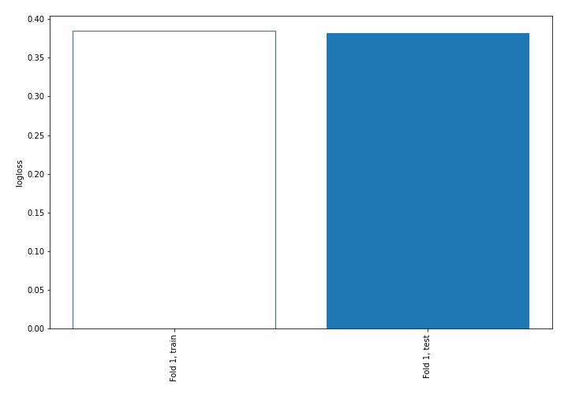
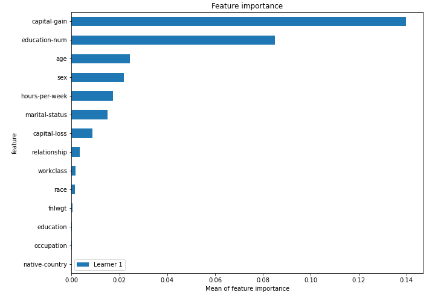
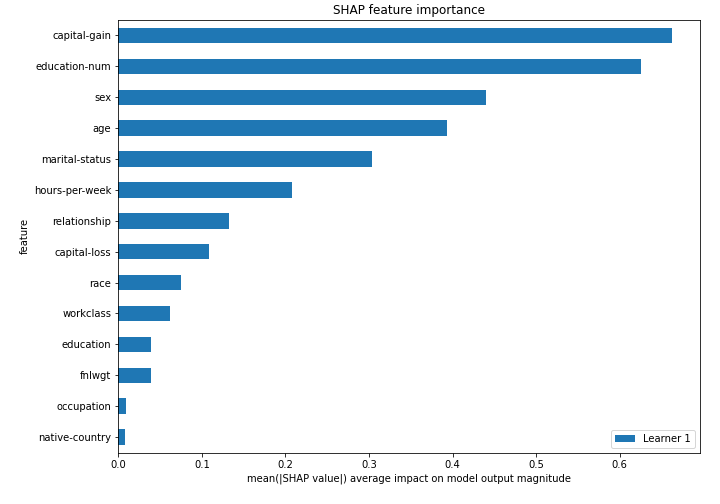
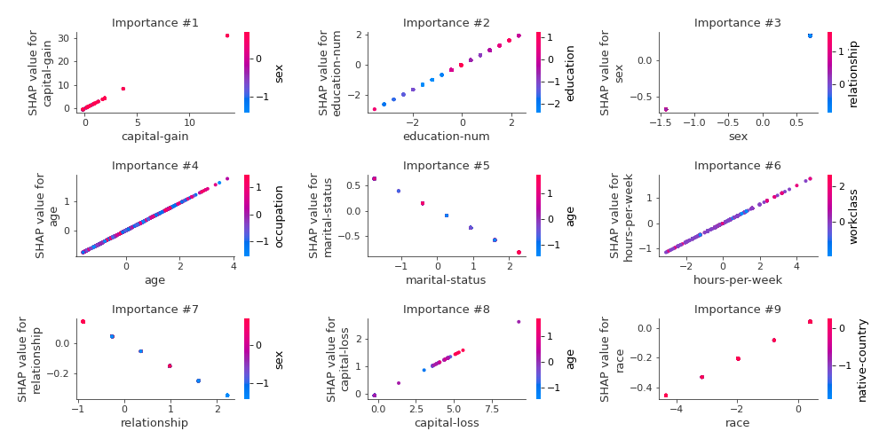
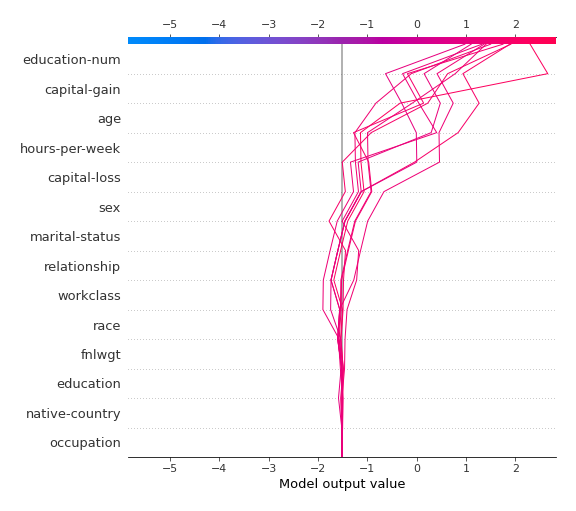
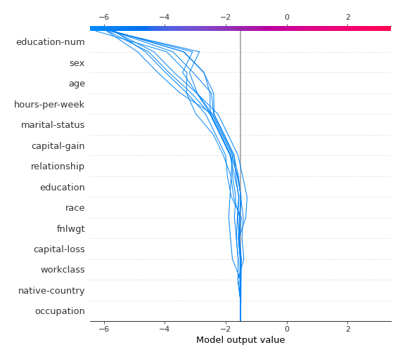
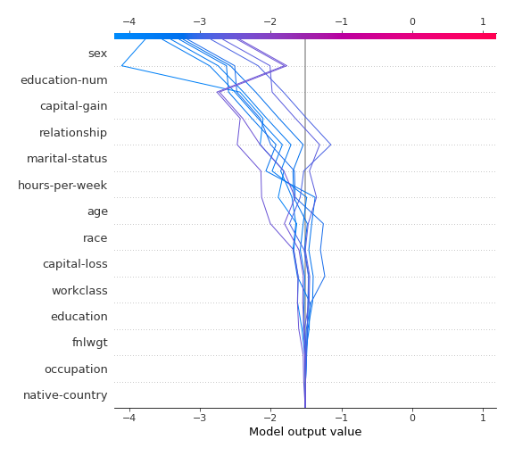
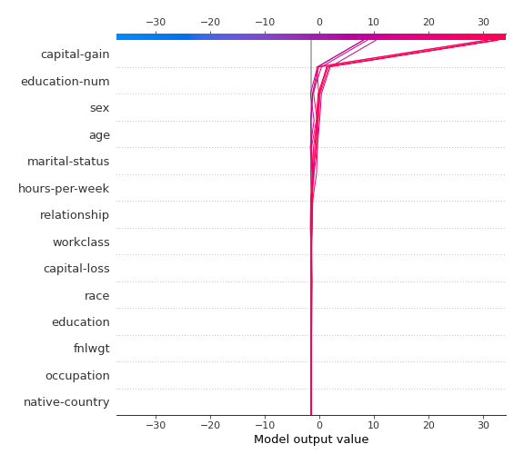

# Summary of 3_Linear

## Logistic Regression (Linear)
- **explain_level**: 2

## Validation
 - **validation_type**: split
 - **train_ratio**: 0.75
 - **shuffle**: True
 - **stratify**: True

## Optimized metric
logloss

## Training time

3.2 seconds

## Metric details
|           |    score |     threshold |
|:----------|---------:|--------------:|
| logloss   | 0.381399 | nan           |
| auc       | 0.857771 | nan           |
| f1        | 0.636203 |   0.309388    |
| accuracy  | 0.827396 |   0.40705     |
| precision | 0.915033 |   0.819295    |
| recall    | 1        |   0.000610889 |
| mcc       | 0.514338 |   0.335185    |

## Confusion matrix (at threshold=0.309388)
|                     |   Predicted as negative |   Predicted as positive |
|:--------------------|------------------------:|------------------------:|
| Labeled as negative |                    4199 |                     745 |
| Labeled as positive |                     489 |                    1079 |

## Learning curves

## Coefficients
| feature        |   Learner_1 |
|:---------------|------------:|
| capital-gain   |  2.28219    |
| education-num  |  0.843846   |
| age            |  0.468591   |
| sex            |  0.468299   |
| hours-per-week |  0.369091   |
| capital-loss   |  0.279562   |
| race           |  0.104163   |
| education      |  0.0546121  |
| fnlwgt         |  0.0545988  |
| native-country |  0.0173909  |
| occupation     | -0.00958272 |
| workclass      | -0.102386   |
| relationship   | -0.154081   |
| marital-status | -0.358737   |
| intercept      | -1.51172    |

## Permutation-based Importance

## SHAP Importance

## SHAP Dependence plots

### Dependence (Fold #1)

## SHAP Decision plots

### Top-10 Worst decisions for class 0 (Fold #1)

### Top-10 Best decisions for class 0 (Fold #1)

### Top-10 Worst decisions for class 1 (Fold #1)

### Top-10 Best decisions for class 1 (Fold #1)
