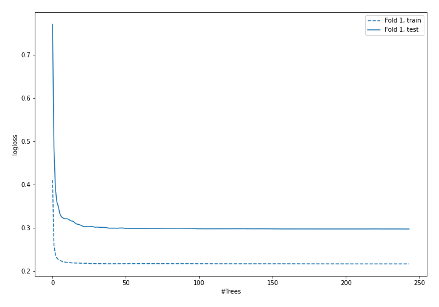
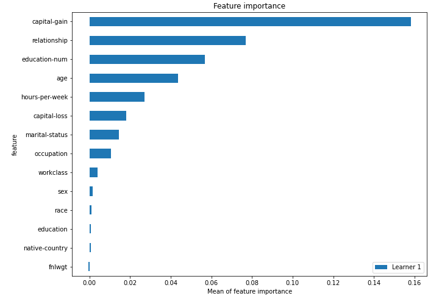
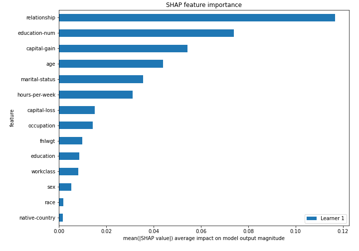
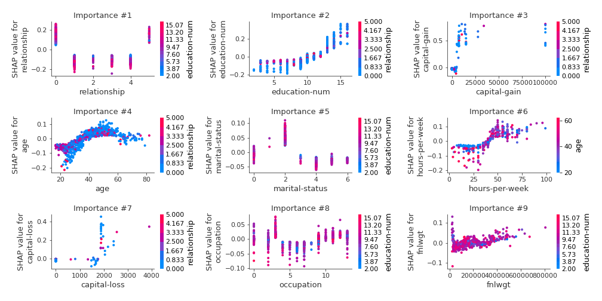
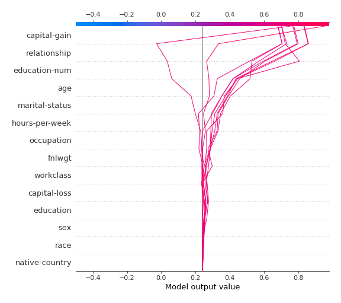
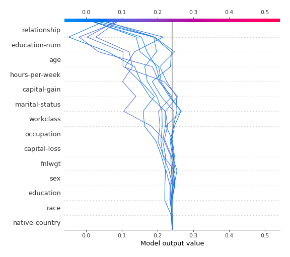
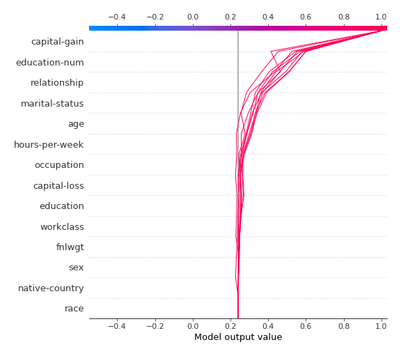

# Summary of 4_Default_RandomForest

## Random Forest
- **criterion**: gini
- **max_features**: 0.6
- **min_samples_split**: 30
- **explain_level**: 2

## Validation
 - **validation_type**: split
 - **train_ratio**: 0.75
 - **shuffle**: True
 - **stratify**: True

## Optimized metric
logloss

## Training time

79.2 seconds

## Metric details
|           |    score |   threshold |
|:----------|---------:|------------:|
| logloss   | 0.29752  |  nan        |
| auc       | 0.916416 |  nan        |
| f1        | 0.719394 |    0.366086 |
| accuracy  | 0.8664   |    0.464378 |
| precision | 0.970954 |    0.823953 |
| recall    | 1        |    0        |
| mcc       | 0.625866 |    0.366086 |

## Confusion matrix (at threshold=0.366086)
|                     |   Predicted as negative |   Predicted as positive |
|:--------------------|------------------------:|------------------------:|
| Labeled as negative |                    4399 |                     545 |
| Labeled as positive |                     381 |                    1187 |

## Learning curves

## Permutation-based Importance

## SHAP Importance

## SHAP Dependence plots

### Dependence (Fold #1)

## SHAP Decision plots

### Top-10 Worst decisions for class 0 (Fold #1)

### Top-10 Best decisions for class 0 (Fold #1)

### Top-10 Worst decisions for class 1 (Fold #1)

### Top-10 Best decisions for class 1 (Fold #1)
