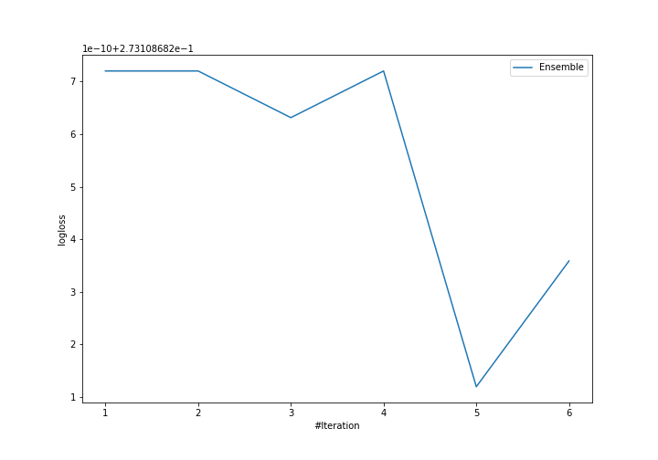

# Summary of Ensemble

## Ensemble structure
| Model             |   Weight |
|:------------------|---------:|
| 5_Default_Xgboost |        5 |

## Metric details
|           |    score |     threshold |
|:----------|---------:|--------------:|
| logloss   | 0.273109 | nan           |
| auc       | 0.931203 | nan           |
| f1        | 0.738846 |   0.382176    |
| accuracy  | 0.877611 |   0.473314    |
| precision | 0.983229 |   0.858185    |
| recall    | 1        |   9.98914e-05 |
| mcc       | 0.655066 |   0.418355    |

## Confusion matrix (at threshold=0.382176)
|                     |   Predicted as negative |   Predicted as positive |
|:--------------------|------------------------:|------------------------:|
| Labeled as negative |                    4491 |                     453 |
| Labeled as positive |                     384 |                    1184 |

## Learning curves
