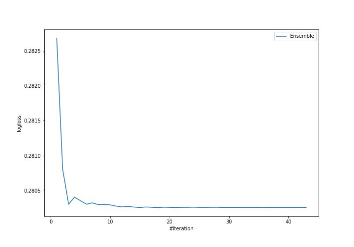

# Summary of ensemble

## Ensemble structure
| Model    |   Weight |
|:---------|---------:|
| model_34 |        2 |
| model_36 |       12 |
| model_44 |       10 |
| model_49 |        2 |
| model_52 |       10 |

## Metric details
|           |    score |     threshold |
|:----------|---------:|--------------:|
| logloss   | 0.280257 | nan           |
| auc       | 0.927737 | nan           |
| f1        | 0.729393 |   0.403047    |
| accuracy  | 0.871545 |   0.462996    |
| precision | 0.971341 |   0.839126    |
| recall    | 1        |   0.000169696 |
| mcc       | 0.643356 |   0.432272    |

## Confusion matrix (at threshold=0.403047)
|                     |   Predicted as negative |   Predicted as positive |
|:--------------------|------------------------:|------------------------:|
| Labeled as negative |                   17932 |                    1816 |
| Labeled as positive |                    1641 |                    4659 |

## Learning curves
