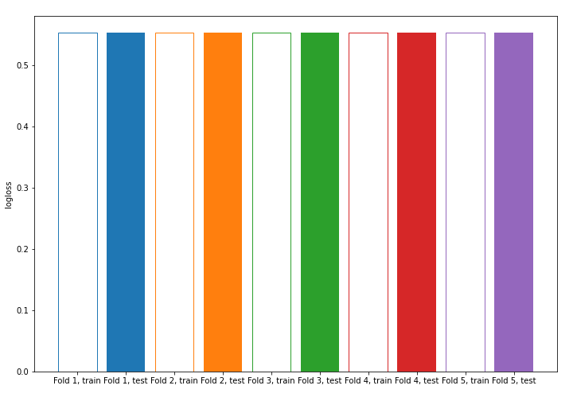

# Summary of model_1

## Baseline Classifier (Baseline)

## Validation
 - **validation_type**: kfold
 - **k_folds**: 5
 - **shuffle**: True
 - **stratify**: True

## Optimized metric
logloss

## Training time

0.6 seconds

## Metric details
|           |    score |   threshold |
|:----------|---------:|------------:|
| logloss   | 0.553216 |  nan        |
| auc       | 0.49997  |  nan        |
| f1        | 0.389514 |    0.217669 |
| accuracy  | 0.241861 |    0.217669 |
| precision | 0.241861 |    0.217669 |
| recall    | 1        |    0.217669 |
| mcc       | 0        |    0.217669 |

## Confusion matrix (at threshold=0.217669)
|                     |   Predicted as negative |   Predicted as positive |
|:--------------------|------------------------:|------------------------:|
| Labeled as negative |                       0 |                   19748 |
| Labeled as positive |                       0 |                    6300 |

## Learning curves
