# Summary of model_2

## Logistic Regression (Linear)

## Validation
 - **validation_type**: kfold
 - **k_folds**: 5
 - **shuffle**: True
 - **stratify**: True

## Optimized metric
logloss

## Training time

16.9 seconds

## Metric details
|           |    score |     threshold |
|:----------|---------:|--------------:|
| logloss   | 0.386093 | nan           |
| auc       | 0.852742 | nan           |
| f1        | 0.626499 |   0.284165    |
| accuracy  | 0.824324 |   0.462329    |
| precision | 0.850425 |   0.697552    |
| recall    | 1        |   0.000622306 |
| mcc       | 0.495699 |   0.303696    |

## Confusion matrix (at threshold=0.284165)
|                     |   Predicted as negative |   Predicted as positive |
|:--------------------|------------------------:|------------------------:|
| Labeled as negative |                   16200 |                    3548 |
| Labeled as positive |                    1808 |                    4492 |

## Learning curves
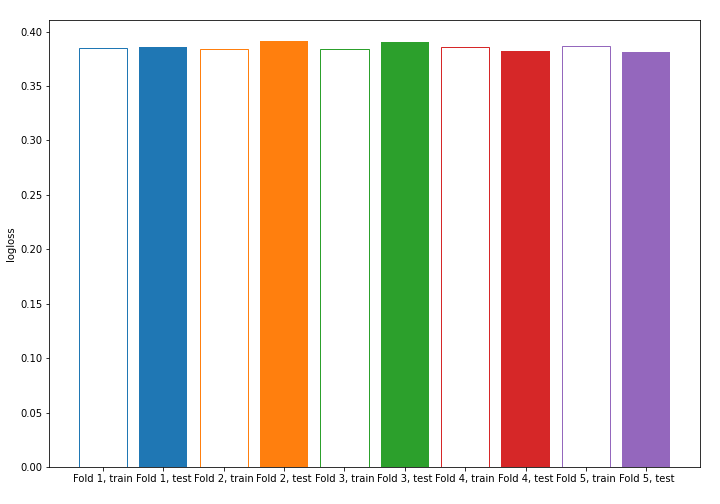

## Coefficients
| feature        |   Learner_1 |    Learner_2 |   Learner_3 |   Learner_4 |   Learner_5 |
|:---------------|------------:|-------------:|------------:|------------:|------------:|
| capital-gain   |  2.35528    |  2.33897     |   2.27469   |  2.23033    |   2.32843   |
| education-num  |  0.857647   |  0.856451    |   0.844171  |  0.853011   |   0.834431  |
| age            |  0.440939   |  0.447326    |   0.472093  |  0.476542   |   0.460026  |
| sex            |  0.420643   |  0.425026    |   0.407316  |  0.430091   |   0.435536  |
| hours-per-week |  0.374141   |  0.353407    |   0.396806  |  0.36961    |   0.37911   |
| capital-loss   |  0.269847   |  0.274448    |   0.279421  |  0.26233    |   0.275825  |
| race           |  0.116648   |  0.112212    |   0.117218  |  0.12879    |   0.122555  |
| education      |  0.0596242  |  0.0600039   |   0.0386951 |  0.0657353  |   0.078314  |
| fnlwgt         |  0.0499316  |  0.0532878   |   0.0653491 |  0.0447831  |   0.048418  |
| native-country |  0.00125862 | -0.000485777 |   0.0160693 |  0.00979267 |   0.04034   |
| occupation     |  0.00348801 | -0.0272141   |  -0.0403305 |  0.00302978 |  -0.050494  |
| workclass      | -0.0926335  | -0.0818883   |  -0.082006  | -0.0869455  |  -0.0876063 |
| relationship   | -0.210874   | -0.210254    |  -0.225903  | -0.194624   |  -0.200095  |
| marital-status | -0.346069   | -0.380293    |  -0.342393  | -0.343765   |  -0.351256  |
| intercept      | -1.49128    | -1.50214     |  -1.51244   | -1.50639    |  -1.49896   |

## Permutation-based Importance
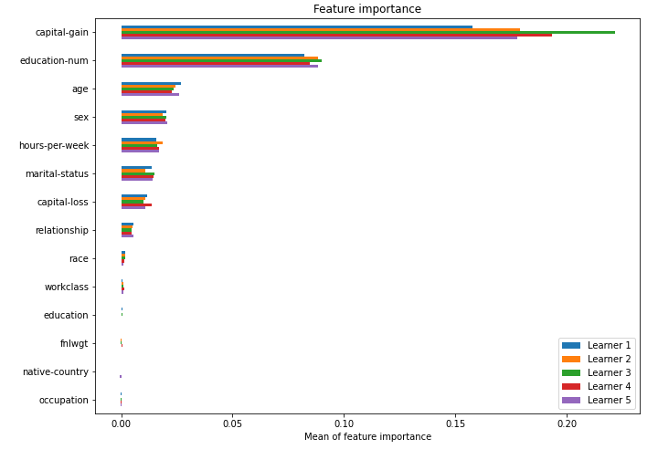

## SHAP Importance
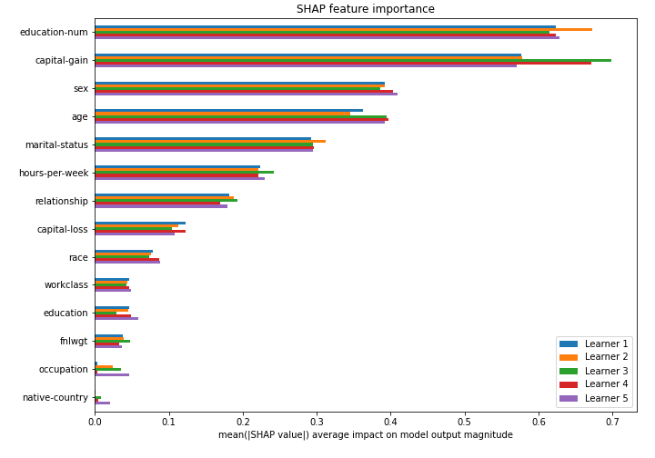

## SHAP Dependence plots

### Dependence (Fold #1)
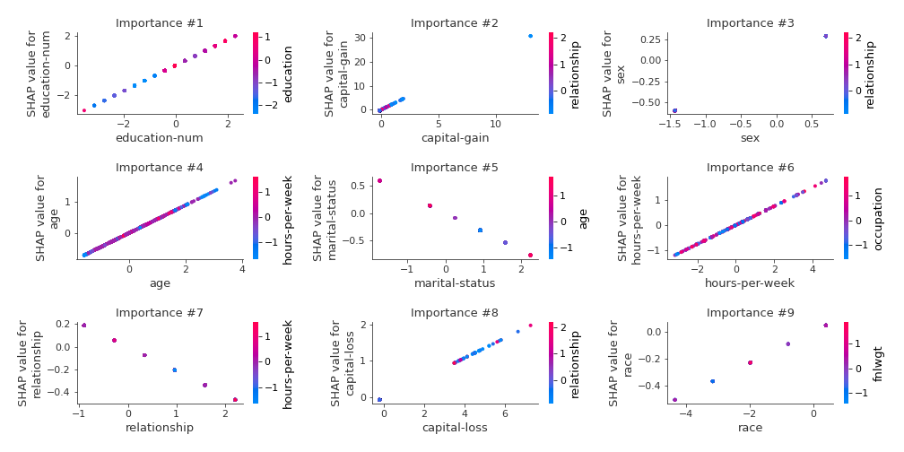
### Dependence (Fold #2)

### Dependence (Fold #3)
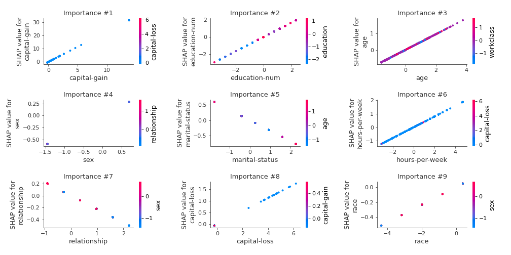
### Dependence (Fold #4)
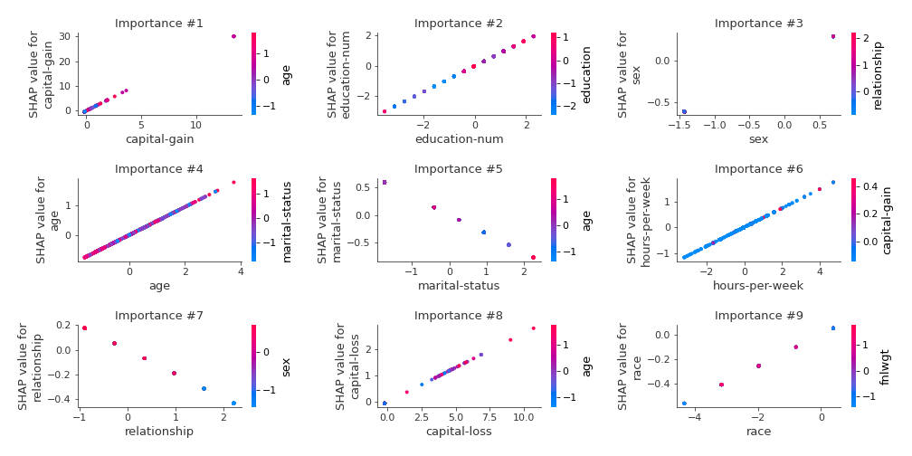
### Dependence (Fold #5)
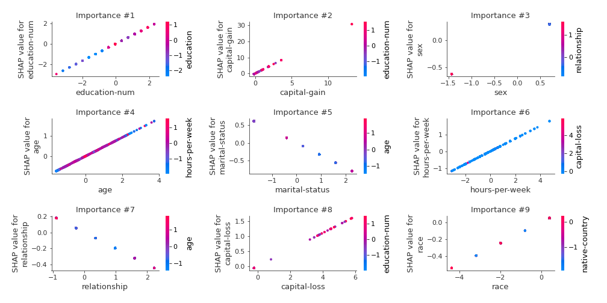

## SHAP Decision plots

### Top-10 Worst decisions for class 0 (Fold #1)
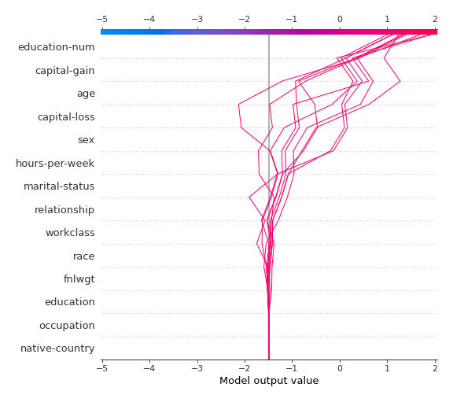
### Top-10 Worst decisions for class 0 (Fold #2)

### Top-10 Worst decisions for class 0 (Fold #3)
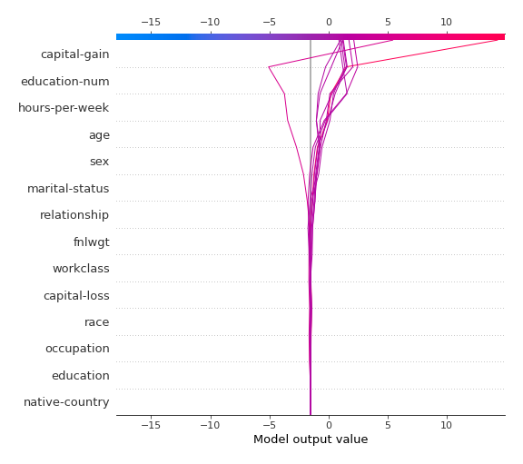
### Top-10 Worst decisions for class 0 (Fold #4)
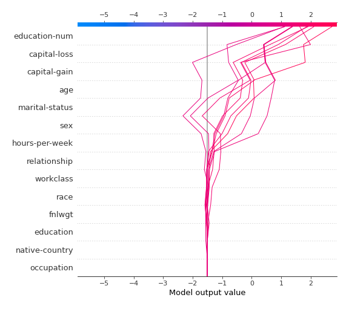
### Top-10 Worst decisions for class 0 (Fold #5)
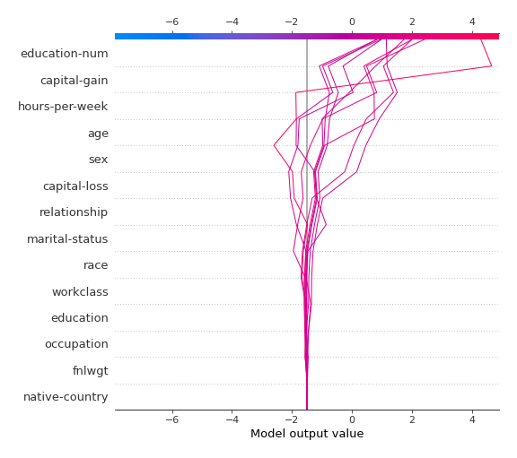
### Top-10 Best decisions for class 0 (Fold #1)
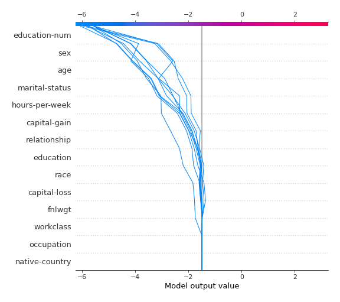
### Top-10 Best decisions for class 0 (Fold #2)
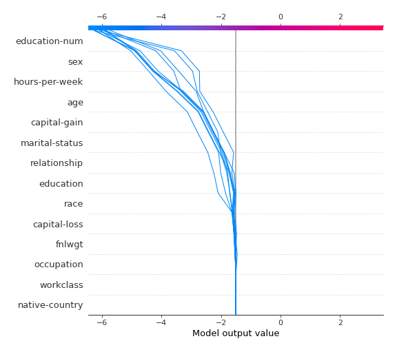
### Top-10 Best decisions for class 0 (Fold #3)
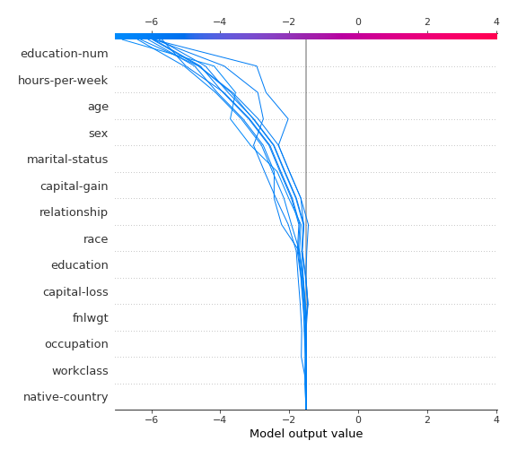
### Top-10 Best decisions for class 0 (Fold #4)
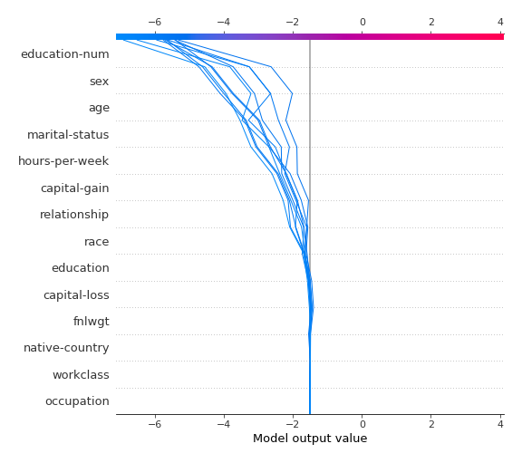
### Top-10 Best decisions for class 0 (Fold #5)
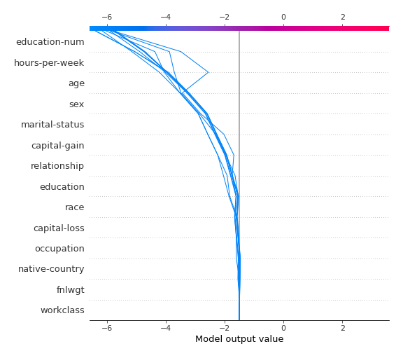
### Top-10 Worst decisions for class 1 (Fold #1)
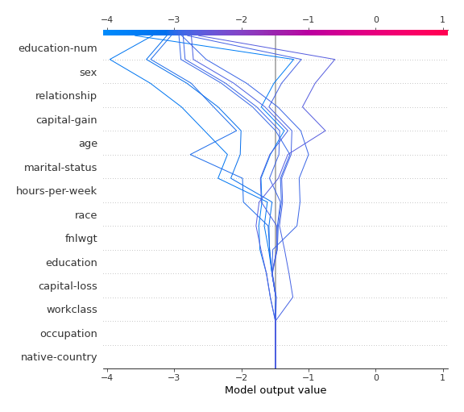
### Top-10 Worst decisions for class 1 (Fold #2)
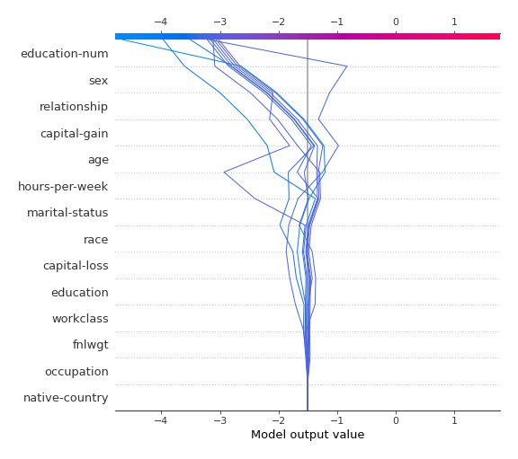
### Top-10 Worst decisions for class 1 (Fold #3)

### Top-10 Worst decisions for class 1 (Fold #4)
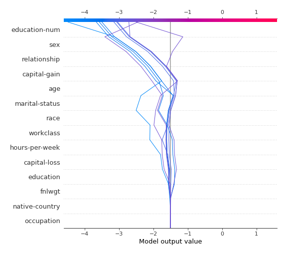
### Top-10 Worst decisions for class 1 (Fold #5)
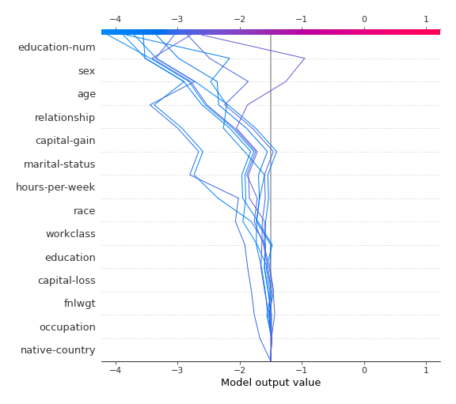
### Top-10 Best decisions for class 1 (Fold #1)
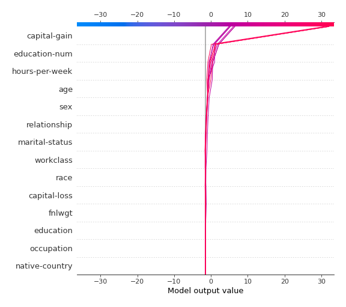
### Top-10 Best decisions for class 1 (Fold #2)
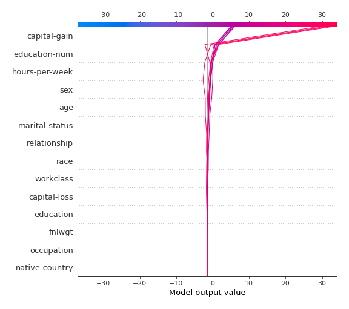
### Top-10 Best decisions for class 1 (Fold #3)
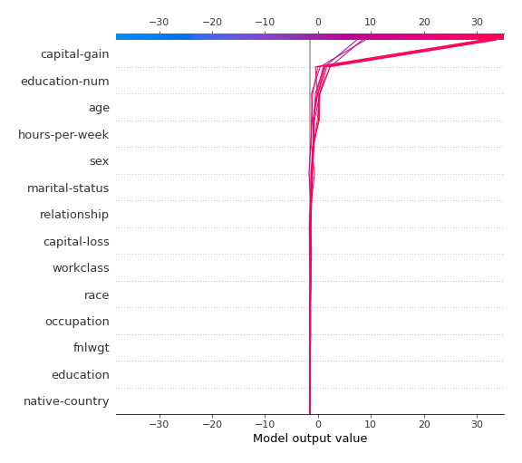
### Top-10 Best decisions for class 1 (Fold #4)
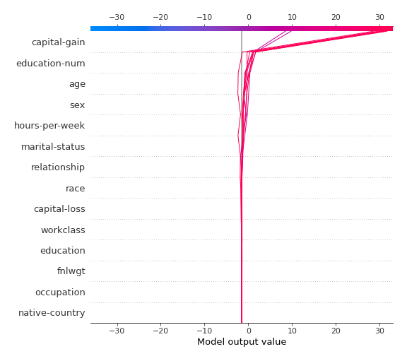
### Top-10 Best decisions for class 1 (Fold #5)
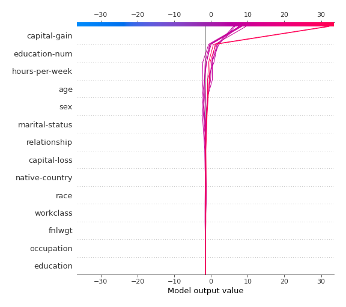