# Summary of model_24

## Extra Trees Classifier (Extra Trees)
- **criterion**: gini
- **max_features**: 0.3
- **min_samples_split**: 4
- **min_samples_leaf**: 3

## Validation
 - **validation_type**: kfold
 - **k_folds**: 5
 - **shuffle**: True
 - **stratify**: True

## Optimized metric
logloss

## Training time

758.4 seconds

## Metric details
|           |    score |   threshold |
|:----------|---------:|------------:|
| logloss   | 0.316764 |  nan        |
| auc       | 0.909596 |  nan        |
| f1        | 0.702682 |    0.380605 |
| accuracy  | 0.857225 |    0.483765 |
| precision | 0.93498  |    0.778295 |
| recall    | 1        |    0        |
| mcc       | 0.602594 |    0.380605 |

## Confusion matrix (at threshold=0.380605)
|                     |   Predicted as negative |   Predicted as positive |
|:--------------------|------------------------:|------------------------:|
| Labeled as negative |                   17415 |                    2333 |
| Labeled as positive |                    1624 |                    4676 |

## Learning curves
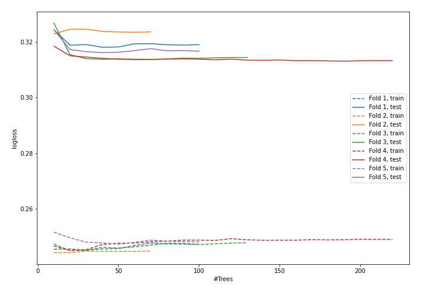

## Permutation-based Importance
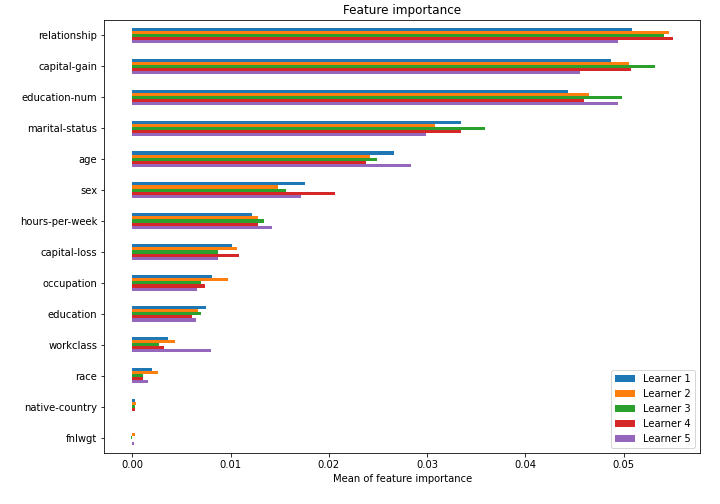

## SHAP Importance
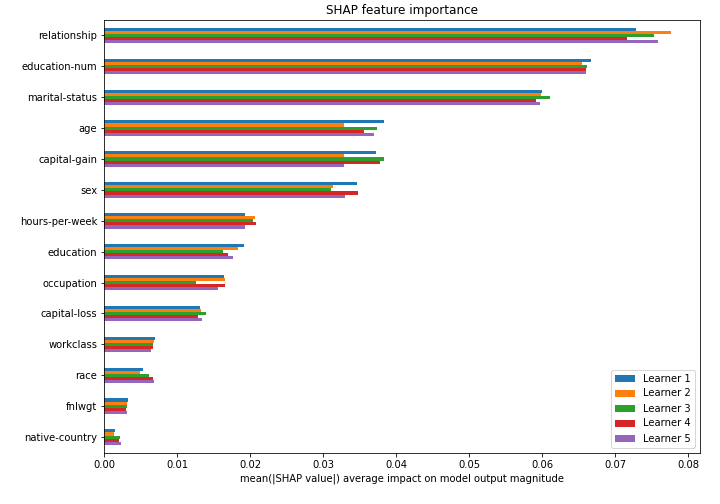

## SHAP Dependence plots

### Dependence (Fold #1)
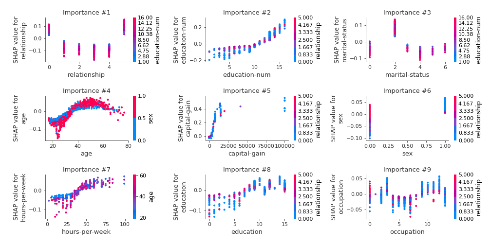
### Dependence (Fold #2)
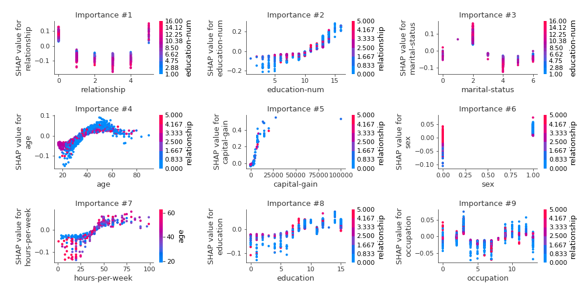
### Dependence (Fold #3)
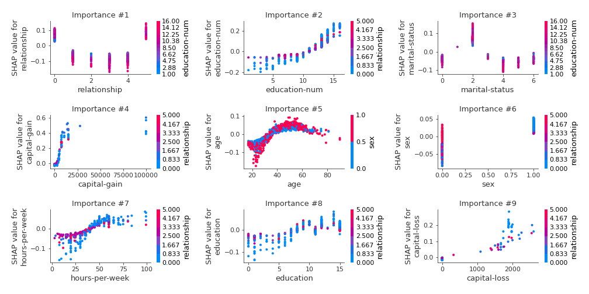
### Dependence (Fold #4)
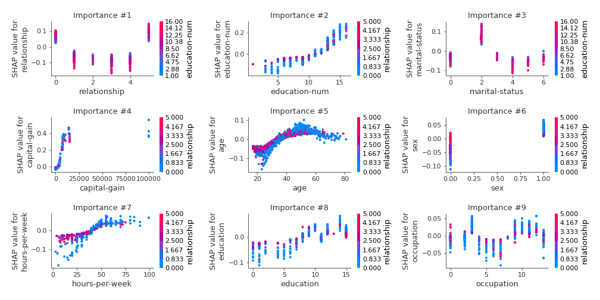
### Dependence (Fold #5)
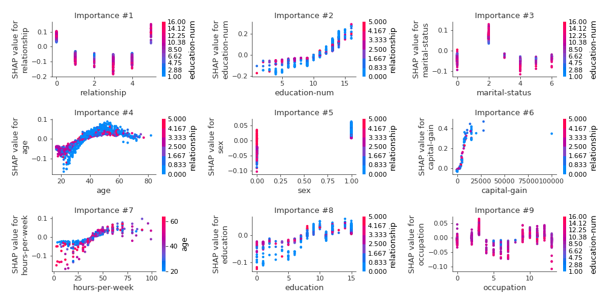

## SHAP Decision plots

### Top-10 Worst decisions for class 0 (Fold #1)
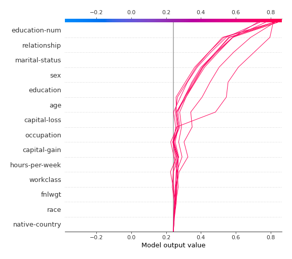
### Top-10 Worst decisions for class 0 (Fold #2)
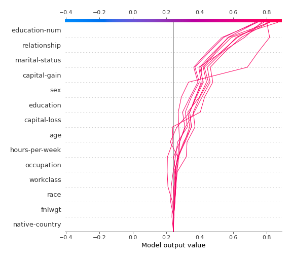
### Top-10 Worst decisions for class 0 (Fold #3)
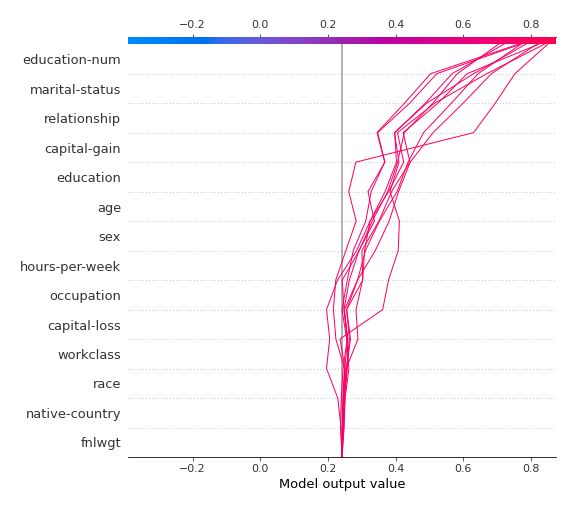
### Top-10 Worst decisions for class 0 (Fold #4)
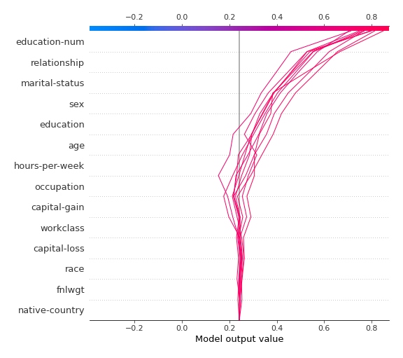
### Top-10 Worst decisions for class 0 (Fold #5)
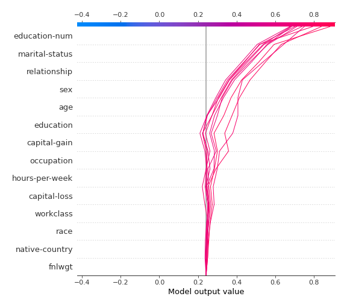
### Top-10 Best decisions for class 0 (Fold #1)
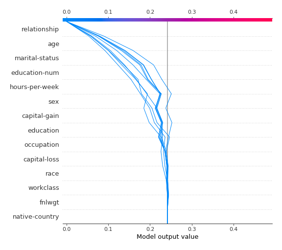
### Top-10 Best decisions for class 0 (Fold #2)
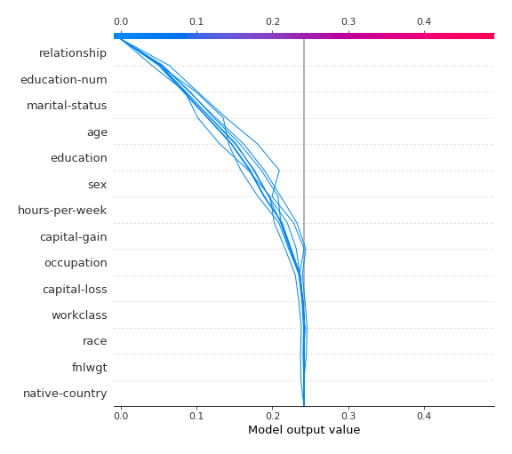
### Top-10 Best decisions for class 0 (Fold #3)
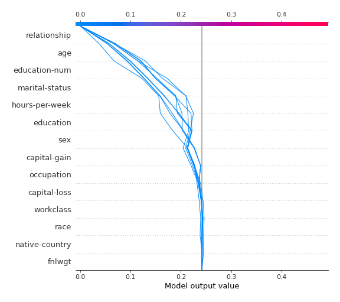
### Top-10 Best decisions for class 0 (Fold #4)
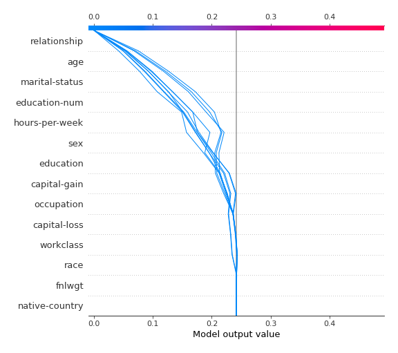
### Top-10 Best decisions for class 0 (Fold #5)
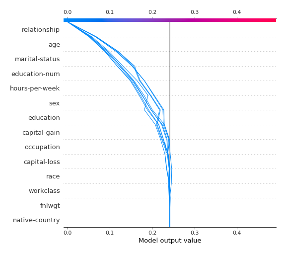
### Top-10 Worst decisions for class 1 (Fold #1)
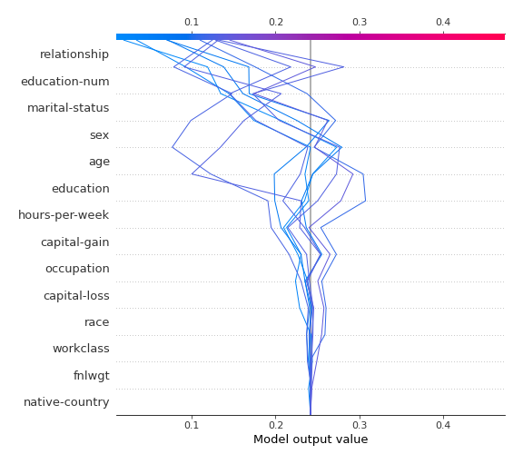
### Top-10 Worst decisions for class 1 (Fold #2)
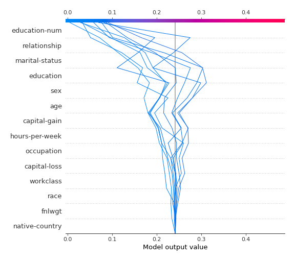
### Top-10 Worst decisions for class 1 (Fold #3)
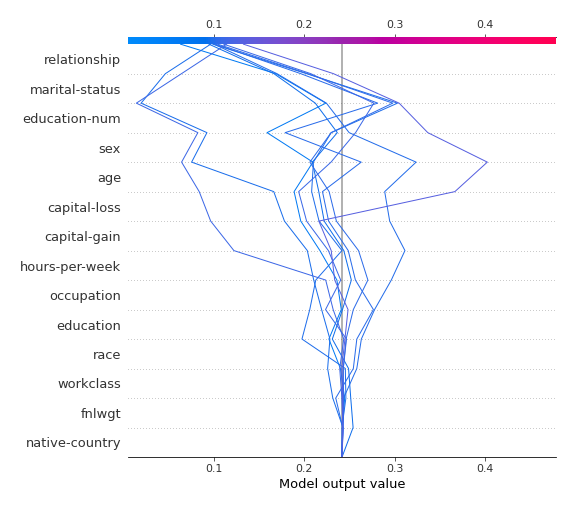
### Top-10 Worst decisions for class 1 (Fold #4)
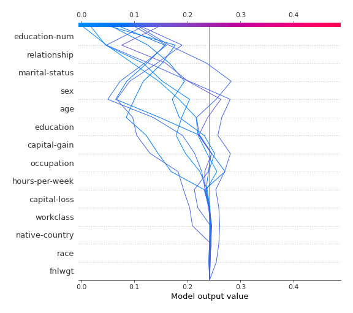
### Top-10 Worst decisions for class 1 (Fold #5)
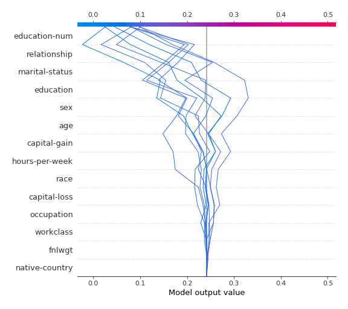
### Top-10 Best decisions for class 1 (Fold #1)
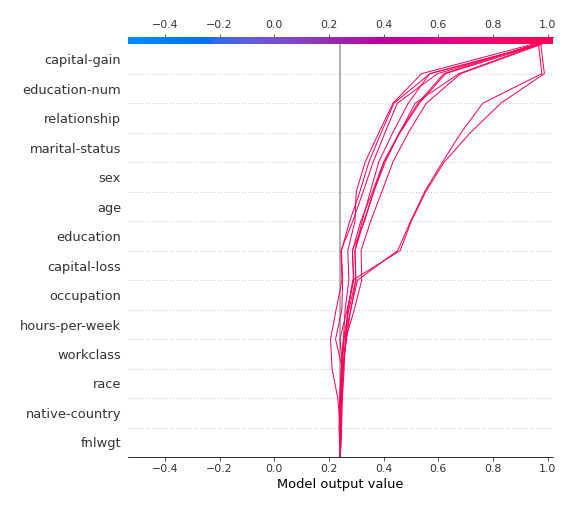
### Top-10 Best decisions for class 1 (Fold #2)

### Top-10 Best decisions for class 1 (Fold #3)
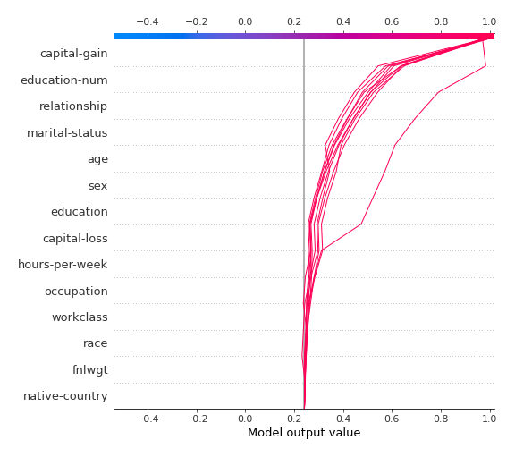
### Top-10 Best decisions for class 1 (Fold #4)
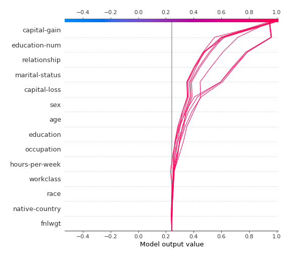
### Top-10 Best decisions for class 1 (Fold #5)
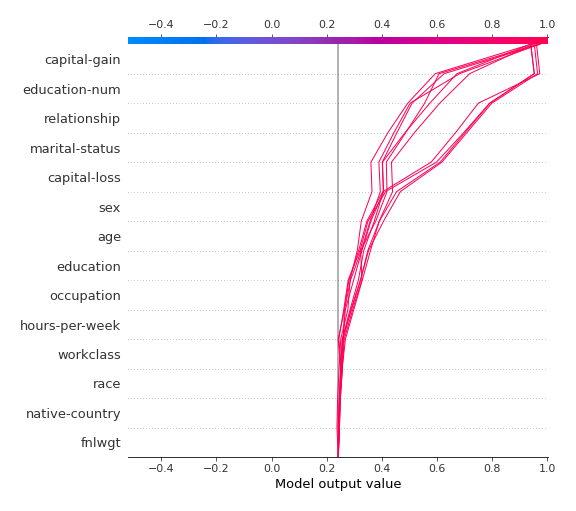