# Summary of model_29

## LightGBM
- **objective**: binary
- **metric**: binary_logloss
- **num_leaves**: 256
- **learning_rate**: 0.025
- **feature_fraction**: 0.5
- **bagging_fraction**: 0.3
- **bagging_freq**: 0

## Validation
 - **validation_type**: kfold
 - **k_folds**: 5
 - **shuffle**: True
 - **stratify**: True

## Optimized metric
logloss

## Training time

76.8 seconds

## Metric details
|           |    score |   threshold |
|:----------|---------:|------------:|
| logloss   | 0.31711  | nan         |
| auc       | 0.916058 | nan         |
| f1        | 0.711205 |   0.351201  |
| accuracy  | 0.861678 |   0.42447   |
| precision | 0.966015 |   0.799836  |
| recall    | 1        |   0.0142055 |
| mcc       | 0.615456 |   0.392446  |

## Confusion matrix (at threshold=0.351201)
|                     |   Predicted as negative |   Predicted as positive |
|:--------------------|------------------------:|------------------------:|
| Labeled as negative |                   17502 |                    2246 |
| Labeled as positive |                    1584 |                    4716 |

## Learning curves
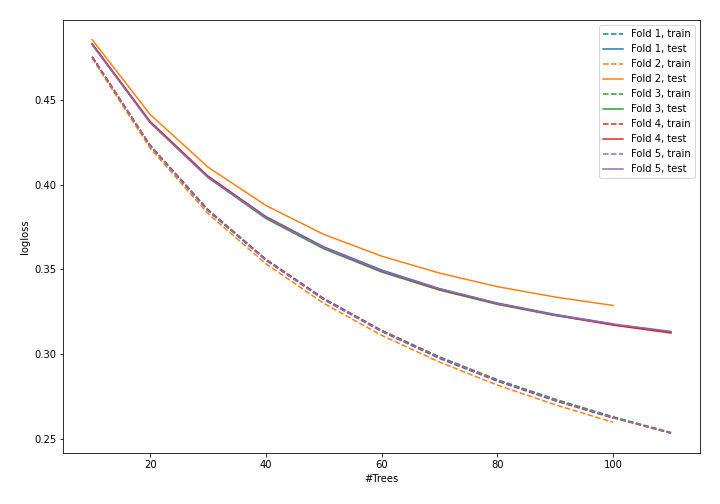

## Permutation-based Importance
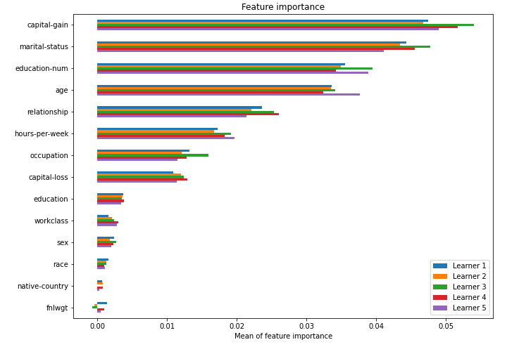

## SHAP Importance
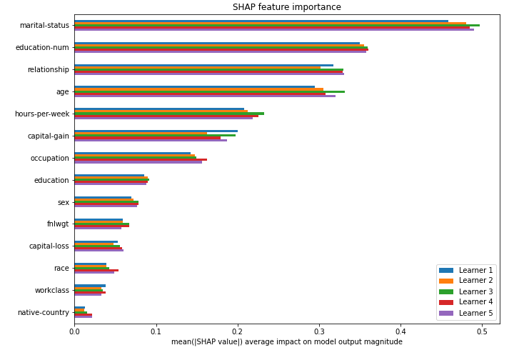

## SHAP Dependence plots

### Dependence (Fold #1)
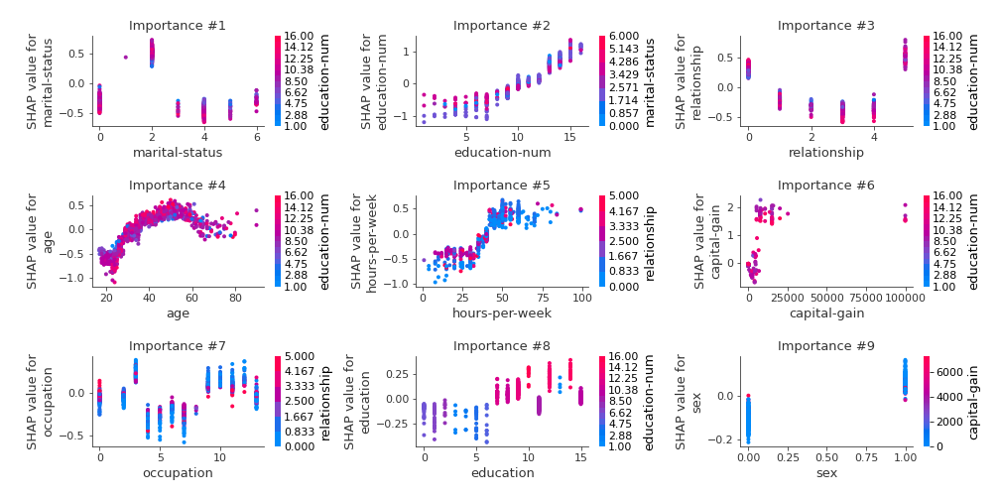
### Dependence (Fold #2)
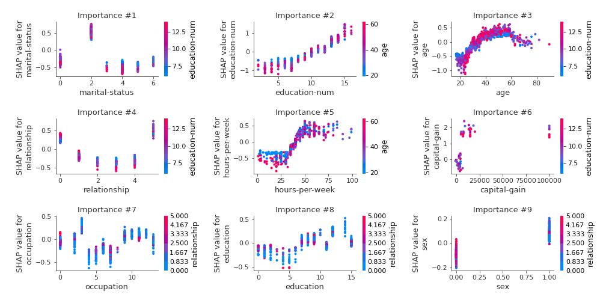
### Dependence (Fold #3)
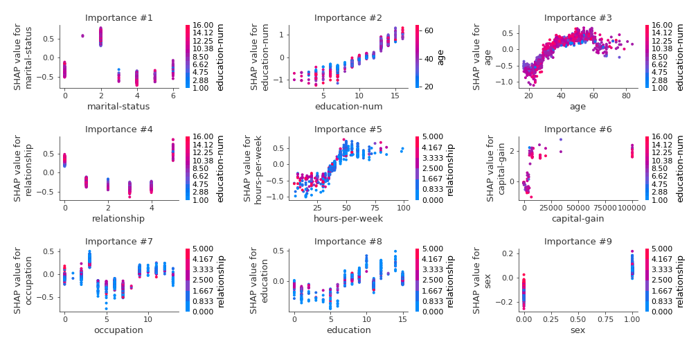
### Dependence (Fold #4)
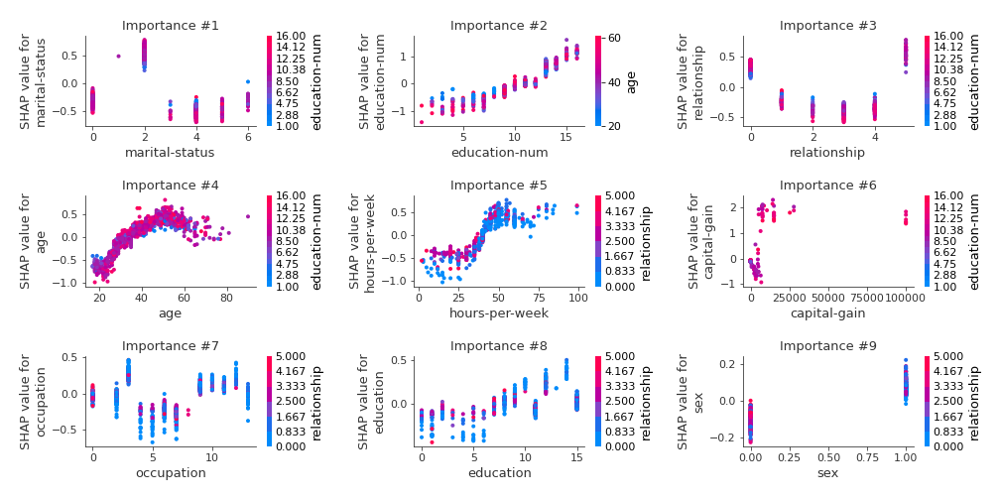
### Dependence (Fold #5)
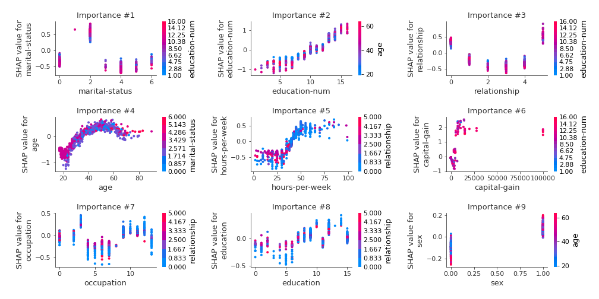

## SHAP Decision plots

### Top-10 Worst decisions for class 0 (Fold #1)
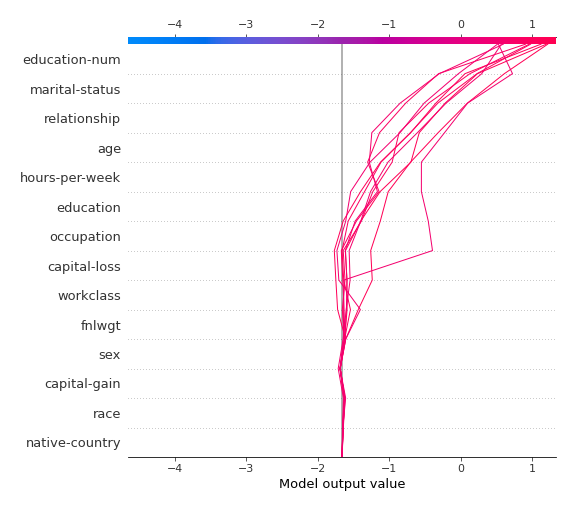
### Top-10 Worst decisions for class 0 (Fold #2)
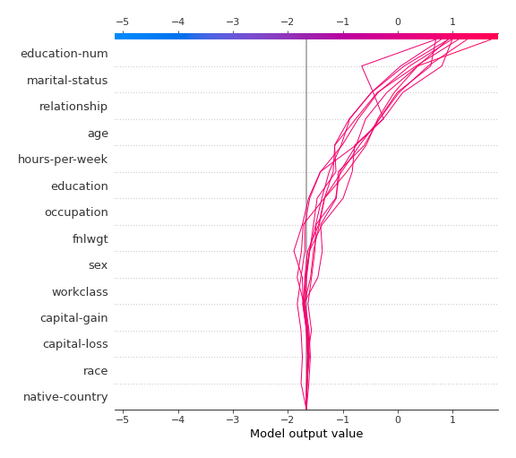
### Top-10 Worst decisions for class 0 (Fold #3)
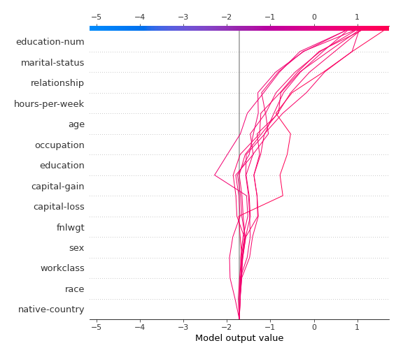
### Top-10 Worst decisions for class 0 (Fold #4)
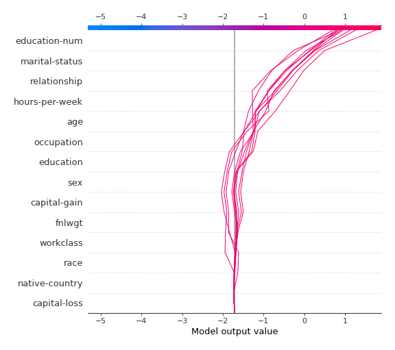
### Top-10 Worst decisions for class 0 (Fold #5)
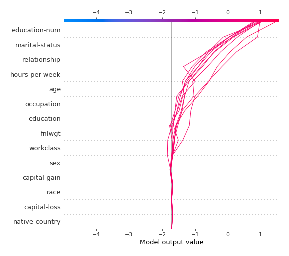
### Top-10 Best decisions for class 0 (Fold #1)
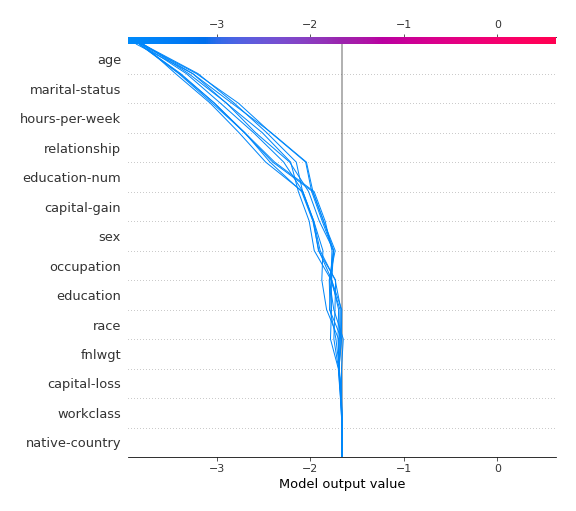
### Top-10 Best decisions for class 0 (Fold #2)
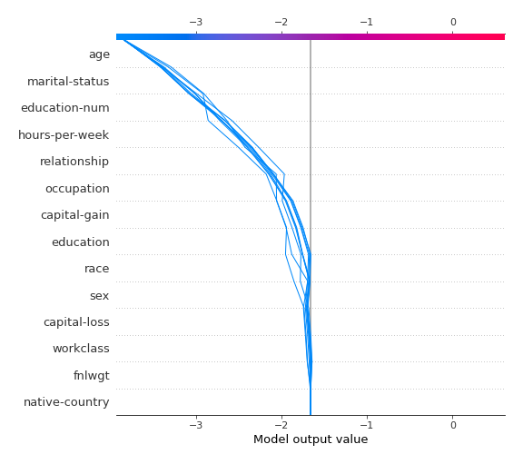
### Top-10 Best decisions for class 0 (Fold #3)
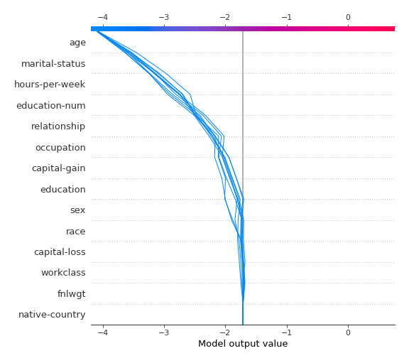
### Top-10 Best decisions for class 0 (Fold #4)
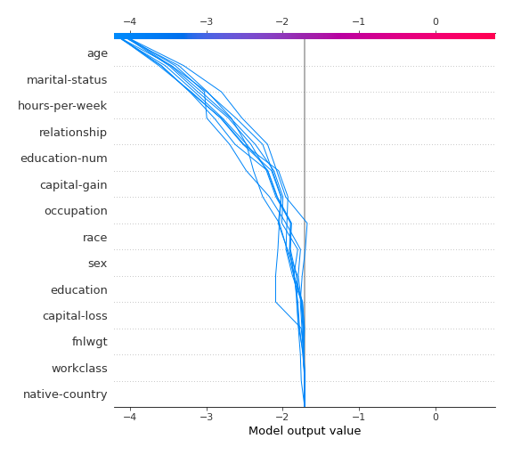
### Top-10 Best decisions for class 0 (Fold #5)

### Top-10 Worst decisions for class 1 (Fold #1)
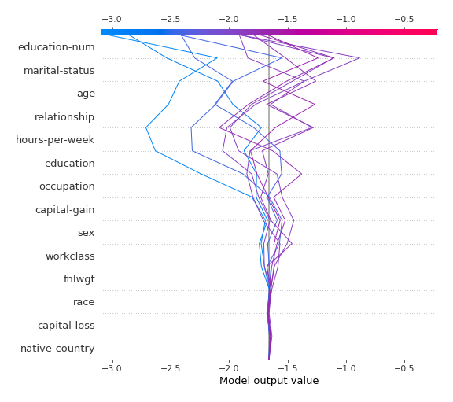
### Top-10 Worst decisions for class 1 (Fold #2)
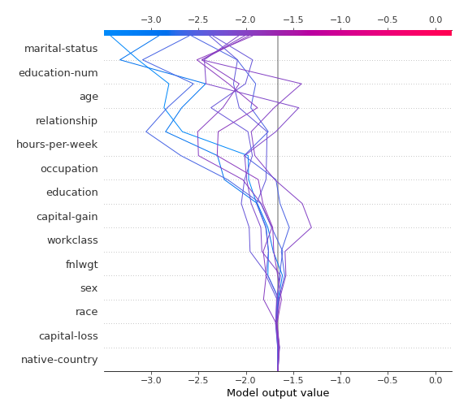
### Top-10 Worst decisions for class 1 (Fold #3)
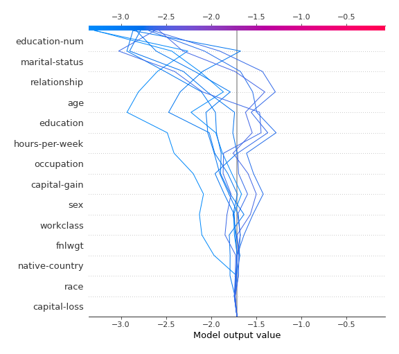
### Top-10 Worst decisions for class 1 (Fold #4)
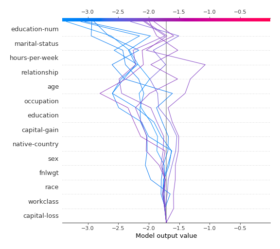
### Top-10 Worst decisions for class 1 (Fold #5)
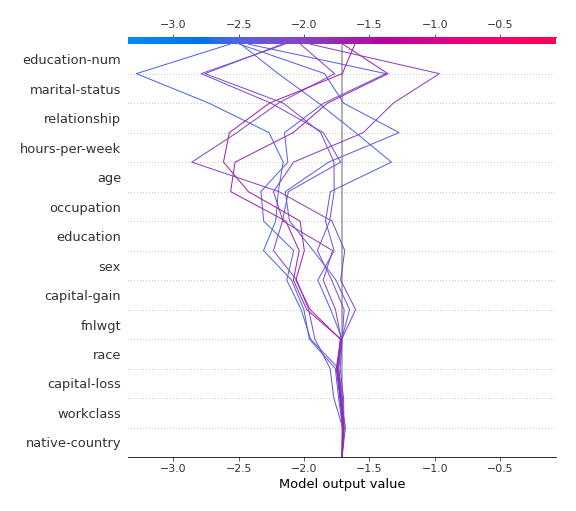
### Top-10 Best decisions for class 1 (Fold #1)
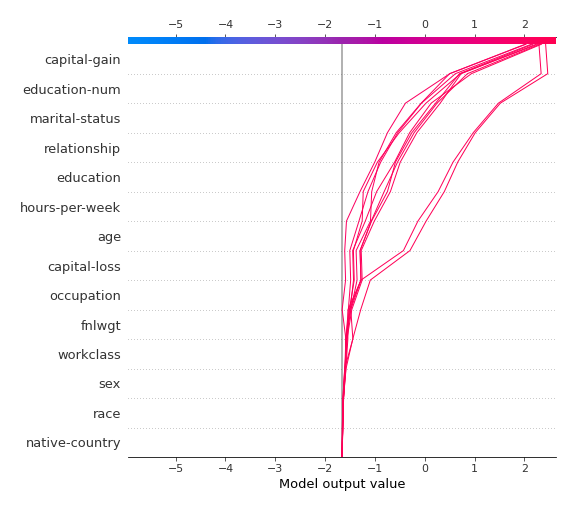
### Top-10 Best decisions for class 1 (Fold #2)
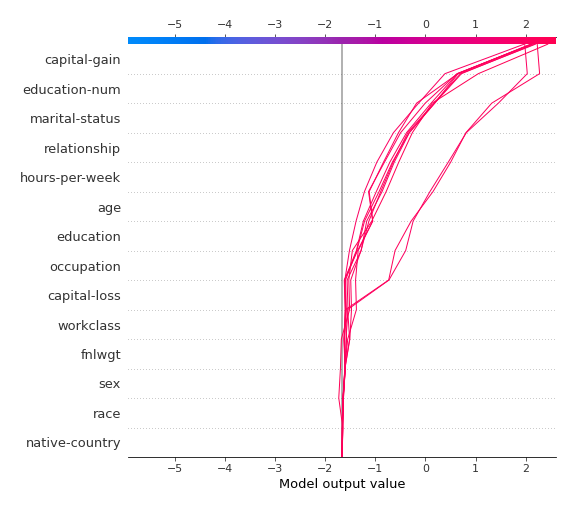
### Top-10 Best decisions for class 1 (Fold #3)

### Top-10 Best decisions for class 1 (Fold #4)
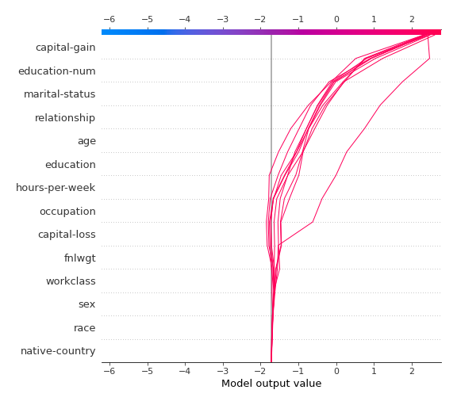
### Top-10 Best decisions for class 1 (Fold #5)
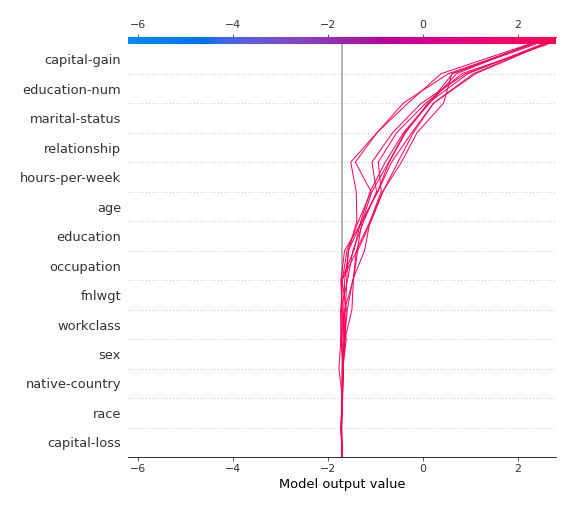