# Summary of model_3

## Decision Tree
- **criterion**: entropy
- **max_depth**: 3

## Validation
 - **validation_type**: kfold
 - **k_folds**: 5
 - **shuffle**: True
 - **stratify**: True

## Optimized metric
logloss

## Training time

32.1 seconds

## Metric details
|           |    score |   threshold |
|:----------|---------:|------------:|
| logloss   | 0.37051  |  nan        |
| auc       | 0.845824 |  nan        |
| f1        | 0.618341 |    0.358698 |
| accuracy  | 0.838682 |    0.483116 |
| precision | 0.879133 |    0.674613 |
| recall    | 0.999683 |    0        |
| mcc       | 0.517748 |    0.358698 |

## Confusion matrix (at threshold=0.358698)
|                     |   Predicted as negative |   Predicted as positive |
|:--------------------|------------------------:|------------------------:|
| Labeled as negative |                   18176 |                    1572 |
| Labeled as positive |                    2777 |                    3523 |

## Learning curves
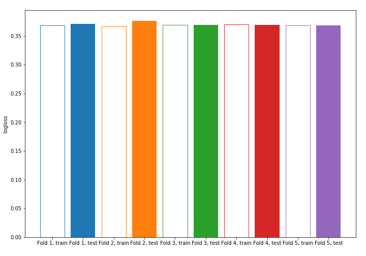

## Tree visualizations

### Tree #1

### Tree #2
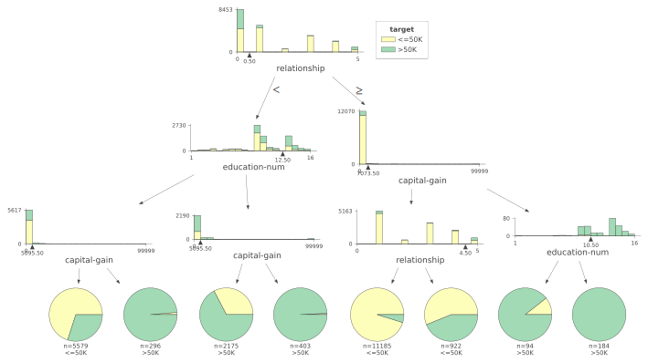
### Tree #3
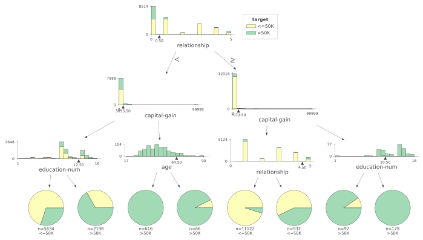
### Tree #4
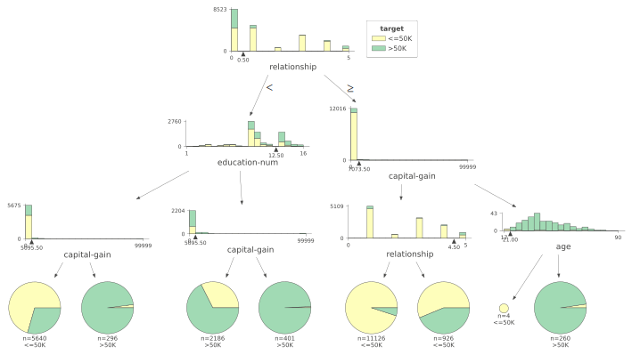
### Tree #5

## Permutation-based Importance
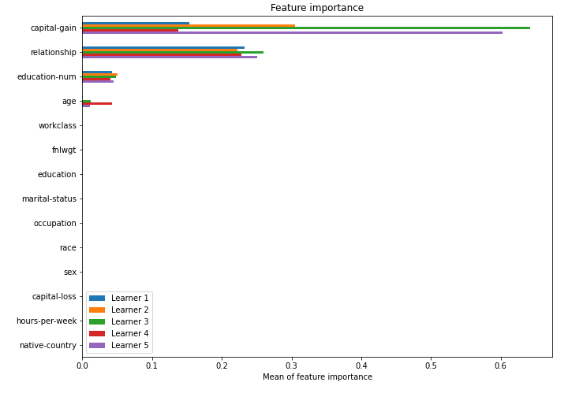

## SHAP Importance
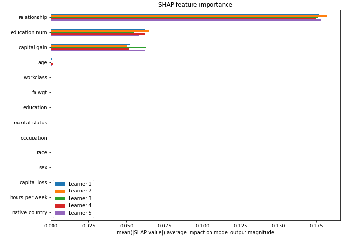

## SHAP Dependence plots

### Dependence (Fold #1)
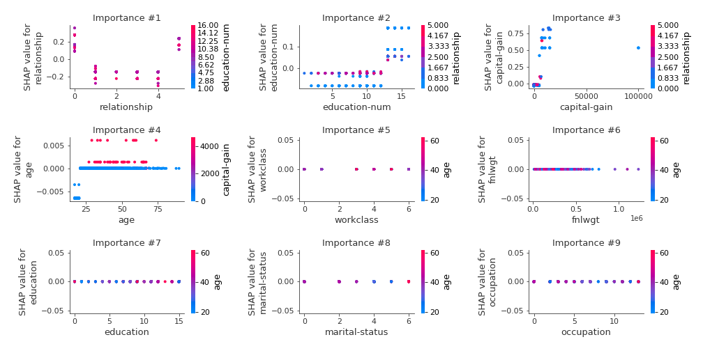
### Dependence (Fold #2)
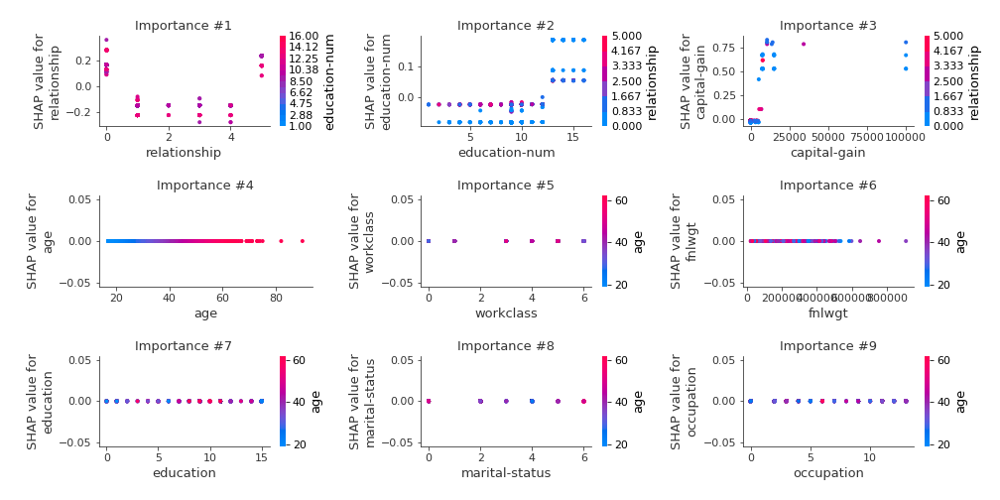
### Dependence (Fold #3)
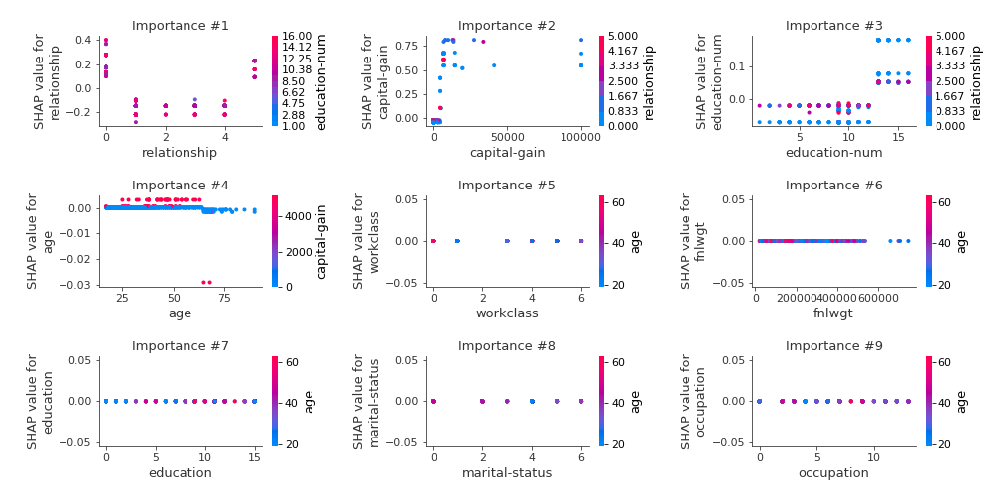
### Dependence (Fold #4)
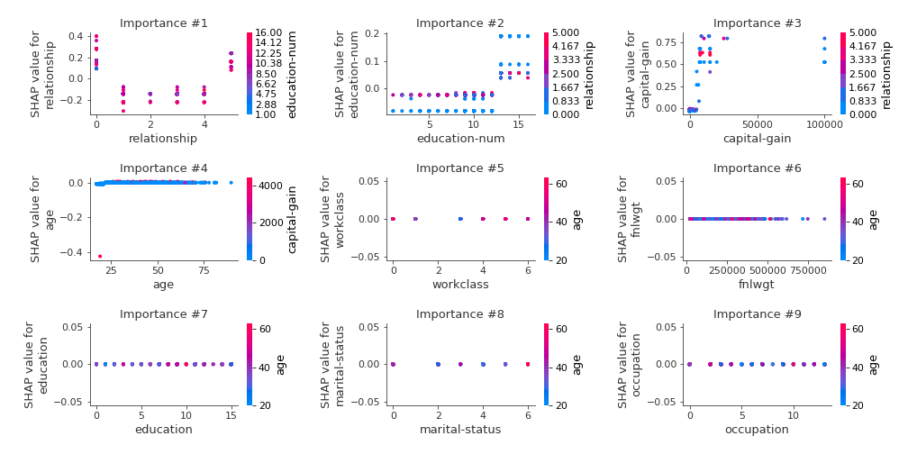
### Dependence (Fold #5)
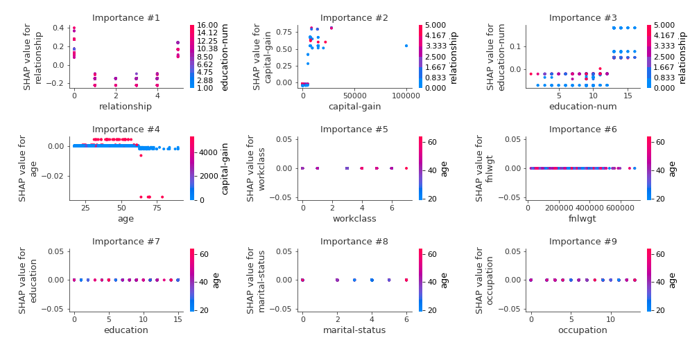

## SHAP Decision plots

### Top-10 Worst decisions for class 0 (Fold #1)
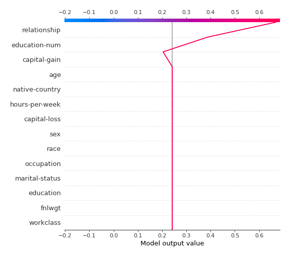
### Top-10 Worst decisions for class 0 (Fold #2)
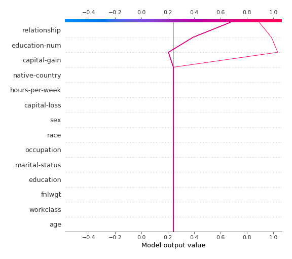
### Top-10 Worst decisions for class 0 (Fold #3)
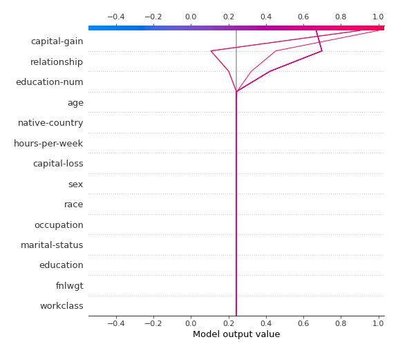
### Top-10 Worst decisions for class 0 (Fold #4)
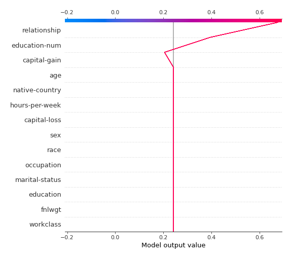
### Top-10 Worst decisions for class 0 (Fold #5)
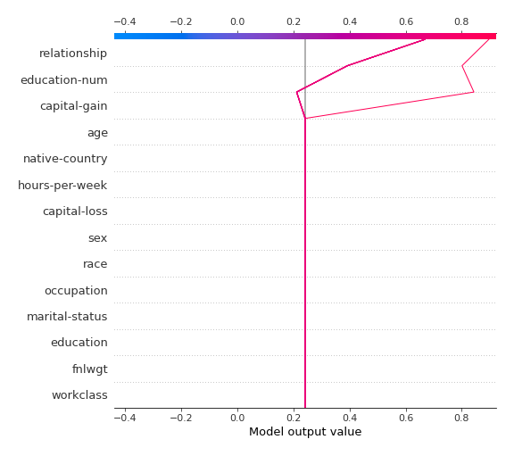
### Top-10 Best decisions for class 0 (Fold #1)
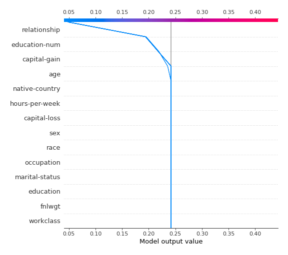
### Top-10 Best decisions for class 0 (Fold #2)
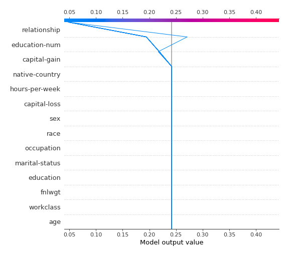
### Top-10 Best decisions for class 0 (Fold #3)
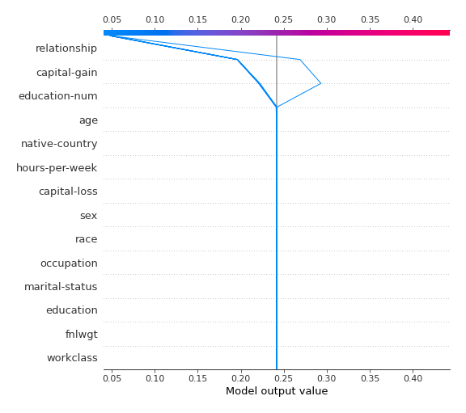
### Top-10 Best decisions for class 0 (Fold #4)
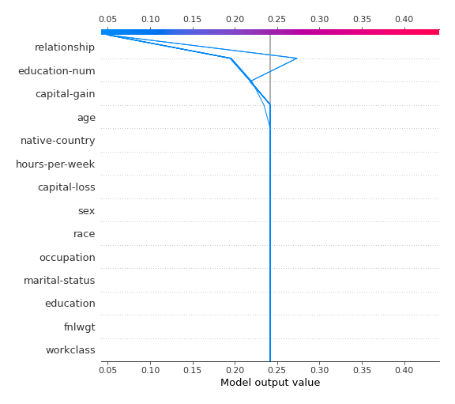
### Top-10 Best decisions for class 0 (Fold #5)

### Top-10 Worst decisions for class 1 (Fold #1)

### Top-10 Worst decisions for class 1 (Fold #2)
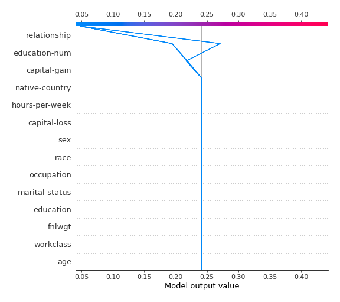
### Top-10 Worst decisions for class 1 (Fold #3)
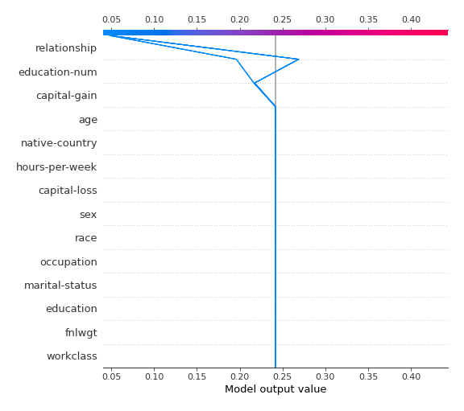
### Top-10 Worst decisions for class 1 (Fold #4)
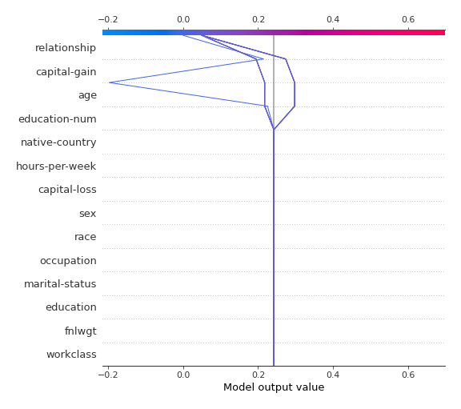
### Top-10 Worst decisions for class 1 (Fold #5)

### Top-10 Best decisions for class 1 (Fold #1)
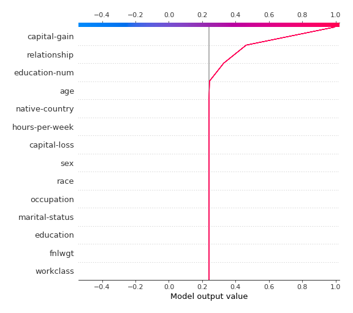
### Top-10 Best decisions for class 1 (Fold #2)
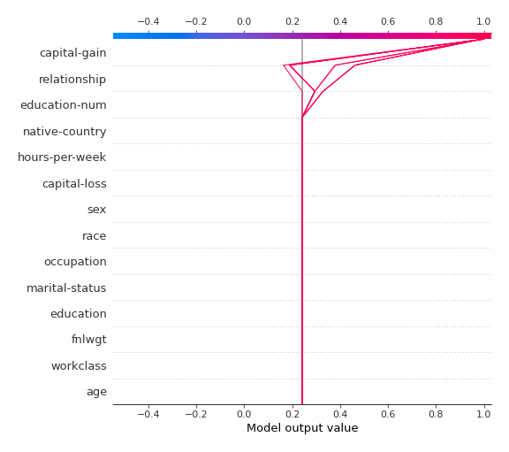
### Top-10 Best decisions for class 1 (Fold #3)

### Top-10 Best decisions for class 1 (Fold #4)
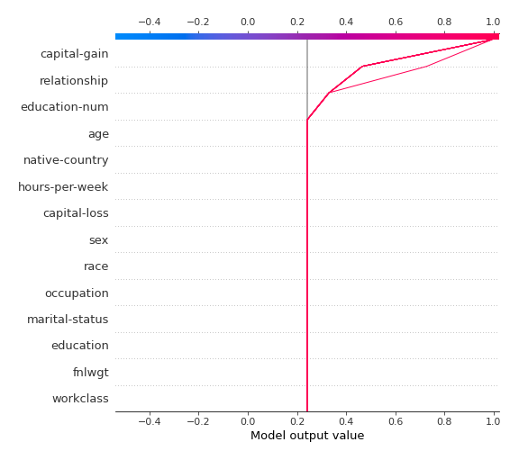
### Top-10 Best decisions for class 1 (Fold #5)
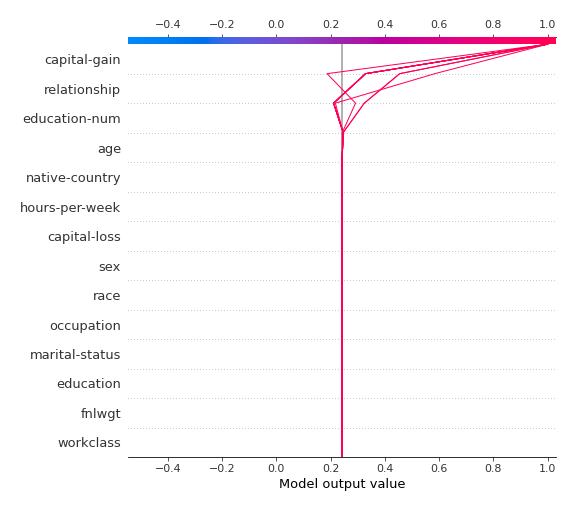