# Summary of model_32

## LightGBM
- **objective**: binary
- **metric**: binary_logloss
- **num_leaves**: 32
- **learning_rate**: 0.1
- **feature_fraction**: 1.0
- **bagging_fraction**: 0.9
- **bagging_freq**: 2

## Validation
 - **validation_type**: kfold
 - **k_folds**: 5
 - **shuffle**: True
 - **stratify**: True

## Optimized metric
logloss

## Training time

37.3 seconds

## Metric details
|           |    score |     threshold |
|:----------|---------:|--------------:|
| logloss   | 0.285343 | nan           |
| auc       | 0.924714 | nan           |
| f1        | 0.724305 |   0.422602    |
| accuracy  | 0.869241 |   0.502538    |
| precision | 0.964179 |   0.838278    |
| recall    | 1        |   0.000121049 |
| mcc       | 0.636719 |   0.422602    |

## Confusion matrix (at threshold=0.422602)
|                     |   Predicted as negative |   Predicted as positive |
|:--------------------|------------------------:|------------------------:|
| Labeled as negative |                   18036 |                    1712 |
| Labeled as positive |                    1751 |                    4549 |

## Learning curves
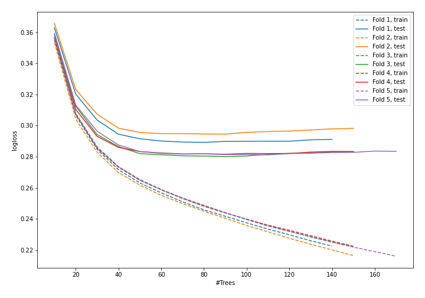

## Permutation-based Importance
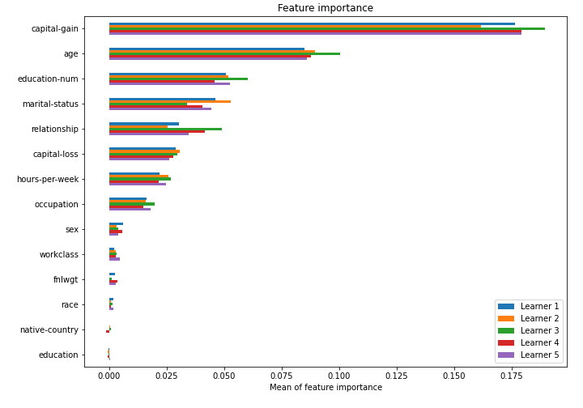

## SHAP Importance
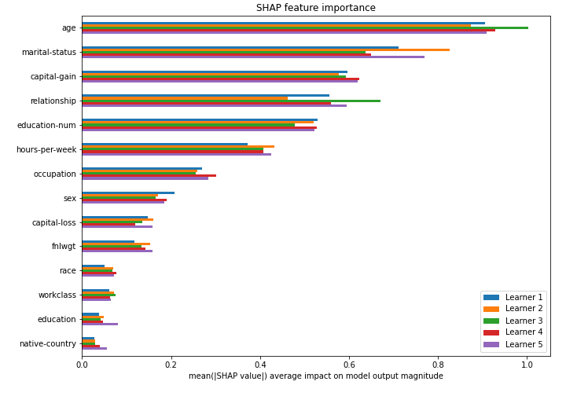

## SHAP Dependence plots

### Dependence (Fold #1)
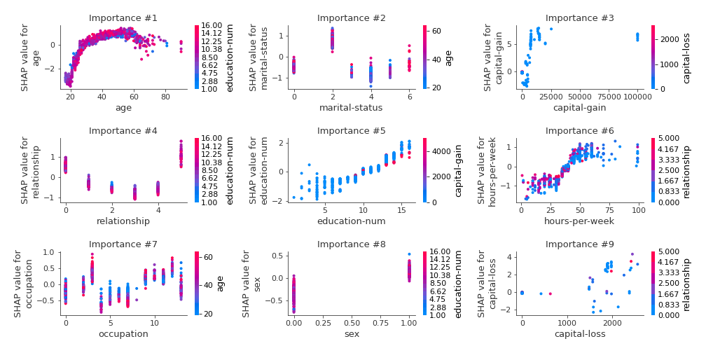
### Dependence (Fold #2)
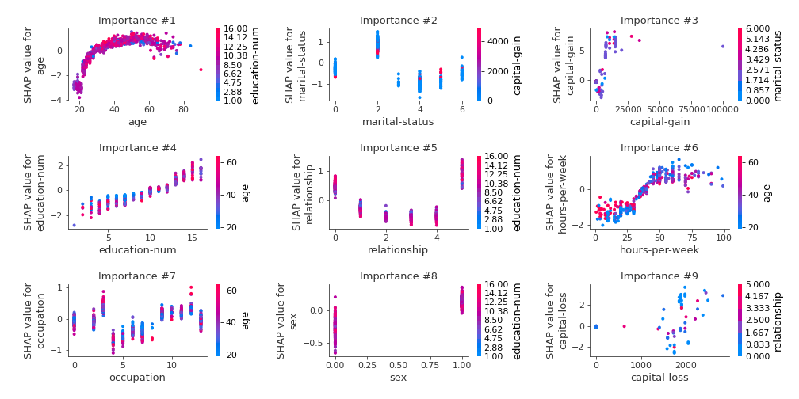
### Dependence (Fold #3)

### Dependence (Fold #4)
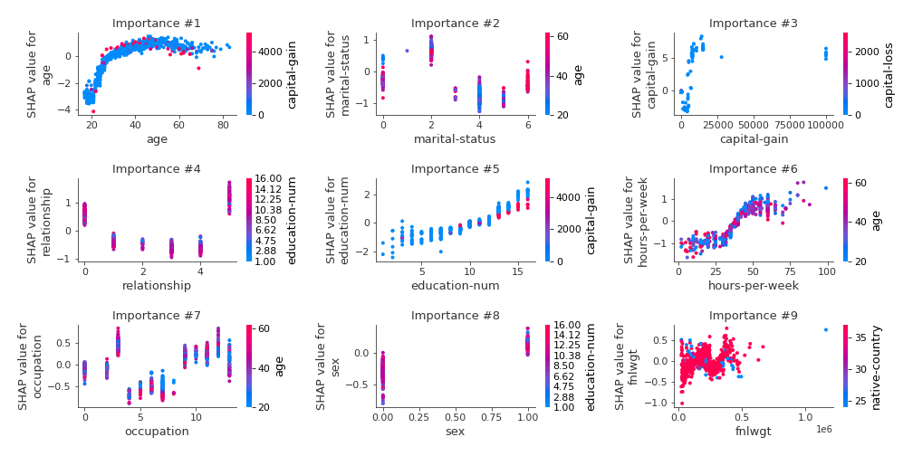
### Dependence (Fold #5)
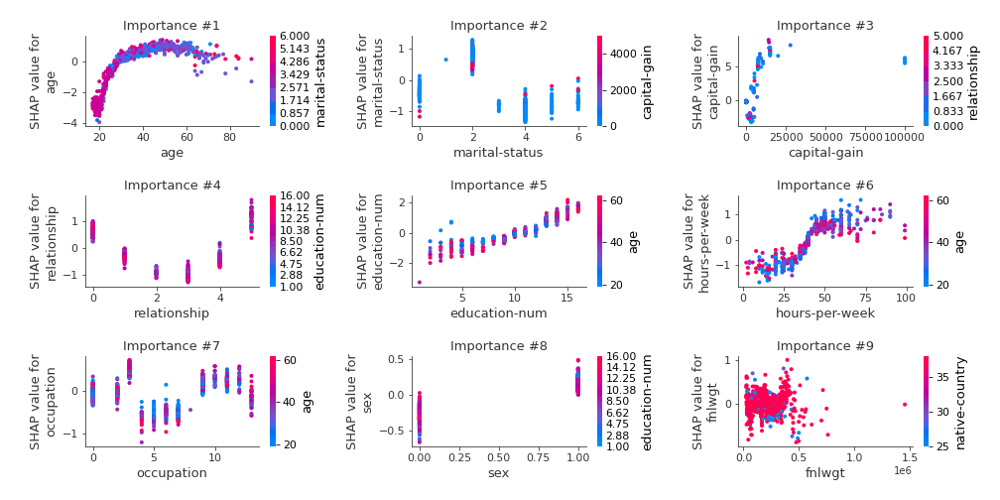

## SHAP Decision plots

### Top-10 Worst decisions for class 0 (Fold #1)
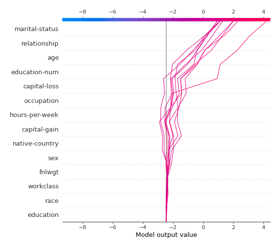
### Top-10 Worst decisions for class 0 (Fold #2)
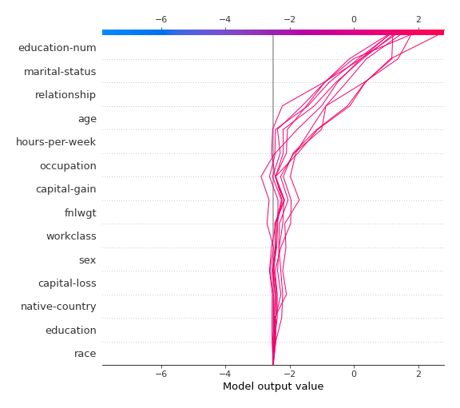
### Top-10 Worst decisions for class 0 (Fold #3)
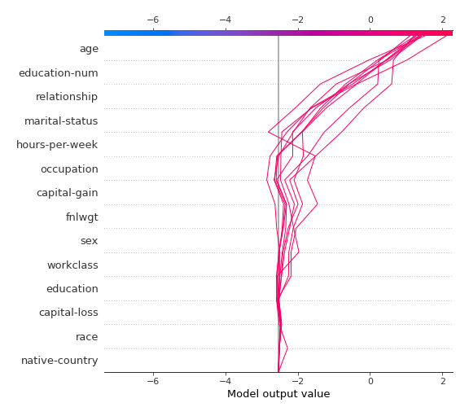
### Top-10 Worst decisions for class 0 (Fold #4)
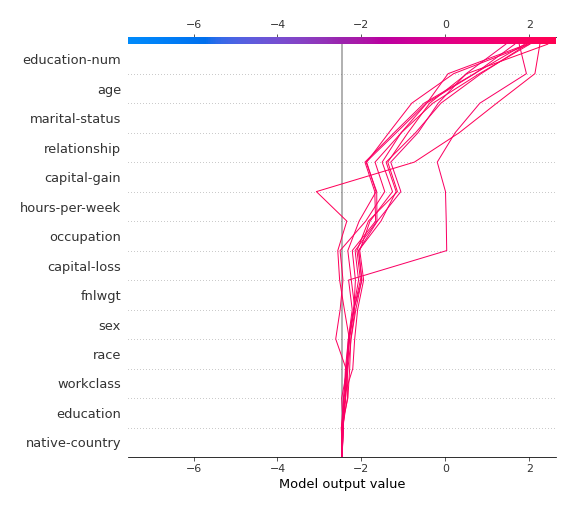
### Top-10 Worst decisions for class 0 (Fold #5)
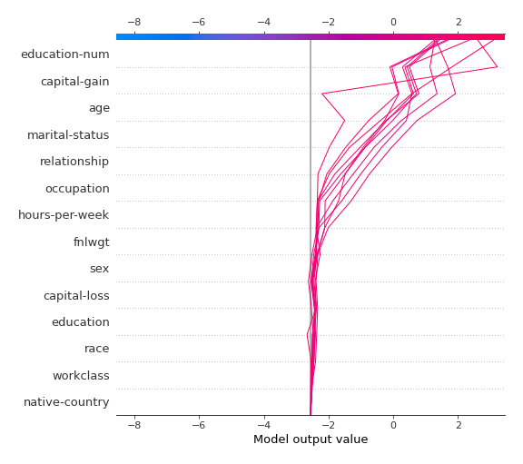
### Top-10 Best decisions for class 0 (Fold #1)
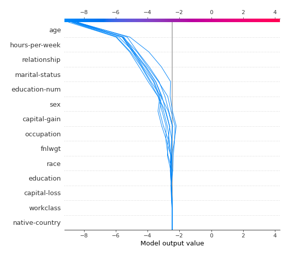
### Top-10 Best decisions for class 0 (Fold #2)
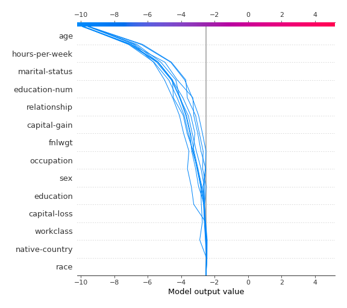
### Top-10 Best decisions for class 0 (Fold #3)
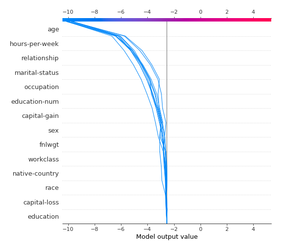
### Top-10 Best decisions for class 0 (Fold #4)
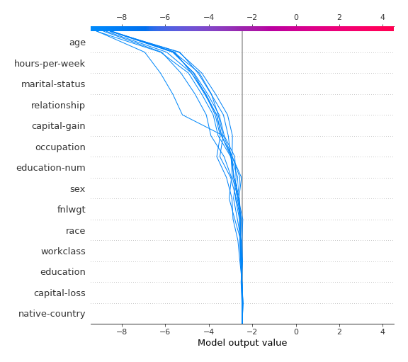
### Top-10 Best decisions for class 0 (Fold #5)
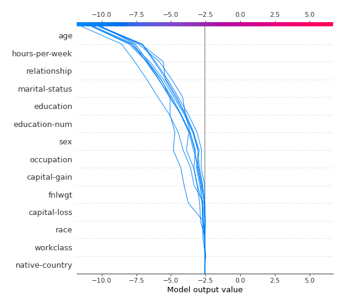
### Top-10 Worst decisions for class 1 (Fold #1)
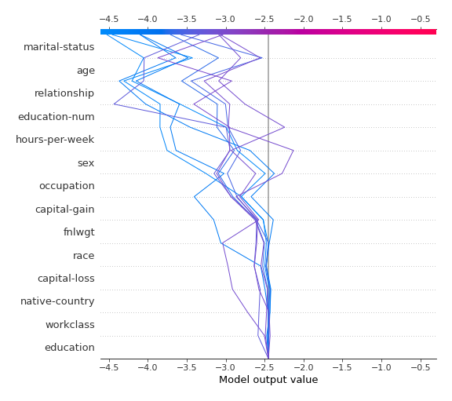
### Top-10 Worst decisions for class 1 (Fold #2)
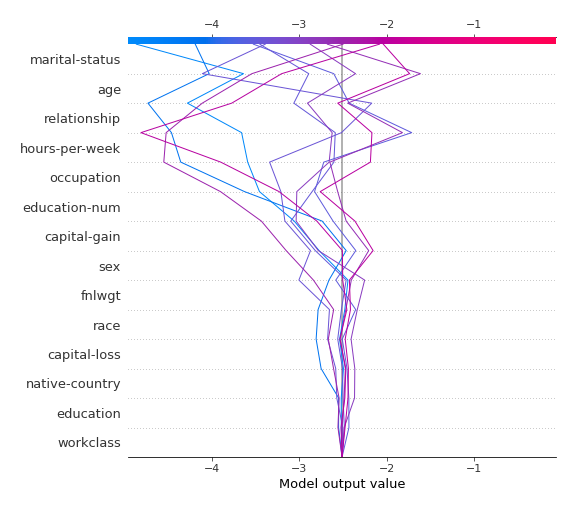
### Top-10 Worst decisions for class 1 (Fold #3)
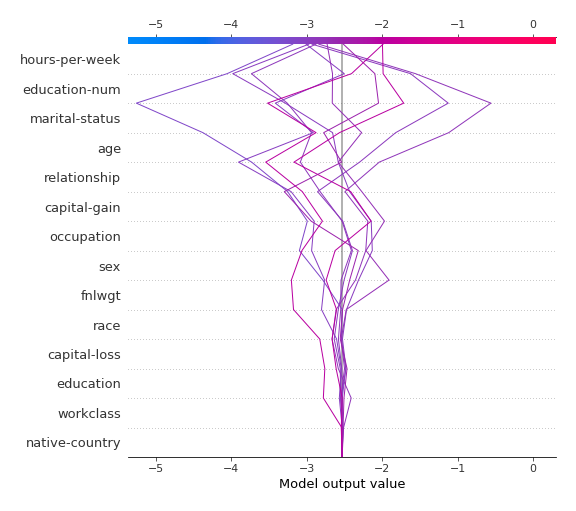
### Top-10 Worst decisions for class 1 (Fold #4)
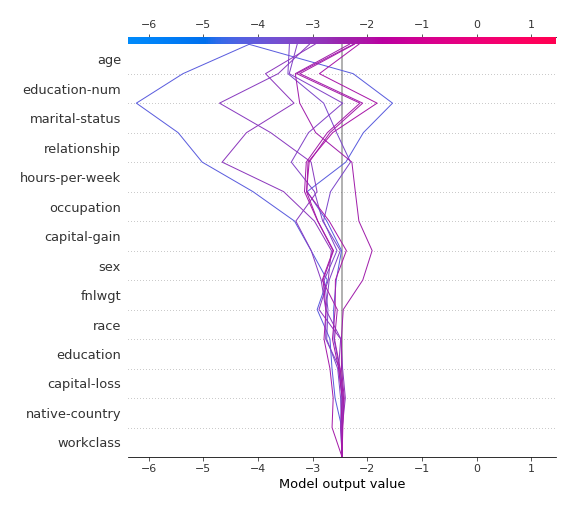
### Top-10 Worst decisions for class 1 (Fold #5)
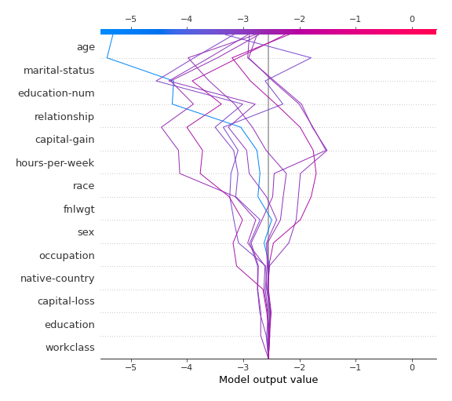
### Top-10 Best decisions for class 1 (Fold #1)
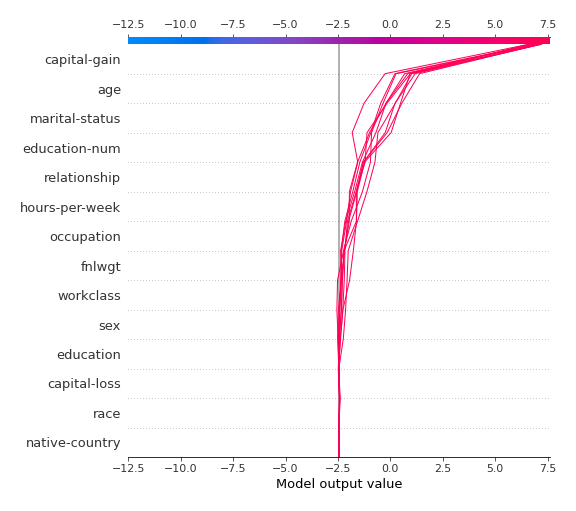
### Top-10 Best decisions for class 1 (Fold #2)
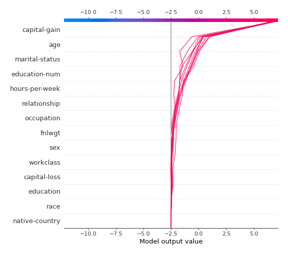
### Top-10 Best decisions for class 1 (Fold #3)
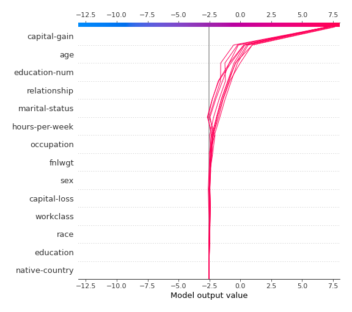
### Top-10 Best decisions for class 1 (Fold #4)
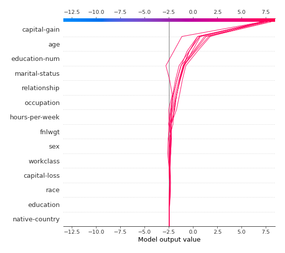
### Top-10 Best decisions for class 1 (Fold #5)
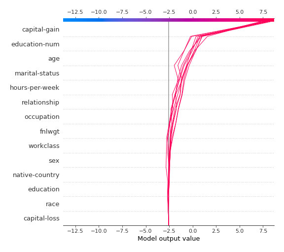