# Summary of model_43

## Extreme Gradient Boosting (Xgboost)
- **objective**: binary:logistic
- **eval_metric**: logloss
- **eta**: 0.15
- **max_depth**: 6
- **min_child_weight**: 9
- **subsample**: 0.4
- **colsample_bytree**: 0.7

## Validation
 - **validation_type**: kfold
 - **k_folds**: 5
 - **shuffle**: True
 - **stratify**: True

## Optimized metric
logloss

## Training time

82.3 seconds

## Metric details
|           |    score |     threshold |
|:----------|---------:|--------------:|
| logloss   | 0.29637  | nan           |
| auc       | 0.918292 | nan           |
| f1        | 0.710863 |   0.360115    |
| accuracy  | 0.863099 |   0.479513    |
| precision | 0.952201 |   0.81018     |
| recall    | 1        |   0.000206241 |
| mcc       | 0.613036 |   0.360115    |

## Confusion matrix (at threshold=0.360115)
|                     |   Predicted as negative |   Predicted as positive |
|:--------------------|------------------------:|------------------------:|
| Labeled as negative |                   17385 |                    2363 |
| Labeled as positive |                    1523 |                    4777 |

## Learning curves
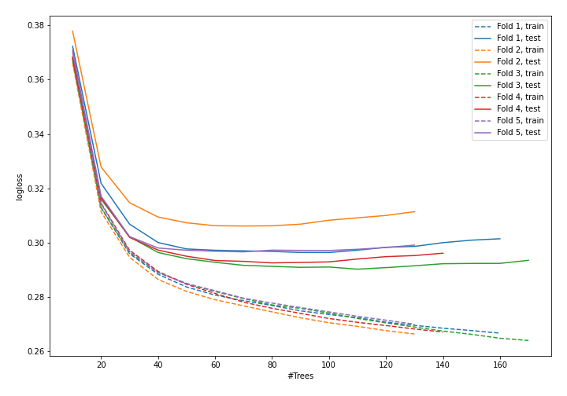

## Permutation-based Importance
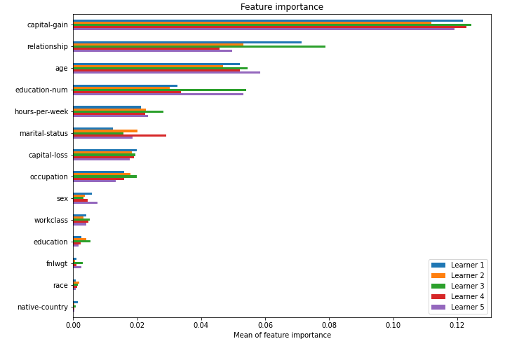

## SHAP Importance
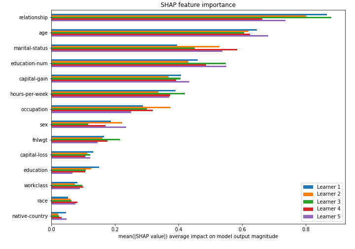

## SHAP Dependence plots

### Dependence (Fold #1)
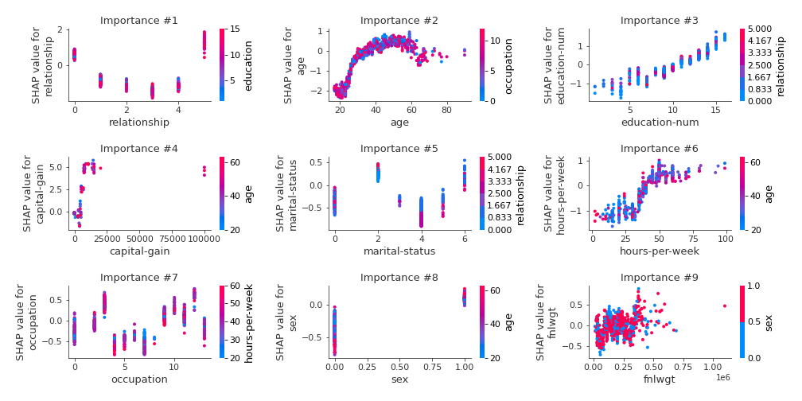
### Dependence (Fold #2)
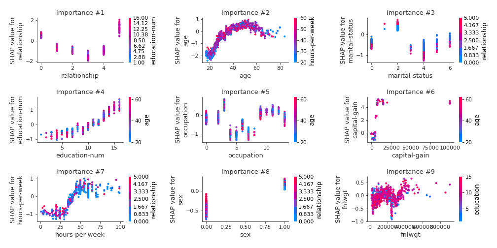
### Dependence (Fold #3)
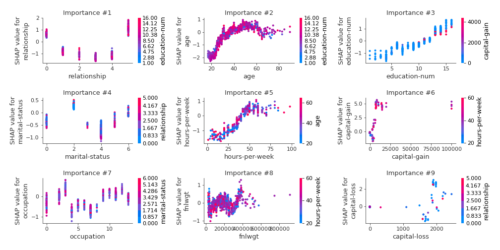
### Dependence (Fold #4)
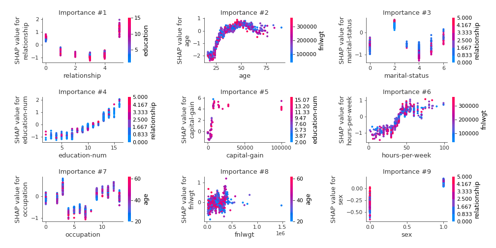
### Dependence (Fold #5)
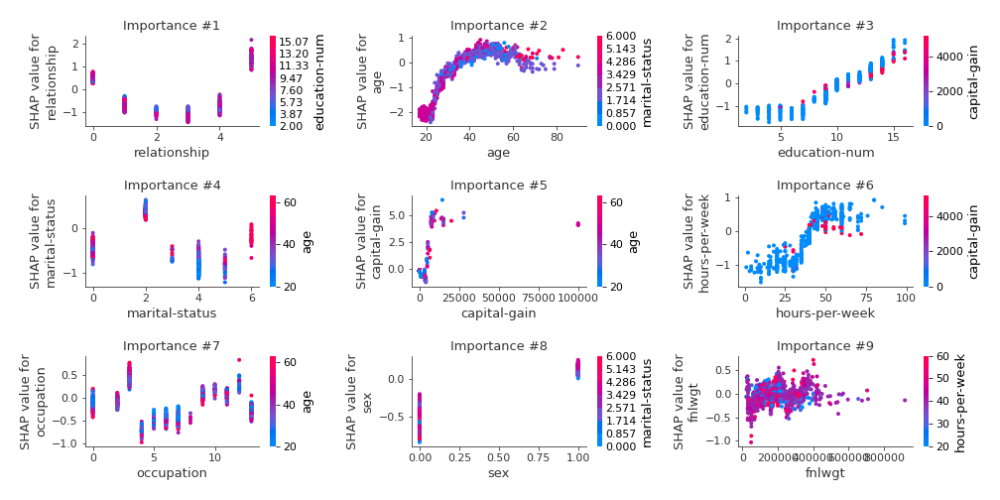

## SHAP Decision plots

### Top-10 Worst decisions for class 0 (Fold #1)
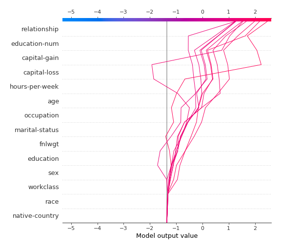
### Top-10 Worst decisions for class 0 (Fold #2)
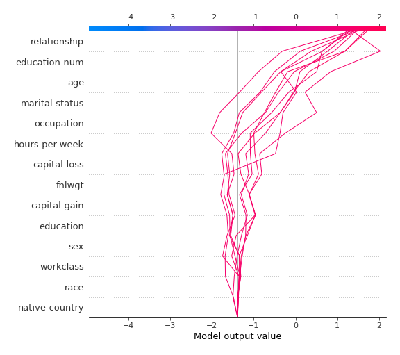
### Top-10 Worst decisions for class 0 (Fold #3)
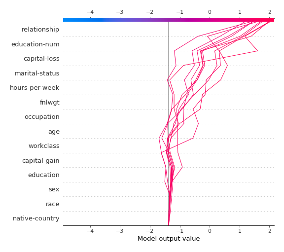
### Top-10 Worst decisions for class 0 (Fold #4)
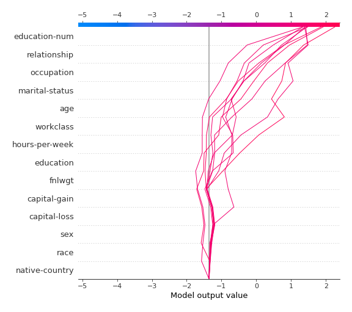
### Top-10 Worst decisions for class 0 (Fold #5)
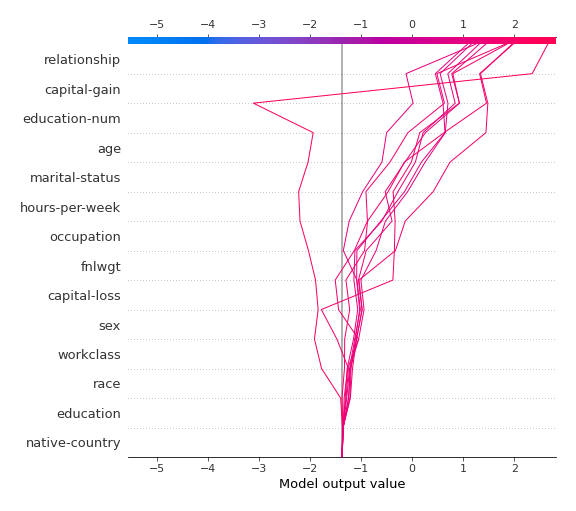
### Top-10 Best decisions for class 0 (Fold #1)

### Top-10 Best decisions for class 0 (Fold #2)
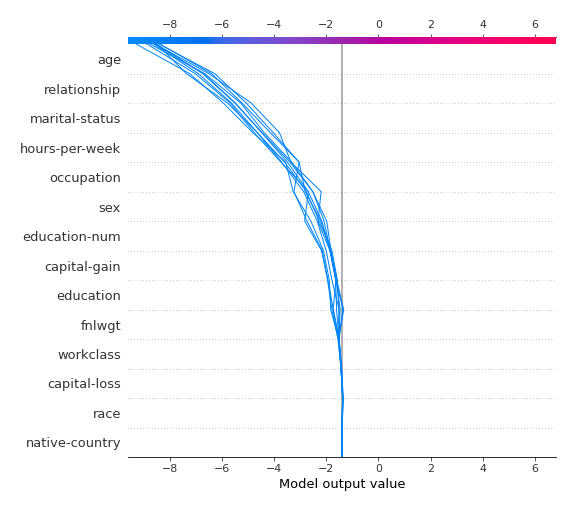
### Top-10 Best decisions for class 0 (Fold #3)
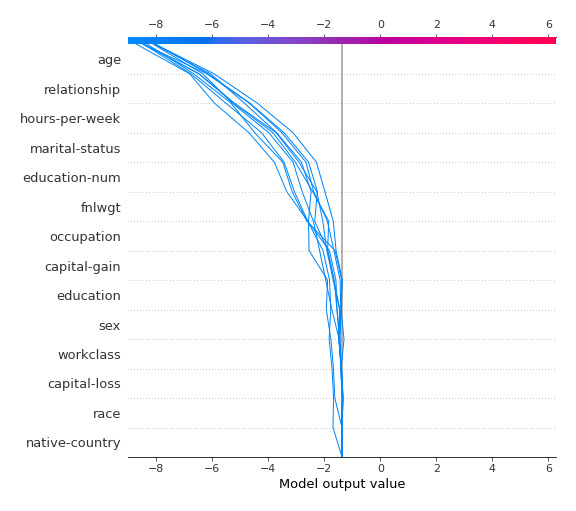
### Top-10 Best decisions for class 0 (Fold #4)

### Top-10 Best decisions for class 0 (Fold #5)

### Top-10 Worst decisions for class 1 (Fold #1)
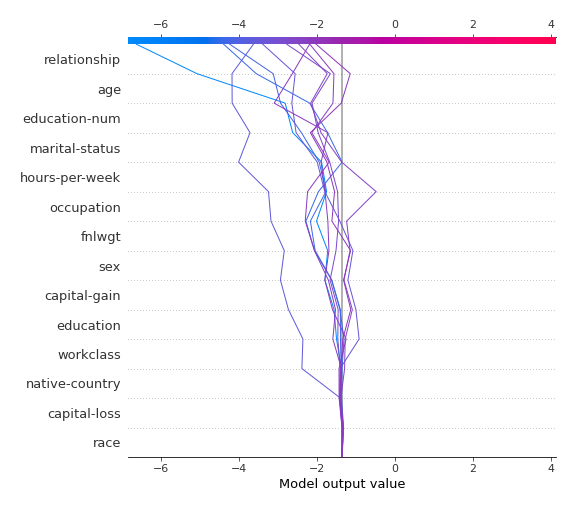
### Top-10 Worst decisions for class 1 (Fold #2)
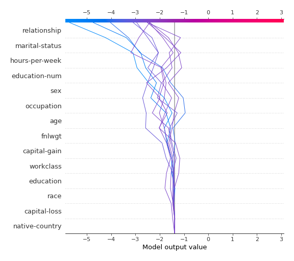
### Top-10 Worst decisions for class 1 (Fold #3)
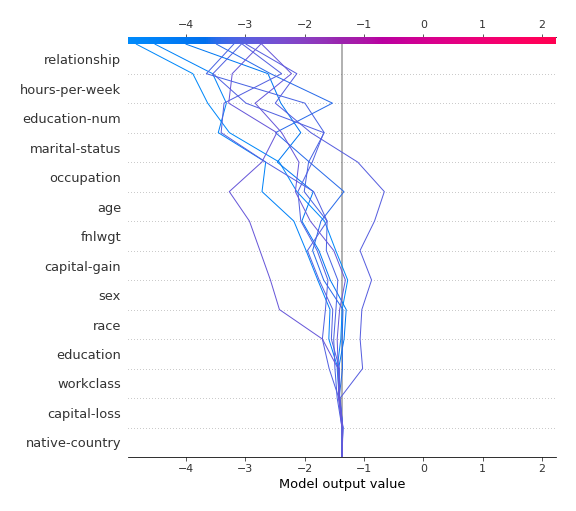
### Top-10 Worst decisions for class 1 (Fold #4)
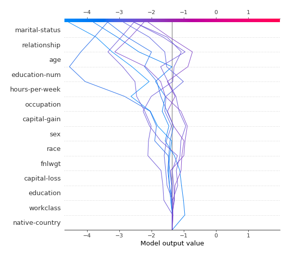
### Top-10 Worst decisions for class 1 (Fold #5)
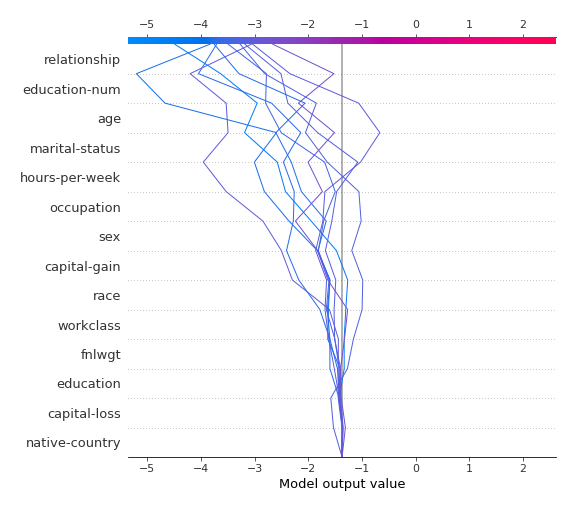
### Top-10 Best decisions for class 1 (Fold #1)
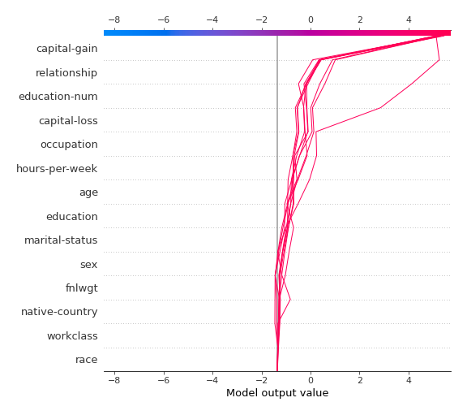
### Top-10 Best decisions for class 1 (Fold #2)
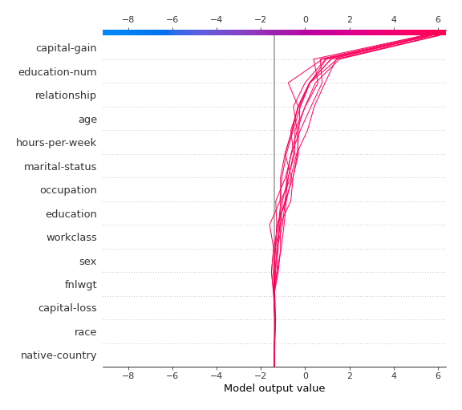
### Top-10 Best decisions for class 1 (Fold #3)
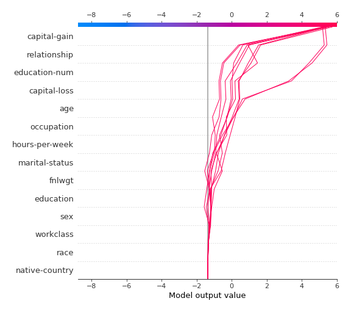
### Top-10 Best decisions for class 1 (Fold #4)
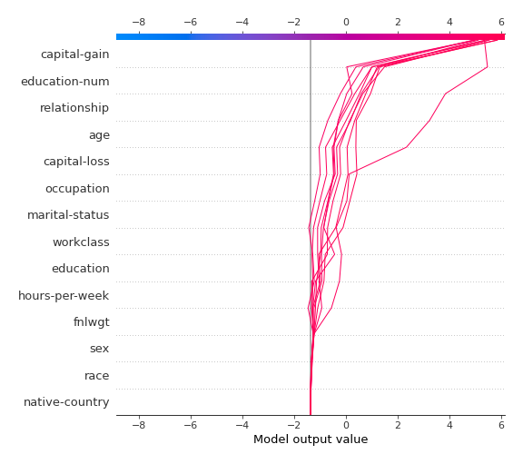
### Top-10 Best decisions for class 1 (Fold #5)
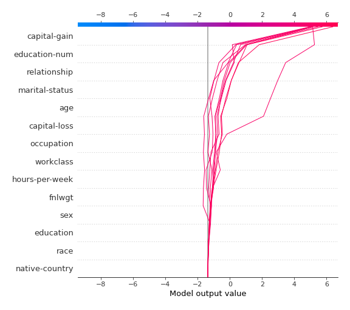