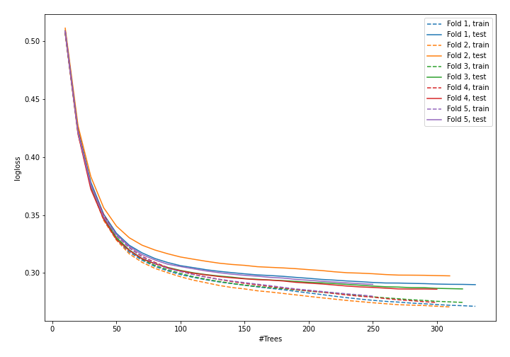
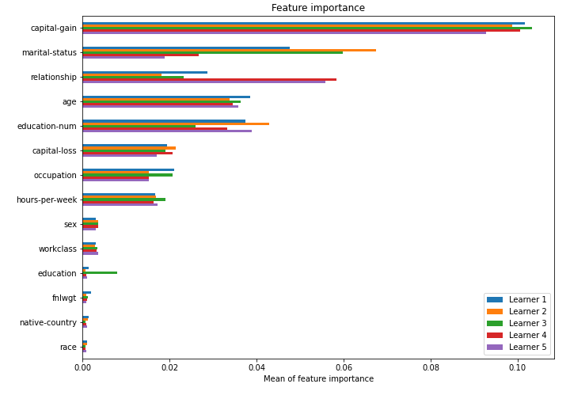

# Summary of model_46

## CatBoost
- **learning_rate**: 0.05
- **depth**: 8
- **rsm**: 0.5
- **l2_leaf_reg**: 3

## Validation
 - **validation_type**: kfold
 - **k_folds**: 5
 - **shuffle**: True
 - **stratify**: True

## Optimized metric
logloss

## Training time

43.9 seconds

## Metric details
|           |    score |     threshold |
|:----------|---------:|--------------:|
| logloss   | 0.289934 | nan           |
| auc       | 0.922467 | nan           |
| f1        | 0.717591 |   0.384231    |
| accuracy  | 0.867283 |   0.451349    |
| precision | 0.973828 |   0.829329    |
| recall    | 1        |   0.000688029 |
| mcc       | 0.629103 |   0.444689    |

## Confusion matrix (at threshold=0.384231)
|                     |   Predicted as negative |   Predicted as positive |
|:--------------------|------------------------:|------------------------:|
| Labeled as negative |                   17679 |                    2069 |
| Labeled as positive |                    1617 |                    4683 |

## Learning curves

## Permutation-based Importance
