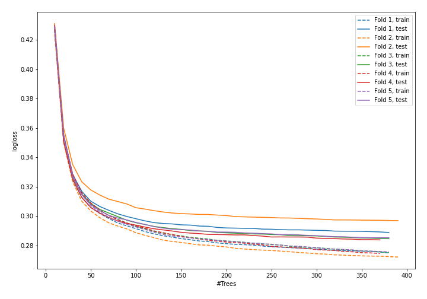
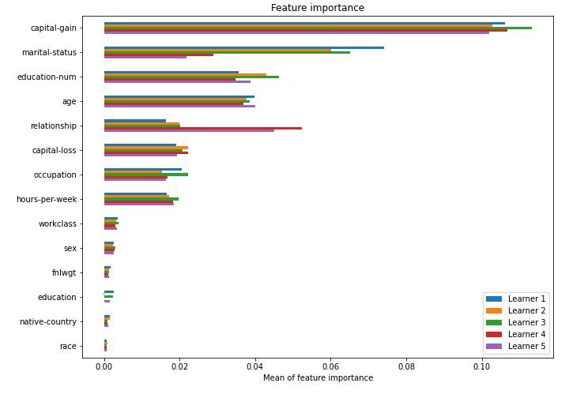

# Summary of model_47

## CatBoost
- **learning_rate**: 0.1
- **depth**: 6
- **rsm**: 0.5
- **l2_leaf_reg**: 7

## Validation
 - **validation_type**: kfold
 - **k_folds**: 5
 - **shuffle**: True
 - **stratify**: True

## Optimized metric
logloss

## Training time

43.4 seconds

## Metric details
|           |    score |     threshold |
|:----------|---------:|--------------:|
| logloss   | 0.287799 | nan           |
| auc       | 0.92354  | nan           |
| f1        | 0.719514 |   0.34758     |
| accuracy  | 0.867898 |   0.497093    |
| precision | 0.966189 |   0.821298    |
| recall    | 1        |   0.000344047 |
| mcc       | 0.630099 |   0.445038    |

## Confusion matrix (at threshold=0.34758)
|                     |   Predicted as negative |   Predicted as positive |
|:--------------------|------------------------:|------------------------:|
| Labeled as negative |                   17301 |                    2447 |
| Labeled as positive |                    1385 |                    4915 |

## Learning curves

## Permutation-based Importance
