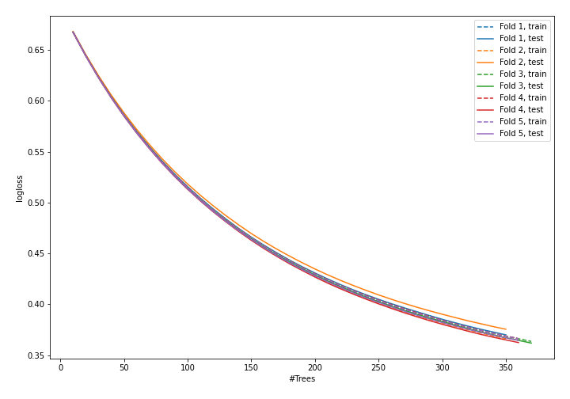
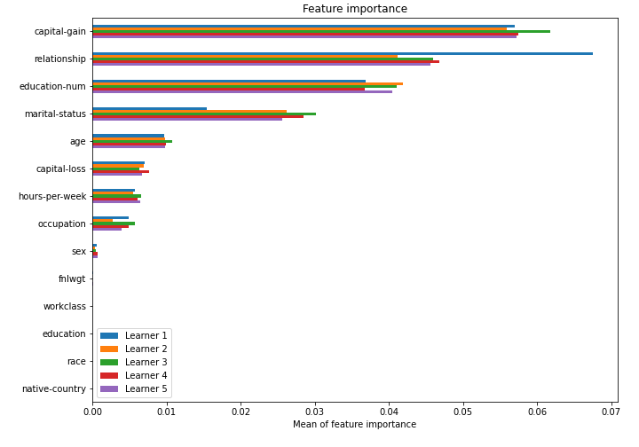

# Summary of model_48

## CatBoost
- **learning_rate**: 0.005
- **depth**: 5
- **rsm**: 0.9
- **l2_leaf_reg**: 10

## Validation
 - **validation_type**: kfold
 - **k_folds**: 5
 - **shuffle**: True
 - **stratify**: True

## Optimized metric
logloss

## Training time

43.7 seconds

## Metric details
|           |    score |   threshold |
|:----------|---------:|------------:|
| logloss   | 0.366781 | nan         |
| auc       | 0.902206 | nan         |
| f1        | 0.6845   |   0.353196  |
| accuracy  | 0.849854 |   0.51298   |
| precision | 0.969697 |   0.66838   |
| recall    | 1        |   0.0794492 |
| mcc       | 0.576703 |   0.369515  |

## Confusion matrix (at threshold=0.353196)
|                     |   Predicted as negative |   Predicted as positive |
|:--------------------|------------------------:|------------------------:|
| Labeled as negative |                   16852 |                    2896 |
| Labeled as positive |                    1515 |                    4785 |

## Learning curves

## Permutation-based Importance
