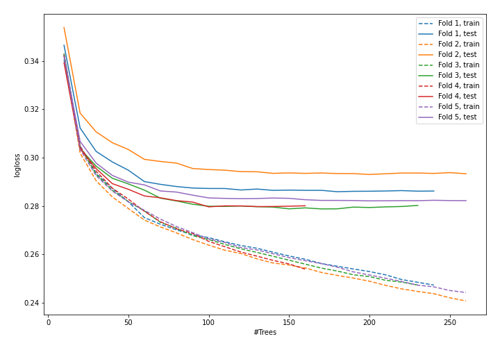
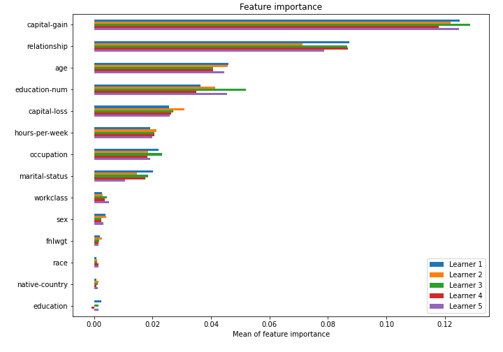

# Summary of model_49

## CatBoost
- **learning_rate**: 0.2
- **depth**: 7
- **rsm**: 1.0
- **l2_leaf_reg**: 1

## Validation
 - **validation_type**: kfold
 - **k_folds**: 5
 - **shuffle**: True
 - **stratify**: True

## Optimized metric
logloss

## Training time

31.8 seconds

## Metric details
|           |    score |     threshold |
|:----------|---------:|--------------:|
| logloss   | 0.28389  | nan           |
| auc       | 0.925596 | nan           |
| f1        | 0.726792 |   0.400905    |
| accuracy  | 0.870048 |   0.496608    |
| precision | 0.969959 |   0.845262    |
| recall    | 1        |   0.000100211 |
| mcc       | 0.637509 |   0.400905    |

## Confusion matrix (at threshold=0.400905)
|                     |   Predicted as negative |   Predicted as positive |
|:--------------------|------------------------:|------------------------:|
| Labeled as negative |                   17860 |                    1888 |
| Labeled as positive |                    1626 |                    4674 |

## Learning curves

## Permutation-based Importance
