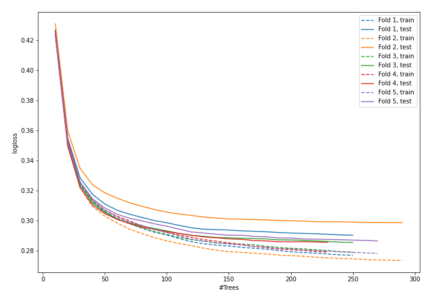
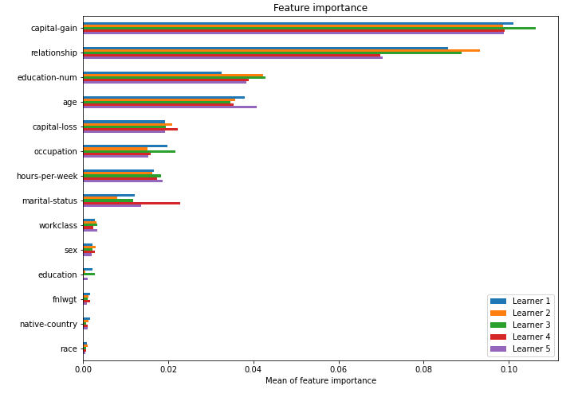

# Summary of model_50

## CatBoost
- **learning_rate**: 0.1
- **depth**: 7
- **rsm**: 0.7
- **l2_leaf_reg**: 10

## Validation
 - **validation_type**: kfold
 - **k_folds**: 5
 - **shuffle**: True
 - **stratify**: True

## Optimized metric
logloss

## Training time

43.6 seconds

## Metric details
|           |    score |     threshold |
|:----------|---------:|--------------:|
| logloss   | 0.289398 | nan           |
| auc       | 0.922666 | nan           |
| f1        | 0.718032 |   0.390042    |
| accuracy  | 0.86809  |   0.49574     |
| precision | 0.976986 |   0.831793    |
| recall    | 1        |   0.000795466 |
| mcc       | 0.626787 |   0.430113    |

## Confusion matrix (at threshold=0.390042)
|                     |   Predicted as negative |   Predicted as positive |
|:--------------------|------------------------:|------------------------:|
| Labeled as negative |                   17737 |                    2011 |
| Labeled as positive |                    1645 |                    4655 |

## Learning curves

## Permutation-based Importance
