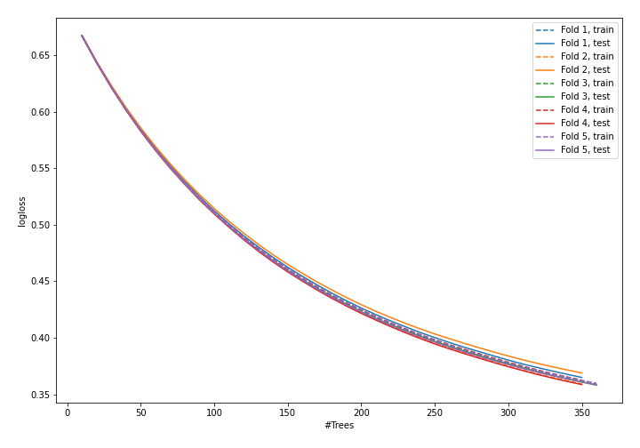
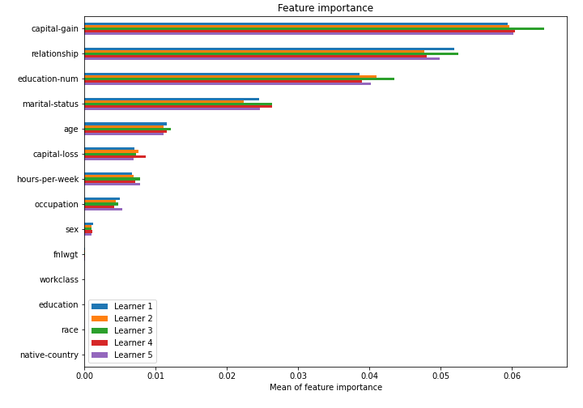

# Summary of model_51

## CatBoost
- **learning_rate**: 0.005
- **depth**: 6
- **rsm**: 0.9
- **l2_leaf_reg**: 3

## Validation
 - **validation_type**: kfold
 - **k_folds**: 5
 - **shuffle**: True
 - **stratify**: True

## Optimized metric
logloss

## Training time

43.5 seconds

## Metric details
|           |    score |   threshold |
|:----------|---------:|------------:|
| logloss   | 0.361852 | nan         |
| auc       | 0.905045 | nan         |
| f1        | 0.686956 |   0.387033  |
| accuracy  | 0.851198 |   0.528601  |
| precision | 0.971102 |   0.682699  |
| recall    | 1        |   0.0792213 |
| mcc       | 0.583647 |   0.387033  |

## Confusion matrix (at threshold=0.387033)
|                     |   Predicted as negative |   Predicted as positive |
|:--------------------|------------------------:|------------------------:|
| Labeled as negative |                   17527 |                    2221 |
| Labeled as positive |                    1842 |                    4458 |

## Learning curves

## Permutation-based Importance
