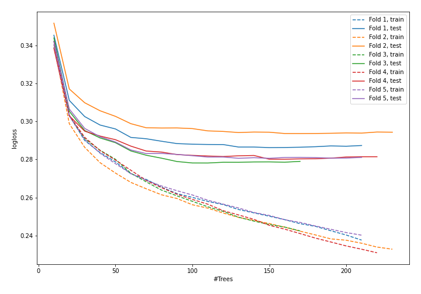
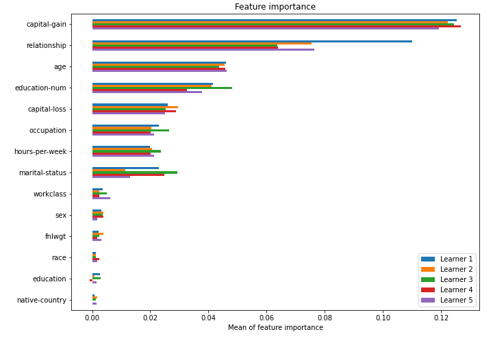

# Summary of model_52

## CatBoost
- **learning_rate**: 0.2
- **depth**: 8
- **rsm**: 1.0
- **l2_leaf_reg**: 1

## Validation
 - **validation_type**: kfold
 - **k_folds**: 5
 - **shuffle**: True
 - **stratify**: True

## Optimized metric
logloss

## Training time

26.7 seconds

## Metric details
|           |    score |     threshold |
|:----------|---------:|--------------:|
| logloss   | 0.283729 | nan           |
| auc       | 0.925888 | nan           |
| f1        | 0.726839 |   0.389754    |
| accuracy  | 0.870201 |   0.531234    |
| precision | 0.965732 |   0.85511     |
| recall    | 1        |   0.000133255 |
| mcc       | 0.637678 |   0.435009    |

## Confusion matrix (at threshold=0.389754)
|                     |   Predicted as negative |   Predicted as positive |
|:--------------------|------------------------:|------------------------:|
| Labeled as negative |                   17768 |                    1980 |
| Labeled as positive |                    1573 |                    4727 |

## Learning curves

## Permutation-based Importance
