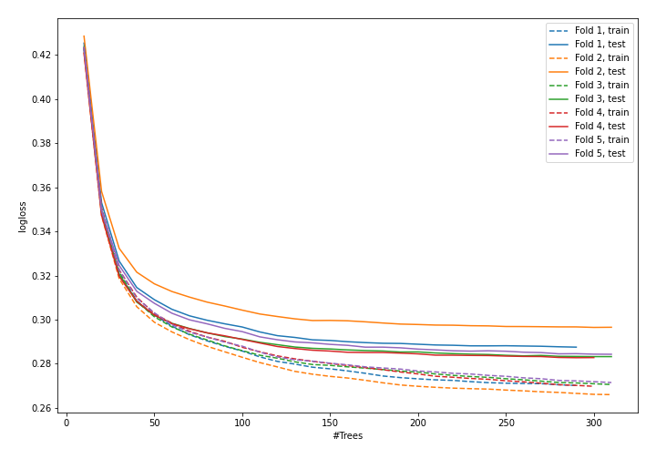
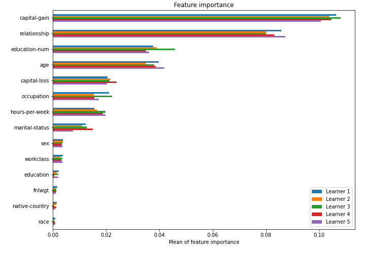

# Summary of model_53

## CatBoost
- **learning_rate**: 0.1
- **depth**: 8
- **rsm**: 1.0
- **l2_leaf_reg**: 7

## Validation
 - **validation_type**: kfold
 - **k_folds**: 5
 - **shuffle**: True
 - **stratify**: True

## Optimized metric
logloss

## Training time

43.7 seconds

## Metric details
|           |    score |     threshold |
|:----------|---------:|--------------:|
| logloss   | 0.286871 | nan           |
| auc       | 0.924175 | nan           |
| f1        | 0.724613 |   0.388074    |
| accuracy  | 0.868973 |   0.492195    |
| precision | 0.962038 |   0.820212    |
| recall    | 1        |   0.000431716 |
| mcc       | 0.6348   |   0.415585    |

## Confusion matrix (at threshold=0.388074)
|                     |   Predicted as negative |   Predicted as positive |
|:--------------------|------------------------:|------------------------:|
| Labeled as negative |                   17765 |                    1983 |
| Labeled as positive |                    1594 |                    4706 |

## Learning curves

## Permutation-based Importance
