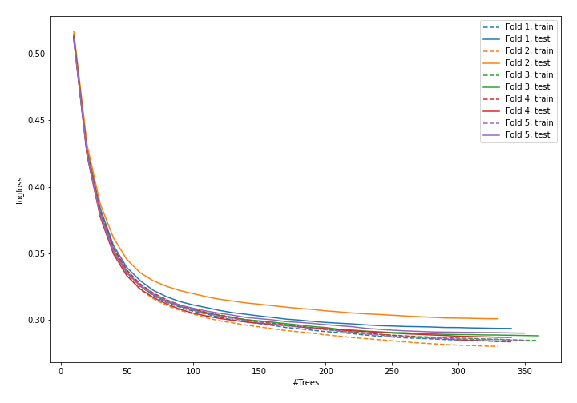
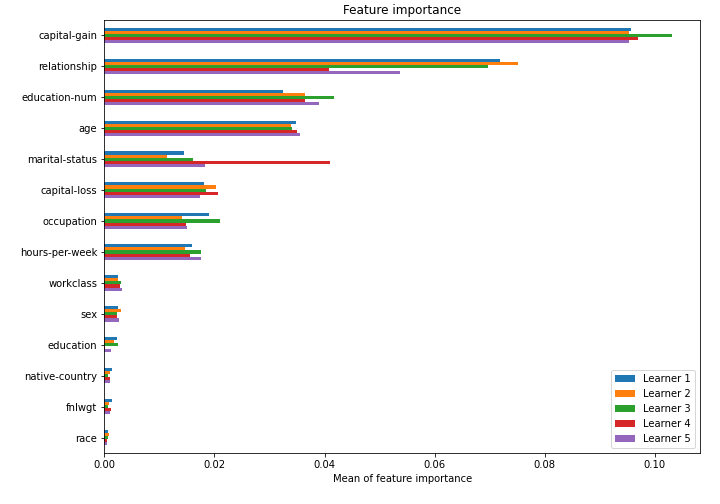

# Summary of model_54

## CatBoost
- **learning_rate**: 0.05
- **depth**: 6
- **rsm**: 0.7
- **l2_leaf_reg**: 7

## Validation
 - **validation_type**: kfold
 - **k_folds**: 5
 - **shuffle**: True
 - **stratify**: True

## Optimized metric
logloss

## Training time

43.8 seconds

## Metric details
|           |    score |    threshold |
|:----------|---------:|-------------:|
| logloss   | 0.291674 | nan          |
| auc       | 0.921553 | nan          |
| f1        | 0.717132 |   0.39968    |
| accuracy  | 0.866477 |   0.477496   |
| precision | 0.973542 |   0.820217   |
| recall    | 1        |   0.00091749 |
| mcc       | 0.626203 |   0.404749   |

## Confusion matrix (at threshold=0.39968)
|                     |   Predicted as negative |   Predicted as positive |
|:--------------------|------------------------:|------------------------:|
| Labeled as negative |                   17871 |                    1877 |
| Labeled as positive |                    1729 |                    4571 |

## Learning curves

## Permutation-based Importance
