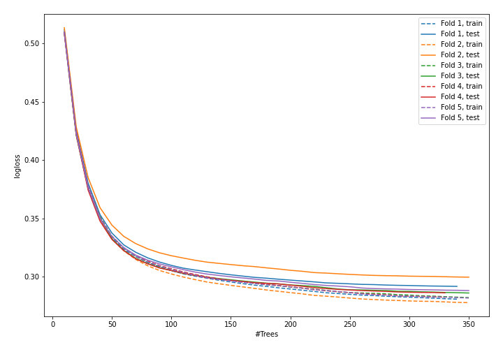
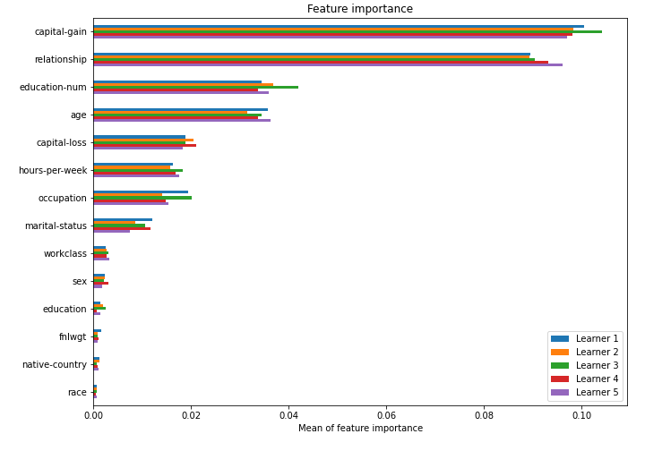

# Summary of model_55

## CatBoost
- **learning_rate**: 0.05
- **depth**: 6
- **rsm**: 0.9
- **l2_leaf_reg**: 5

## Validation
 - **validation_type**: kfold
 - **k_folds**: 5
 - **shuffle**: True
 - **stratify**: True

## Optimized metric
logloss

## Training time

43.7 seconds

## Metric details
|           |    score |    threshold |
|:----------|---------:|-------------:|
| logloss   | 0.290329 | nan          |
| auc       | 0.922351 | nan          |
| f1        | 0.71877  |   0.41475    |
| accuracy  | 0.868205 |   0.475084   |
| precision | 0.971336 |   0.822023   |
| recall    | 1        |   0.00101831 |
| mcc       | 0.629512 |   0.41475    |

## Confusion matrix (at threshold=0.41475)
|                     |   Predicted as negative |   Predicted as positive |
|:--------------------|------------------------:|------------------------:|
| Labeled as negative |                   18007 |                    1741 |
| Labeled as positive |                    1789 |                    4511 |

## Learning curves

## Permutation-based Importance
