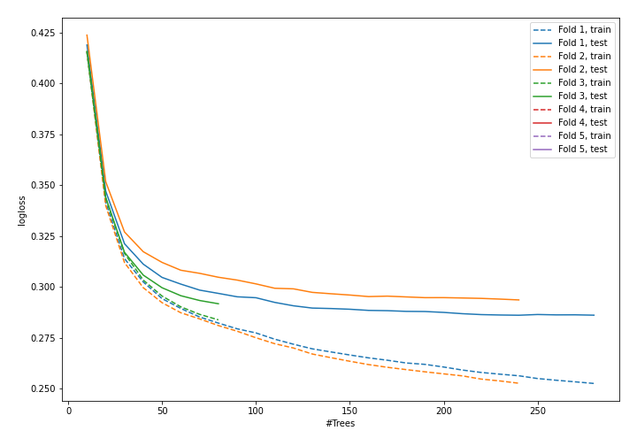
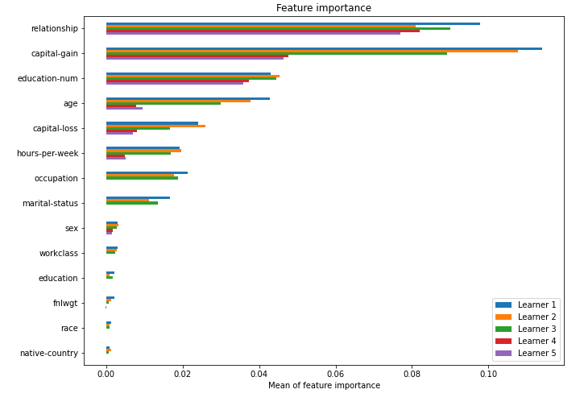

# Summary of model_56

## CatBoost
- **learning_rate**: 0.1
- **depth**: 8
- **rsm**: 1.0
- **l2_leaf_reg**: 1

## Validation
 - **validation_type**: kfold
 - **k_folds**: 5
 - **shuffle**: True
 - **stratify**: True

## Optimized metric
logloss

## Training time

27.9 seconds

## Metric details
|           |    score |     threshold |
|:----------|---------:|--------------:|
| logloss   | 0.340194 | nan           |
| auc       | 0.901479 | nan           |
| f1        | 0.707027 |   0.389214    |
| accuracy  | 0.860296 |   0.528086    |
| precision | 0.957606 |   0.789871    |
| recall    | 1        |   0.000392766 |
| mcc       | 0.609785 |   0.408608    |

## Confusion matrix (at threshold=0.389214)
|                     |   Predicted as negative |   Predicted as positive |
|:--------------------|------------------------:|------------------------:|
| Labeled as negative |                   17409 |                    2339 |
| Labeled as positive |                    1576 |                    4724 |

## Learning curves

## Permutation-based Importance
