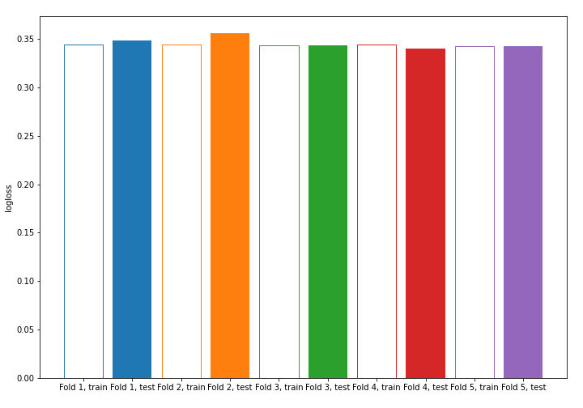
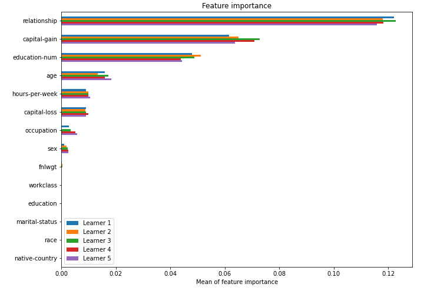

# Summary of model_57

## CatBoost
- **learning_rate**: 0.2
- **depth**: 7
- **rsm**: 1.0
- **l2_leaf_reg**: 3

## Validation
 - **validation_type**: kfold
 - **k_folds**: 5
 - **shuffle**: True
 - **stratify**: True

## Optimized metric
logloss

## Training time

10.3 seconds

## Metric details
|           |    score |   threshold |
|:----------|---------:|------------:|
| logloss   | 0.346185 | nan         |
| auc       | 0.906478 | nan         |
| f1        | 0.688174 |   0.338052  |
| accuracy  | 0.852887 |   0.463874  |
| precision | 0.974425 |   0.714831  |
| recall    | 1        |   0.0606237 |
| mcc       | 0.584388 |   0.376825  |

## Confusion matrix (at threshold=0.338052)
|                     |   Predicted as negative |   Predicted as positive |
|:--------------------|------------------------:|------------------------:|
| Labeled as negative |                   16736 |                    3012 |
| Labeled as positive |                    1415 |                    4885 |

## Learning curves

## Permutation-based Importance
