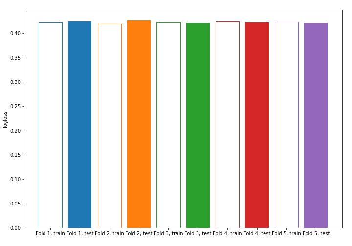
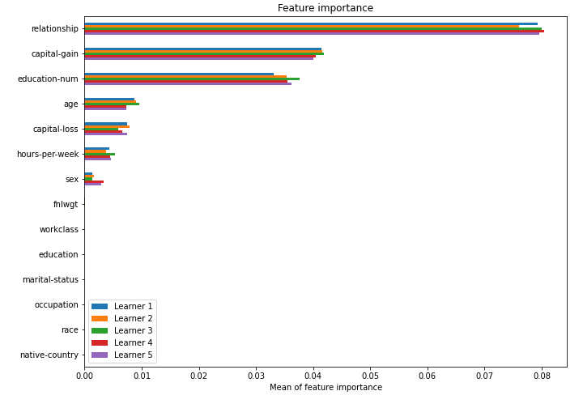

# Summary of model_58

## CatBoost
- **learning_rate**: 0.1
- **depth**: 7
- **rsm**: 1.0
- **l2_leaf_reg**: 7

## Validation
 - **validation_type**: kfold
 - **k_folds**: 5
 - **shuffle**: True
 - **stratify**: True

## Optimized metric
logloss

## Training time

10.5 seconds

## Metric details
|           |    score |   threshold |
|:----------|---------:|------------:|
| logloss   | 0.423313 |  nan        |
| auc       | 0.900315 |  nan        |
| f1        | 0.678748 |    0.383318 |
| accuracy  | 0.847666 |    0.525107 |
| precision | 0.984906 |    0.665536 |
| recall    | 1        |    0.166098 |
| mcc       | 0.569913 |    0.407366 |

## Confusion matrix (at threshold=0.383318)
|                     |   Predicted as negative |   Predicted as positive |
|:--------------------|------------------------:|------------------------:|
| Labeled as negative |                   16971 |                    2777 |
| Labeled as positive |                    1637 |                    4663 |

## Learning curves

## Permutation-based Importance
