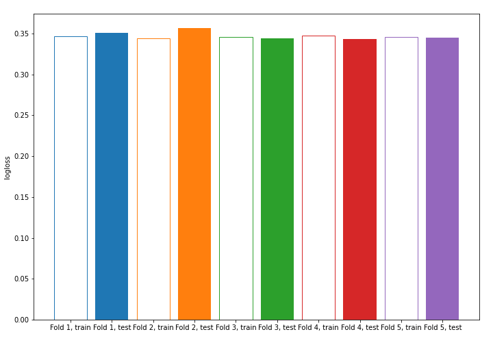
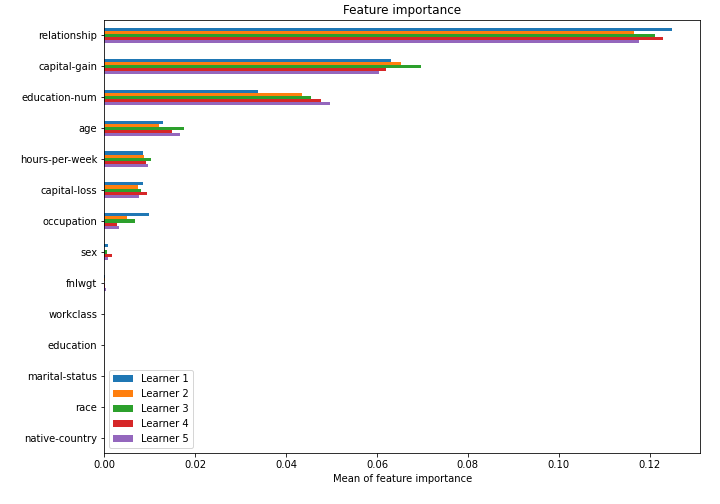

# Summary of model_59

## CatBoost
- **learning_rate**: 0.2
- **depth**: 6
- **rsm**: 1.0
- **l2_leaf_reg**: 1

## Validation
 - **validation_type**: kfold
 - **k_folds**: 5
 - **shuffle**: True
 - **stratify**: True

## Optimized metric
logloss

## Training time

3.4 seconds

## Metric details
|           |    score |   threshold |
|:----------|---------:|------------:|
| logloss   | 0.347703 | nan         |
| auc       | 0.905312 | nan         |
| f1        | 0.688542 |   0.374973  |
| accuracy  | 0.851083 |   0.452924  |
| precision | 0.962426 |   0.718587  |
| recall    | 1        |   0.0593452 |
| mcc       | 0.584639 |   0.374973  |

## Confusion matrix (at threshold=0.374973)
|                     |   Predicted as negative |   Predicted as positive |
|:--------------------|------------------------:|------------------------:|
| Labeled as negative |                   17435 |                    2313 |
| Labeled as positive |                    1778 |                    4522 |

## Learning curves

## Permutation-based Importance
