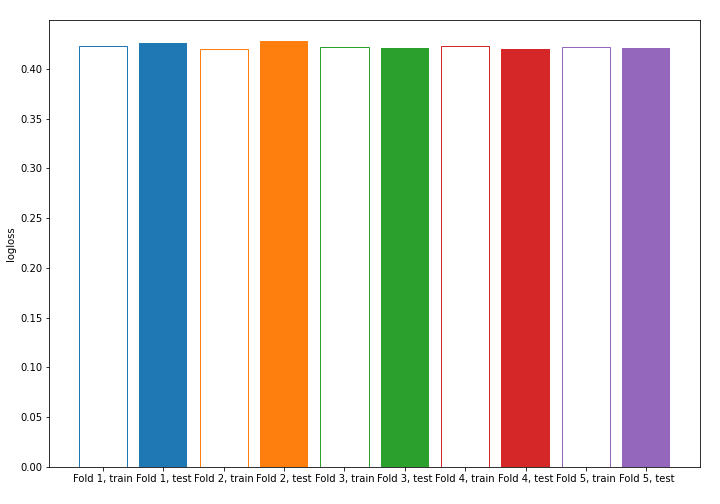
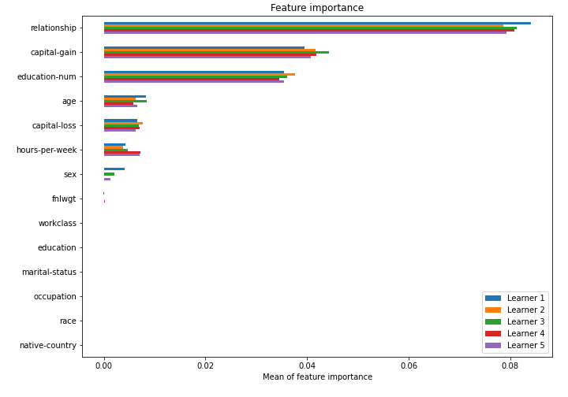

# Summary of model_60

## CatBoost
- **learning_rate**: 0.1
- **depth**: 8
- **rsm**: 0.9
- **l2_leaf_reg**: 7

## Validation
 - **validation_type**: kfold
 - **k_folds**: 5
 - **shuffle**: True
 - **stratify**: True

## Optimized metric
logloss

## Training time

3.5 seconds

## Metric details
|           |    score |   threshold |
|:----------|---------:|------------:|
| logloss   | 0.423381 |  nan        |
| auc       | 0.900253 |  nan        |
| f1        | 0.682368 |    0.380829 |
| accuracy  | 0.849509 |    0.537288 |
| precision | 0.982301 |    0.652086 |
| recall    | 1        |    0.167485 |
| mcc       | 0.572332 |    0.380829 |

## Confusion matrix (at threshold=0.380829)
|                     |   Predicted as negative |   Predicted as positive |
|:--------------------|------------------------:|------------------------:|
| Labeled as negative |                   16733 |                    3015 |
| Labeled as positive |                    1476 |                    4824 |

## Learning curves

## Permutation-based Importance
