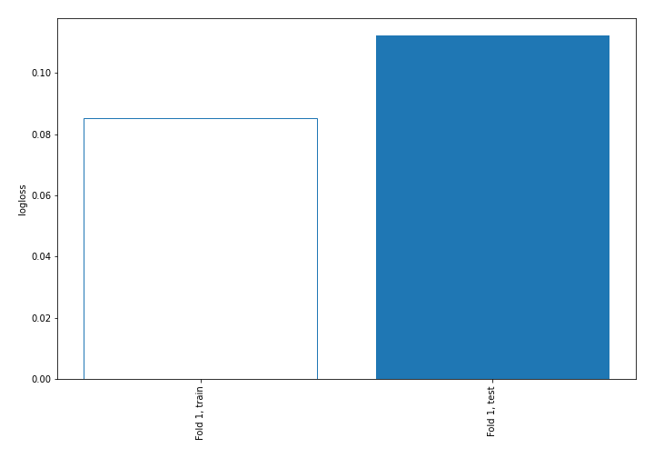
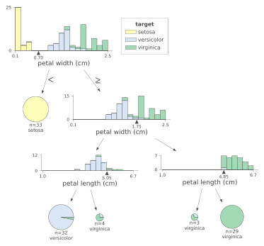
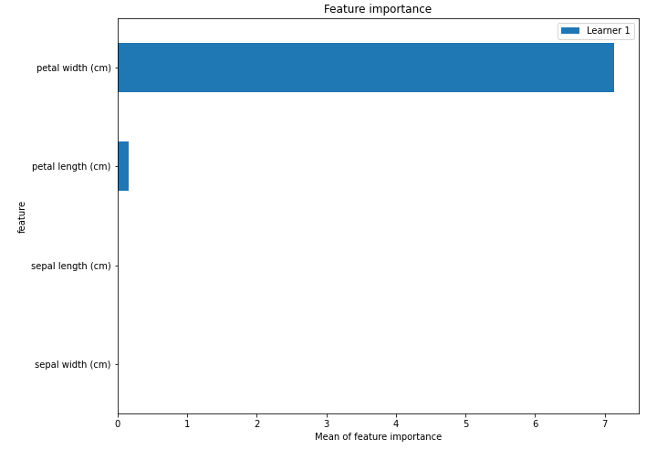
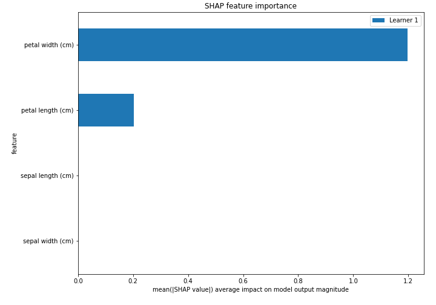
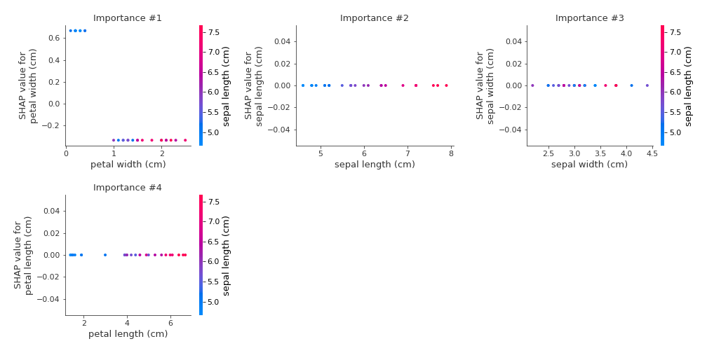
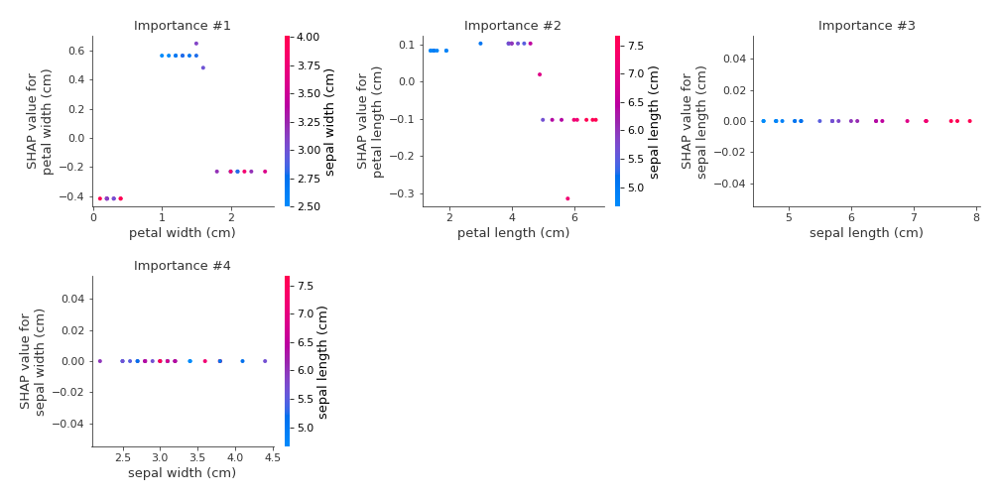
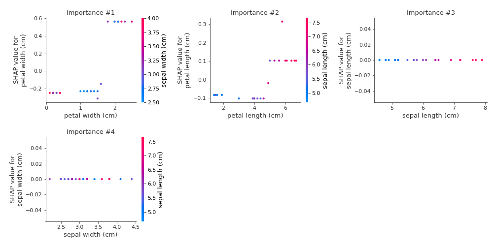
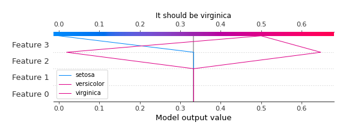
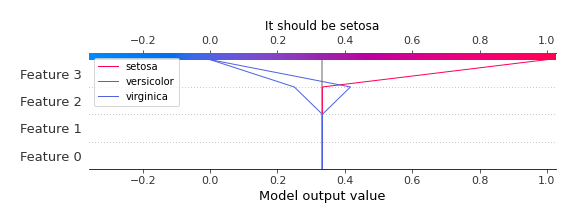

# Summary of 2_DecisionTree

## Decision Tree
- **criterion**: gini
- **max_depth**: 3
- **num_class**: 3
- **explain_level**: 2

## Validation
 - **validation_type**: split
 - **train_ratio**: 0.75
 - **shuffle**: True
 - **stratify**: True

## Optimized metric
logloss

## Training time

32.7 seconds

### Metric details
|           |   setosa |   versicolor |   virginica |   accuracy |   macro avg |   weighted avg |   logloss |
|:----------|---------:|-------------:|------------:|-----------:|------------:|---------------:|----------:|
| precision |        1 |     0.9      |    1        |   0.962963 |    0.966667 |       0.966667 | 0.0256741 |
| recall    |        1 |     1        |    0.888889 |   0.962963 |    0.962963 |       0.962963 | 0.0256741 |
| f1-score  |        1 |     0.947368 |    0.941176 |   0.962963 |    0.962848 |       0.962848 | 0.0256741 |
| support   |        9 |     9        |    9        |   0.962963 |   27        |      27        | 0.0256741 |

## Confusion matrix
|                       |   Predicted as setosa |   Predicted as versicolor |   Predicted as virginica |
|:----------------------|----------------------:|--------------------------:|-------------------------:|
| Labeled as setosa     |                     9 |                         0 |                        0 |
| Labeled as versicolor |                     0 |                         9 |                        0 |
| Labeled as virginica  |                     0 |                         1 |                        8 |

## Learning curves

## Tree visualizations

### Tree #1

## Permutation-based Importance

## SHAP Importance

## SHAP Dependence plots

### Dependence setosa (Fold #1)

### Dependence versicolor (Fold #1)

### Dependence virginica (Fold #1)

## SHAP Decision plots

### Worst decisions for selected sample #1 (Fold #1)

### Worst decisions for selected sample #2 (Fold #1)

### Worst decisions for selected sample #3 (Fold #1)

### Worst decisions for selected sample #4 (Fold #1)

### Best decisions for selected sample #1 (Fold #1)

### Best decisions for selected sample #2 (Fold #1)

### Best decisions for selected sample #3 (Fold #1)

### Best decisions for selected sample #4 (Fold #1)
