# Summary of 3_Linear

## Logistic Regression (Linear)
- **num_class**: 3
- **explain_level**: 2

## Validation
 - **validation_type**: split
 - **train_ratio**: 0.75
 - **shuffle**: True
 - **stratify**: True

## Optimized metric
logloss

## Training time

27.1 seconds

### Metric details
|           |   setosa |   versicolor |   virginica |   accuracy |   macro avg |   weighted avg |   logloss |
|:----------|---------:|-------------:|------------:|-----------:|------------:|---------------:|----------:|
| precision |        1 |            1 |           1 |          1 |           1 |              1 |   0.12529 |
| recall    |        1 |            1 |           1 |          1 |           1 |              1 |   0.12529 |
| f1-score  |        1 |            1 |           1 |          1 |           1 |              1 |   0.12529 |
| support   |        9 |            9 |           9 |          1 |          27 |             27 |   0.12529 |

## Confusion matrix
|                       |   Predicted as setosa |   Predicted as versicolor |   Predicted as virginica |
|:----------------------|----------------------:|--------------------------:|-------------------------:|
| Labeled as setosa     |                     9 |                         0 |                        0 |
| Labeled as versicolor |                     0 |                         9 |                        0 |
| Labeled as virginica  |                     0 |                         0 |                        9 |

## Learning curves
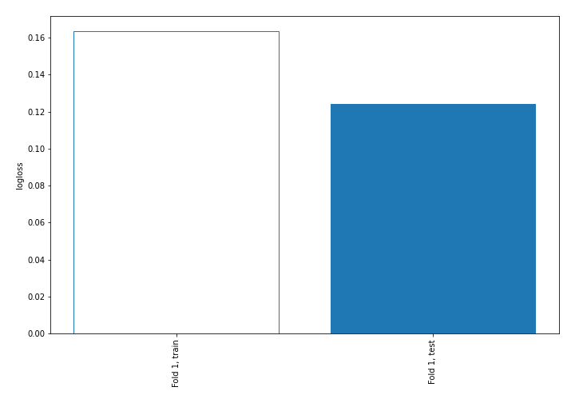

## Coefficients

### Coefficients learner #1
|                   |    setosa |   versicolor |   virginica |
|:------------------|----------:|-------------:|------------:|
| intercept         | -0.340419 |   1.61125    |   -1.27083  |
| sepal length (cm) | -1.03992  |   0.500877   |    0.539043 |
| sepal width (cm)  |  0.840776 |  -0.382739   |   -0.458037 |
| petal length (cm) | -1.55192  |   0.00792678 |    1.544    |
| petal width (cm)  | -1.37221  |  -0.835489   |    2.2077   |

## Permutation-based Importance
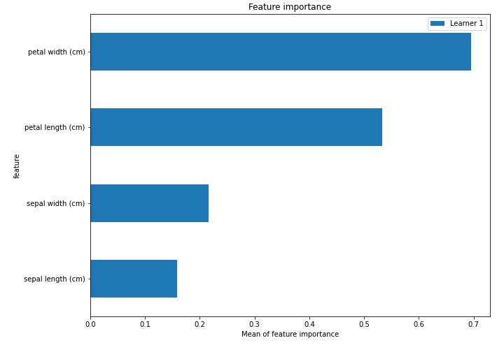

## SHAP Importance
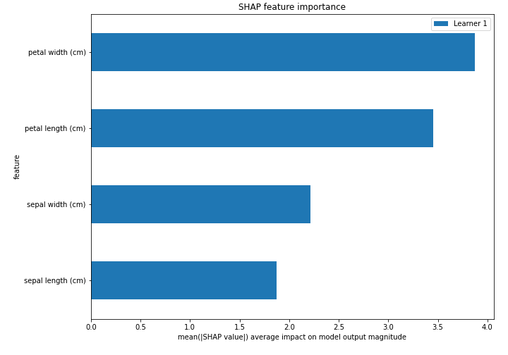

## SHAP Dependence plots

### Dependence setosa (Fold #1)
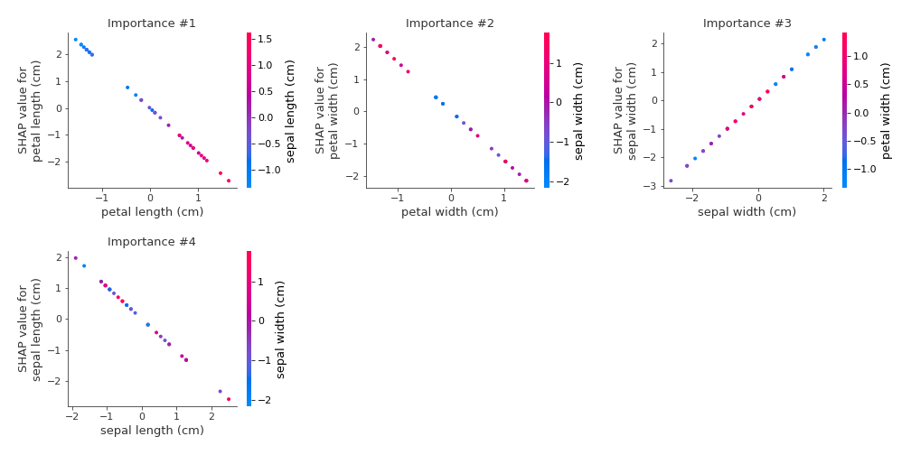
### Dependence versicolor (Fold #1)
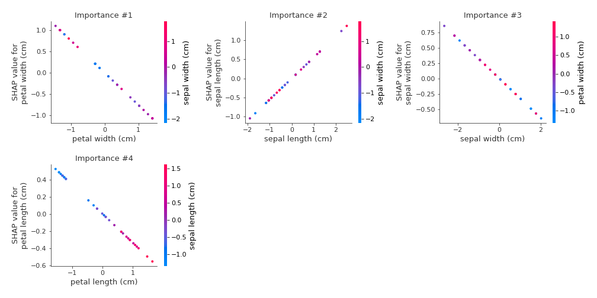
### Dependence virginica (Fold #1)
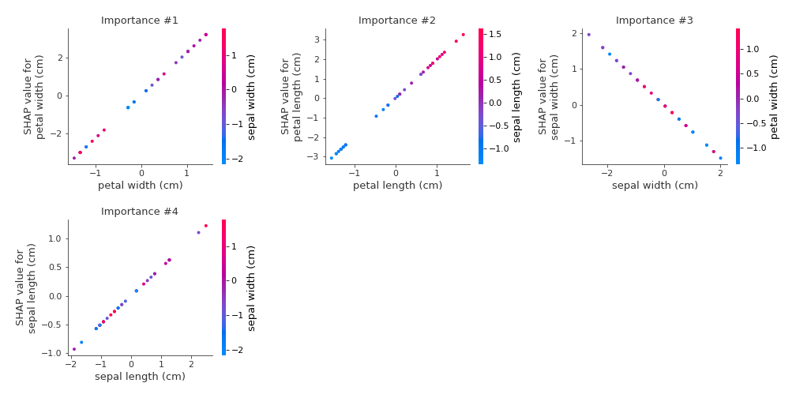

## SHAP Decision plots

### Worst decisions for selected sample #1 (Fold #1)

### Worst decisions for selected sample #2 (Fold #1)
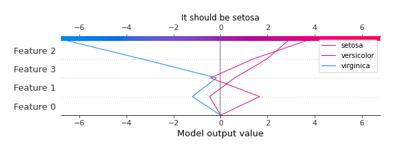
### Worst decisions for selected sample #3 (Fold #1)
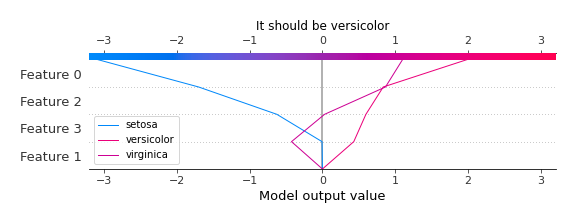
### Worst decisions for selected sample #4 (Fold #1)
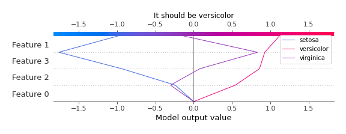
### Best decisions for selected sample #1 (Fold #1)
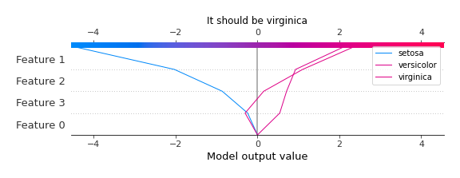
### Best decisions for selected sample #2 (Fold #1)
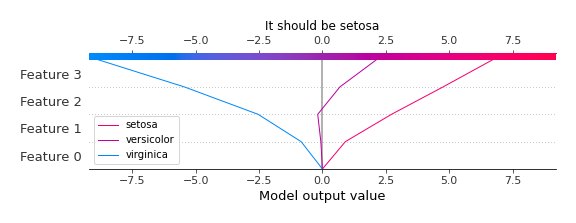
### Best decisions for selected sample #3 (Fold #1)

### Best decisions for selected sample #4 (Fold #1)
